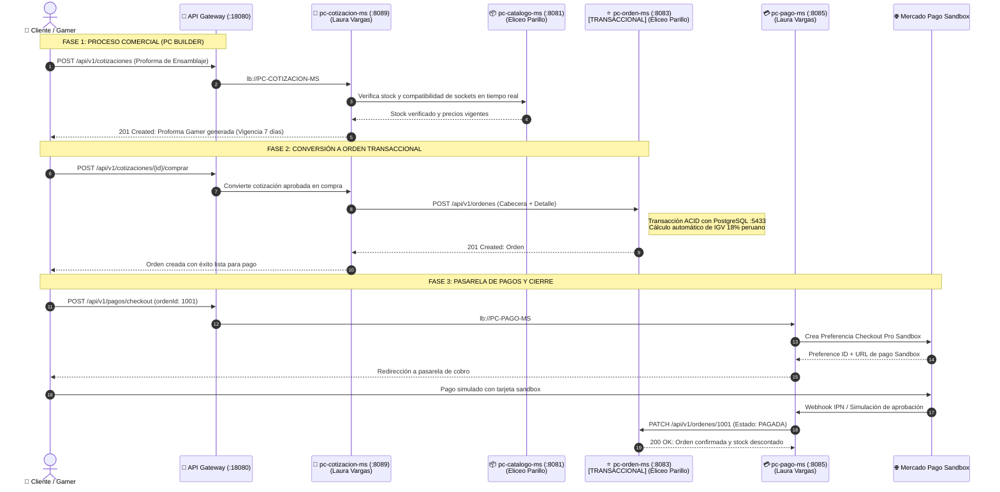

# 🎮 ENIAC Labs - Ecosistema Distribuido de Comercio Electrónico Gamer

<div align="center">


**Plataforma distribuida orientada a producción para la cotización inteligente, armado y venta de computadoras gamer ensambladas ("PC Builder"), periféricos y piezas de hardware con verificación de stock en tiempo real y pasarela de pagos.**

*Proyecto Sello de Sistemas Distribuidos — Universidad Peruana Unión (UPeU)*

</div>

---

## ⚡ 1. Inicio Rápido en 1 Clic (Python Orchestrator)

El ecosistema cuenta con un orquestador automatizado en Python (`iniciar_todo.py`) que:
- Detecta y arranca **Docker Desktop** automáticamente si se encuentra apagado.
- Levanta las **4 bases de datos PostgreSQL**, los **3 servidores de infraestructura**, los **4 microservicios** y la **suite de observabilidad**.
- Sincroniza y autorrepara el orden de inicio entre el Config Server y Eureka.
- Inicia el servidor de documentación **MkDocs**.
- **Abre automáticamente cada una de las 10 páginas y dashboards en tu navegador predeterminado.**

```powershell
# Opción 1: Ejecutar desde terminal
python iniciar_todo.py

# Opción 2: En el Explorador de Windows, doble clic sobre:
iniciar_todo.bat
```

> **Comandos adicionales del script:**
> - `python iniciar_todo.py --status` : Muestra la matriz de salud en tiempo real de todos los servicios.
> - `python iniciar_todo.py --open-only` : Abre las 10 páginas web en el navegador sin reiniciar servicios.
> - `python iniciar_todo.py --no-browser` : Enciende todo el ecosistema en segundo plano sin abrir ventanas.
> - `python iniciar_todo.py --down` : Detiene limpiamente todos los contenedores y el servidor MkDocs.

---

## 👥 2. Integrantes y Asignación de Roles (2 por Alumno = 4 Microservicios)

Siguiendo las directivas del curso, la arquitectura cuenta con **un único Microservicio Transaccional** para todo el sistema (`pc-orden-ms`) y **tres Microservicios No Transaccionales**, distribuidos equitativamente entre los dos integrantes:

| Integrante | Rol Arquitectónico y Comercial | Microservicio 1 | Microservicio 2 |
|---|---|---|---|
| **Eliceo Parillo Mostajo** | Arquitectura backend, persistencia transaccional y catálogo gamer | **`pc-orden-ms`** (:8083)<br>⭐ **ÚNICO MICROSERVICIO TRANSACCIONAL**<br>*(Cabecera-Detalle, IGV 18% peruano, persistencia ACID, PostgreSQL :5433)* | **`pc-catalogo-ms`** (:8081)<br>*(No Transaccional)*<br>*(Catálogo de Hardware Gamer, Categorías, Stock en tiempo real, PostgreSQL :15432)* |
| **Laura Vargas Cristhian Paul** | Motor comercial PC Builder, pasarela externa y observabilidad | **`pc-cotizacion-ms`** (:8089)<br>🚀 **MOTOR COMERCIAL QUE VENDE EL SISTEMA**<br>*(PC Gamer Builder, validación de compatibilidad de sockets/fuente, proformas de 7 días, PostgreSQL :5436)* | **`pc-pago-ms`** (:8085)<br>*(No Transaccional / Integración Externa)*<br>*(Adaptador Mercado Pago Sandbox, Checkout Pro y Webhooks IPN, PostgreSQL :5434)* |

> 🛡️ **Seguridad Perimetral Centralizada:** El control de acceso y las políticas de enrutamiento se gestionan perimetralmente en el **API Gateway** (`pc-gateway`), optimizando el rendimiento y evitando la sobrecarga de un microservicio de autenticación redundante.

---

## 🏛️ 3. Modelo Arquitectónico del Ecosistema

### 3.1 Diagrama Estructural Completo de Capas y Componentes

```mermaid
flowchart TB
    %% ==========================================
    %% ESTILOS VISUALES Y PALETA DE COLORES
    %% ==========================================
    classDef clientStyle fill:#0284c7,stroke:#0369a1,stroke-width:2px,color:#ffffff,font-weight:bold;
    classDef gatewayStyle fill:#6366f1,stroke:#4338ca,stroke-width:3px,color:#ffffff,font-weight:bold;
    classDef infraStyle fill:#334155,stroke:#1e293b,stroke-width:2px,color:#ffffff,font-weight:bold;
    classDef eurekaStyle fill:#d97706,stroke:#b45309,stroke-width:2px,color:#ffffff,font-weight:bold;
    classDef transStyle fill:#e11d48,stroke:#9f1239,stroke-width:3px,color:#ffffff,font-weight:bold;
    classDef commercialStyle fill:#059669,stroke:#047857,stroke-width:3px,color:#ffffff,font-weight:bold;
    classDef catalogStyle fill:#2563eb,stroke:#1d4ed8,stroke-width:2px,color:#ffffff,font-weight:bold;
    classDef paymentStyle fill:#7c3aed,stroke:#6d28d9,stroke-width:2px,color:#ffffff,font-weight:bold;
    classDef dbStyle fill:#0f172a,stroke:#38bdf8,stroke-width:2px,color:#38bdf8,font-weight:bold;
    classDef obsStyle fill:#ea580c,stroke:#c2410c,stroke-width:2px,color:#ffffff,font-weight:bold;
    classDef externalStyle fill:#0891b2,stroke:#0e7490,stroke-width:2px,color:#ffffff,font-weight:bold;

    %% ==========================================
    %% 1. CAPA CLIENTES
    %% ==========================================
    subgraph CLIENT_LAYER ["🌐 CAPA 1: CLIENTES & CONSUMIDORES"]
        CLIENT["💻 Cliente Web / PC Gamer Builder UI / Mobile / Postman"]:::clientStyle
    end

    %% ==========================================
    %% 2. CAPA PERIMETRAL & ENRUTAMIENTO
    %% ==========================================
    subgraph GATEWAY_LAYER ["🛡️ CAPA 2: PERÍMETRO & ACCESO UNIFICADO (:18080)"]
        GATEWAY["🚪 PC-GATEWAY\n(Spring Cloud Gateway Server WebMVC)\nFiltros Perimetrales & Balanceador lb://"]:::gatewayStyle
    end

    %% ==========================================
    %% 3. INFRAESTRUCTURA SPRING CLOUD
    %% ==========================================
    subgraph INFRA_LAYER ["⚙️ CAPA 3: SERVIDORES DE INFRAESTRUCTURA SPRING CLOUD"]
        direction LR
        CONFIG["📁 PC-CONFIG (:18888)\n(Spring Cloud Config Native)\n12 Perfiles (dev / prod)"]:::infraStyle
        EUREKA["🔍 PC-EUREKA (:18761)\n(Eureka Service Registry)\nDescubrimiento Dinámico & Heartbeats"]:::eurekaStyle
    end

    %% ==========================================
    %% 4. MICROSERVICIOS DE NEGOCIO
    %% ==========================================
    subgraph BUSINESS_LAYER ["🚀 CAPA 4: MICROSERVICIOS DE NEGOCIO (2 POR ALUMNO)"]
        
        subgraph ELICEO_SERVICES ["👤 ELICEO PARILLO MOSTAJO (Ventas y Catálogo)"]
            ORDEN_MS["⭐ PC-ORDEN-MS (:8083)\n⚡ ÚNICO TRANSACCIONAL DEL ECOSISTEMA\n• Cabecera-Detalle de Pedidos\n• Cálculo Automático IGV 18%\n• Transacciones ACID y Estados de Orden"]:::transStyle
            CATALOGO_MS["📦 PC-CATALOGO-MS (:8081)\n(No Transaccional)\n• Catálogo CPUs, GPUs, RAM, Placas\n• Verificación de Stock en Tiempo Real"]:::catalogStyle
        end

        subgraph LAURA_SERVICES ["👤 LAURA VARGAS CRISTHIAN PAUL (Comercial y Pasarela)"]
            COTIZACION_MS["🚀 PC-COTIZACION-MS (:8089)\n🔥 MOTOR COMERCIAL QUE VENDE EL SISTEMA\n• PC Builder / Compatibilidad Técnica\n• Generación de Proformas (Vigencia 7 días)\n• Conversor Proforma ➔ Orden de Compra"]:::commercialStyle
            PAGO_MS["💳 PC-PAGO-MS (:8085)\n(No Transaccional / Integración Externa)\n• Adaptador Mercado Pago Sandbox\n• Webhooks IPN y Simulación de Cobro"]:::paymentStyle
        end

    end

    %% ==========================================
    %% 5. CAPA DE PERSISTENCIA DATABASE-PER-SERVICE
    %% ==========================================
    subgraph DATA_LAYER ["🗄️ CAPA 5: BASES DE DATOS AISLADAS (POSTGRESQL 16 + FLYWAY)"]
        direction LR
        DB_CATALOGO[("🛢️ DB Catálogo\n:15432\neniaclabs_catalogo_db")]:::dbStyle
        DB_ORDEN[("🛢️ DB Orden\n:5433\neniaclabs_orden_db")]:::dbStyle
        DB_COTIZACION[("🛢️ DB Cotización\n:5436\neniaclabs_cotizacion_db")]:::dbStyle
        DB_PAGO[("🛢️ DB Pago\n:5434\neniaclabs_pago_db")]:::dbStyle
    end

    %% ==========================================
    %% 6. PASARELA EXTERNA
    %% ==========================================
    subgraph EXTERNAL_LAYER ["🌍 CAPA 6: SERVICIOS EXTERNOS"]
        MERCADOPAGO["🌐 Pasarela Mercado Pago API\n(Sandbox Checkout Pro & IPN)"]:::externalStyle
    end

    %% ==========================================
    %% 7. OBSERVABILIDAD & TELEMETRÍA
    %% ==========================================
    subgraph OBS_LAYER ["📊 CAPA 7: STACK DE OBSERVABILIDAD COMPLETA"]
        direction LR
        PROMETHEUS["🔥 Prometheus (:9090)\nPull Metrics (cada 5s)\n10 Active Targets"]:::obsStyle
        GRAFANA["📈 Grafana (:3000)\nDashboards JVM, Throughput,\nLatencias y Métricas de Host"]:::obsStyle
        LOKI["📑 Loki (:3100)\nAgregación de Logs Distribuidos"]:::obsStyle
    end

    %% ==========================================
    %% INTERCONEXIONES Y FLUJOS DE COMUNICACIÓN
    %% ==========================================
    CLIENT ==>|HTTP REST / JSON :18080| GATEWAY

    GATEWAY -.->|Consulta Rutas Dinámicas| EUREKA
    GATEWAY -->|lb://PC-COTIZACION-MS| COTIZACION_MS
    GATEWAY -->|lb://PC-CATALOGO-MS| CATALOGO_MS
    GATEWAY -->|lb://PC-ORDEN-MS| ORDEN_MS
    GATEWAY -->|lb://PC-PAGO-MS| PAGO_MS

    CONFIG -.->|Inyecta Configuración Centralizada| EUREKA
    CONFIG -.->|Inyecta Configuración Centralizada| GATEWAY
    CONFIG -.->|Inyecta Configuración Centralizada| CATALOGO_MS
    CONFIG -.->|Inyecta Configuración Centralizada| ORDEN_MS
    CONFIG -.->|Inyecta Configuración Centralizada| COTIZACION_MS
    CONFIG -.->|Inyecta Configuración Centralizada| PAGO_MS

    COTIZACION_MS -->|1. Valida Stock & Precios| CATALOGO_MS
    COTIZACION_MS ==>|2. Convierte Proforma en Orden| ORDEN_MS
    PAGO_MS -->|3. Sincroniza Estado de Pago| ORDEN_MS
    PAGO_MS ==>|Checkout & Webhooks| MERCADOPAGO

    CATALOGO_MS --- DB_CATALOGO
    ORDEN_MS --- DB_ORDEN
    COTIZACION_MS --- DB_COTIZACION
    PAGO_MS --- DB_PAGO

    ORDEN_MS -.->|Micrometer :8080/actuator/prometheus| PROMETHEUS
    CATALOGO_MS -.->|Micrometer :8080/actuator/prometheus| PROMETHEUS
    COTIZACION_MS -.->|Micrometer :8080/actuator/prometheus| PROMETHEUS
    PAGO_MS -.->|Micrometer :8080/actuator/prometheus| PROMETHEUS
    GATEWAY -.->|Micrometer :28080/actuator/prometheus| PROMETHEUS

    PROMETHEUS ==>|Datasource PromQL| GRAFANA
    LOKI ==>|Datasource LogQL| GRAFANA
```



---

### 3.2 Diagrama de Secuencia del Flujo Transaccional de Venta



---

## 🌐 4. Matriz de Enlaces del Ecosistema en Funcionamiento

### 4.1 Infraestructura y Documentación
* **Portal de Documentación Oficial MkDocs:** [http://localhost:8000](http://localhost:8000)
* **Eureka Service Registry Dashboard:** [http://localhost:18761](http://localhost:18761)
* **API Gateway Actuator Health:** [http://localhost:18080/actuator/health](http://localhost:18080/actuator/health)
* **API Gateway Enrutamiento Productos:** [http://localhost:18080/api/v1/productos](http://localhost:18080/api/v1/productos)
* **Config Server (Dev Catálogo):** [http://localhost:18888/pc-catalogo-ms/dev](http://localhost:18888/pc-catalogo-ms/dev)
* **Config Server (Dev Cotizaciones):** [http://localhost:18888/pc-cotizacion-ms/dev](http://localhost:18888/pc-cotizacion-ms/dev)

### 4.2 Documentación Swagger UI / OpenAPI 3.0 Interactiva
* **pc-catalogo-ms:** [http://localhost:8081/swagger-ui/index.html](http://localhost:8081/swagger-ui/index.html) *(JSON: [http://localhost:8081/v3/api-docs](http://localhost:8081/v3/api-docs))*
* **pc-orden-ms (Transaccional):** [http://localhost:8083/swagger-ui/index.html](http://localhost:8083/swagger-ui/index.html) *(JSON: [http://localhost:8083/v3/api-docs](http://localhost:8083/v3/api-docs))*
* **pc-cotizacion-ms (Comercial / PC Builder):** [http://localhost:8089/swagger-ui/index.html](http://localhost:8089/swagger-ui/index.html) *(JSON: [http://localhost:8089/v3/api-docs](http://localhost:8089/v3/api-docs))*
* **pc-pago-ms (Mercado Pago):** [http://localhost:8085/swagger-ui/index.html](http://localhost:8085/swagger-ui/index.html) *(JSON: [http://localhost:8085/v3/api-docs](http://localhost:8085/v3/api-docs))*

### 4.3 Stack de Monitoreo y Observabilidad
* **Grafana Dashboards:** [http://localhost:3000](http://localhost:3000) *(Usuario: `admin` / Password: `admin`)*
* **Prometheus TSDB:** [http://localhost:9090](http://localhost:9090)
* **Prometheus Scrape Targets (10 Targets UP):** [http://localhost:9090/targets](http://localhost:9090/targets)
* **Loki Log Engine Readiness:** [http://localhost:3100/ready](http://localhost:3100/ready)
* **Node Exporter Host Metrics:** [http://localhost:9100/metrics](http://localhost:9100/metrics)

---

## 📡 5. Endpoints Expuestos en el API Gateway (:18080)

| Microservicio | Método | Ruta en Gateway (:18080) | Descripción Funcional y Comercial |
|---|:---:|---|---|
| **`pc-cotizacion-ms`** | `GET` | `/api/v1/cotizaciones` | Lista todas las proformas de PC Gamer armadas |
| **`pc-cotizacion-ms`** | `POST` | `/api/v1/cotizaciones` | Crea nueva proforma con cálculo de IGV 18% y vigencia de 7 días |
| **`pc-cotizacion-ms`** | `POST` | `/api/v1/cotizaciones/validar-compatibilidad` | Valida compatibilidad técnica (socket CPU, potencia de fuente y GPU) |
| **`pc-cotizacion-ms`** | `POST` | `/api/v1/cotizaciones/{id}/comprar` | **Vende el sistema:** convierte la proforma en Orden Transaccional |
| **`pc-catalogo-ms`** | `GET` | `/api/v1/productos` | Consulta hardware gamer disponible, especificaciones y precios |
| **`pc-catalogo-ms`** | `POST` | `/api/v1/productos/{id}/stock/verificar` | Verifica stock en tiempo real antes de cotizar |
| **`pc-orden-ms`** | `POST` | `/api/v1/ordenes` | ⭐ **ÚNICO TRANSACCIONAL:** Registra orden con IGV 18% y Cabecera-Detalle |
| **`pc-orden-ms`** | `GET` | `/api/v1/ordenes/{id}` | Consulta estado de la orden (`PENDIENTE`, `PAGADA`, etc.) |
| **`pc-pago-ms`** | `POST` | `/api/v1/pagos/checkout` | Genera preferencia de pago en Mercado Pago Sandbox |
| **`pc-pago-ms`** | `POST` | `/api/v1/pagos/{id}/simular` | Simula aprobación del pago y actualiza la orden a `PAGADA` |

---

## 🧪 6. Guía Rápida de Prueba para Sustentación

Para demostrar el funcionamiento completo del ecosistema desde la terminal:

### Paso 1: Consultar hardware gamer en el Catálogo a través del Gateway
```bash
curl -X GET http://localhost:18080/api/v1/productos
```

### Paso 2: Crear una Proforma en el PC Builder (Laura Vargas)
```bash
curl -X POST http://localhost:18080/api/v1/cotizaciones \
  -H "Content-Type: application/json" \
  -d '{"cliente": "Carlos Gamer", "componentes": [1, 3, 5], "uso": "Gaming 4K"}'
```

### Paso 3: Convertir la Proforma en Orden de Compra Transaccional con IGV 18% (Eliceo Parillo)
```bash
curl -X POST http://localhost:18080/api/v1/cotizaciones/1/comprar
```

### Paso 4: Generar Checkout en Mercado Pago Sandbox y Simular Aprobación
```bash
curl -X POST http://localhost:18080/api/v1/pagos/checkout \
  -H "Content-Type: application/json" \
  -d '{"ordenId": 1, "monto": 7799.00}'

curl -X POST http://localhost:18080/api/v1/pagos/1/simular
```

### Paso 5: Verificar que la Orden pasó a estado PAGADA
```bash
curl -X GET http://localhost:18080/api/v1/ordenes/1
```

---

## 📂 7. Estructura del Repositorio

```text
micro/
├── compose.yml                    # Orquestación Docker Compose de los 14 contenedores
├── iniciar_todo.py                # Script orquestador en Python con autorreparación
├── iniciar_todo.bat               # Lanzador de un solo clic para Windows
├── mkdocs.yml                     # Configuración del portal de documentación Material
├── ENIAC Labs.pptx                # Presentación ejecutiva oficial
├── docs/                          # Documentación detallada de sesiones S01 a S06
│   ├── index.md
│   ├── proyecto-sello/            # Brief y producto de la Unidad 1
│   └── sesiones/                  # Guías paso a paso de cada sesión
├── infra/                         # Servidores de infraestructura Spring Cloud
│   ├── pc-config/                 # Servidor de configuración centralizado (:18888)
│   ├── pc-eureka/                  # Registro y descubrimiento de servicios (:18761)
│   ├── pc-gateway/                 # Spring Cloud Gateway WebMVC (:18080)
│   └── monitoring/                # Configuraciones de Prometheus, Grafana, Loki y Promtail
├── pc-catalogo-ms/                # Microservicio Catálogo Gamer & Stock (:8081)
├── pc-orden-ms/                   # Microservicio Órdenes Transaccionales (:8083)
├── pc-cotizacion-ms/              # Microservicio PC Builder & Proformas (:8089)
└── pc-pago-ms/                    # Microservicio Pasarela Mercado Pago (:8085)
```

---

<div align="center">
Desarrollado con dedicación por <b>Eliceo Parillo Mostajo</b> & <b>Laura Vargas Cristhian Paul</b><br/>
<i>Universidad Peruana Unión (UPeU) — Escuela Profesional de Ingeniería de Sistemas</i>
</div>