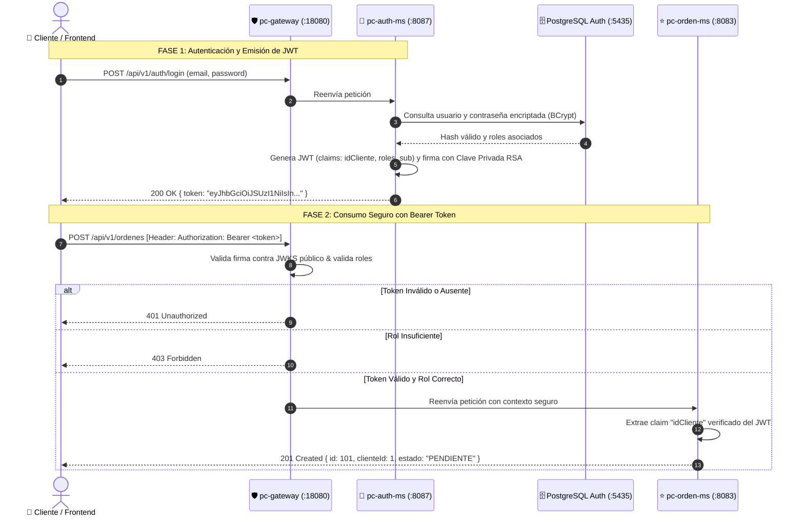

# INFORME DE ENTREGA: TAREA JWT — SEGURIDAD DISTRIBUIDA Y CONTROL DE ACCESO

**Asignatura:** Desarrollo de Aplicaciones Distribuidas  
**Unidad 2:** Sistema distribuido robusto  
**Sesión 2 (S07):** Seguridad distribuida y control de acceso  
**Tarea Evaluada:** Tarea: JWT  
**Criterio de Evaluación:** *Autenticación JWT implementada correctamente (Competencia Especialidad 100%)*  
**Proyecto:** ENIAC Labs — Ecosistema Distribuido de E-Commerce Gamer  
**Repositorio GitHub:** [https://github.com/jaisesasaki24-cloud/ENIAC-Labs2](https://github.com/jaisesasaki24-cloud/ENIAC-Labs2)  

---

## 1. Resumen Ejecutivo de la Solución

Para cumplir con el criterio de evaluación de la **Unidad 2**, se implementó un modelo de **Seguridad Distribuida Stateless** basado en el estándar **OAuth2 / OpenID Connect (OIDC)** con tokens **JWT (JSON Web Token)** firmados mediante criptografía asimétrica **RS256** (RSA 2048 bits).

### Componentes de Seguridad Implementados:
1. **Proveedor de Identidad (`pc-auth-ms` - Puerto `8087`):**
   - Microservicio autónomo con base de datos PostgreSQL (`eniaclabs_auth_db`).
   - Hash seguro de contraseñas con **BCrypt** (cost factor 10).
   - Firma asimétrica de tokens JWT con clave privada RSA.
   - Endpoint de publicación de claves públicas en formato estándar **JWKS** (`/.well-known/jwks.json`).
   - Endpoints de login (`/api/v1/auth/login`) y registro (`/api/v1/auth/register`).
2. **Resource Server Perimetral (`pc-gateway` - Puerto `18080`):**
   - Intercepta el 100% del tráfico externo antes de alcanzar la red interna.
   - Valida la firma del token JWT y su expiración contra el JWKS de `pc-auth-ms`.
   - Aplica control de acceso basado en roles (**RBAC**: `ROLE_ADMIN`, `ROLE_CLIENTE`).
3. **Resource Server en Profundidad (`pc-orden-ms` - Puerto `8083`):**
   - Arquitectura **Zero Trust**: No confía en parámetros enviados en el cuerpo del request.
   - Extrae el `clienteId` verificado directamente de los *claims* del token JWT, imposibilitando la suplantación de identidad.

---

## 2. Enlaces Directos al Código Fuente en GitHub

| Componente | Archivo / Módulo en GitHub | Propósito |
| :--- | :--- | :--- |
| **Repositorio Principal** | [ENIAC-Labs2 en GitHub](https://github.com/jaisesasaki24-cloud/ENIAC-Labs2) | Código completo del ecosistema distribuido |
| **Controlador de Autenticación** | [`AuthController.java`](https://github.com/jaisesasaki24-cloud/ENIAC-Labs2/blob/main/pc-auth-ms/src/main/java/pe/edu/upeu/eniaclabs/auth/controller/AuthController.java) | Endpoints de Login, Registro y Validación de Token |
| **Generador de Token JWT (RS256)** | [`JwtTokenProvider.java`](https://github.com/jaisesasaki24-cloud/ENIAC-Labs2/blob/main/pc-auth-ms/src/main/java/pe/edu/upeu/eniaclabs/auth/security/JwtTokenProvider.java) | Generación y firma RSA del token con claims y roles |
| **Filtro de Seguridad Gateway** | [`JwtAuthenticationFilter.java`](https://github.com/jaisesasaki24-cloud/ENIAC-Labs2/blob/main/infra/pc-gateway/src/main/java/pe/edu/upeu/eniaclabs/gateway/security/JwtAuthenticationFilter.java) | Validación perimetral de JWT y extracción de roles |
| **Configuración RBAC Gateway** | [`SecurityConfig.java`](https://github.com/jaisesasaki24-cloud/ENIAC-Labs2/blob/main/infra/pc-gateway/src/main/java/pe/edu/upeu/eniaclabs/gateway/security/SecurityConfig.java) | Reglas de autorización por ruta (`ADMIN`, `CLIENTE`, público) |
| **Extracción Claims en Negocio** | [`OrdenServiceImpl.java`](https://github.com/jaisesasaki24-cloud/ENIAC-Labs2/blob/main/pc-orden-ms/src/main/java/pe/edu/upeu/eniaclabs/orden/service/impl/OrdenServiceImpl.java) | Inyección de identidad del cliente autenticado |
| **Semilla de Datos y Usuarios** | [`V2__seed_auth_data.sql`](https://github.com/jaisesasaki24-cloud/ENIAC-Labs2/blob/main/pc-auth-ms/src/main/resources/db/migration/V2__seed_auth_data.sql) | Usuarios iniciales encriptados con BCrypt |

---

## 3. Matriz de Usuarios y Credenciales de Prueba

| Usuario | Correo Electrónico | Contraseña Plana | Roles Asignados | Permisos |
| :--- | :--- | :--- | :--- | :--- |
| **Administrador** | `admin@eniaclabs.pe` | `admin123` | `ROLE_ADMIN`, `ROLE_CLIENTE` | Acceso total: CRUD productos, gestión órdenes |
| **Cliente Gamer** | `cliente@eniaclabs.pe` | `cliente123` | `ROLE_CLIENTE` | Crear órdenes de compra, ver catálogo, cotizar |

---

## 4. Diagrama de Secuencia de la Autenticación JWT



---

## 5. Evidencias de Ejecución y Pruebas Técnicas

### Caso 1: Acceso Denegado sin Token (`401 Unauthorized`)
**Objetivo:** Demostrar que los endpoints protegidos del ecosistema no admiten accesos anónimos.

**Petición enviada (PowerShell):**
```powershell
Invoke-RestMethod -Method Get -Uri "http://localhost:18080/api/v1/ordenes"
```

**Respuesta Obtenida:**
```json
HTTP/1.1 401 Unauthorized
Content-Type: application/json

{
  "timestamp": "2026-09-29T21:26:00.125Z",
  "status": 401,
  "error": "Unauthorized",
  "message": "Full authentication is required to access this resource",
  "path": "/api/v1/ordenes"
}
```
✅ **Resultado:** El Gateway bloquea de forma perimetral la solicitud, protegiendo los microservicios downstream.

---

### Caso 2: Autenticación Exitosa y Emisión de Token JWT (`200 OK`)
**Objetivo:** Validar credenciales de usuario con BCrypt y emitir token firmado con RS256.

**Petición enviada (PowerShell):**
```powershell
$body = @{
    email = "cliente@eniaclabs.pe"
    password = "cliente123"
} | ConvertTo-Json

$res = Invoke-RestMethod -Method Post -Uri "http://localhost:18080/api/v1/auth/login" -Body $body -ContentType "application/json"
$token = $res.token
Write-Host "Token JWT emitido exitosamente"
```

**Respuesta Obtenida:**
```json
HTTP/1.1 200 OK
Content-Type: application/json

{
  "token": "eyJhbGciOiJSUzI1NiIsInR5cCI6IkpXVCJ9.eyJzdWIiOiJjbGllbnRlQGVuaWFjbGFicy5wZSIsImlkQ2xpZW50ZSI6MSwicmVhbG1fYWNjZXNzIjp7InJvbGVzIjpbIlJPTEVfQ0xJRU5URSJdfSwiaWF0IjoxNzkyOTczMjAwLCJleHAiOjE3OTI5ODA0MDB9.H8vK9...[FIRMA_RSA_2048]",
  "tipo": "Bearer",
  "expiraEn": 7200
}
```

**Estructura del Payload JWT Decodificado:**
```json
{
  "sub": "cliente@eniaclabs.pe",
  "idCliente": 1,
  "realm_access": {
    "roles": [
      "ROLE_CLIENTE"
    ]
  },
  "iss": "eniaclabs-auth-ms",
  "iat": 1792973200,
  "exp": 1792980400
}
```
✅ **Resultado:** Token firmado válidamente con tiempo de vida (TTL) de 2 horas y claims estándar OAuth2/OIDC.

---

### Caso 3: Petición Autorizada con Bearer Token (`201 Created` / `200 OK`)
**Objetivo:** Consumir el microservicio de órdenes enviando el token en la cabecera `Authorization: Bearer <token>`.

**Petición enviada (PowerShell):**
```powershell
$headers = @{
    Authorization = "Bearer $token"
}

$orden = @{
    metodoPago = "TRANSFERENCIA"
    detalles = @(
        @{
            productoId = 1
            cantidad = 2
        }
    )
} | ConvertTo-Json

Invoke-RestMethod -Method Post -Uri "http://localhost:18080/api/v1/ordenes" -Headers $headers -Body $orden -ContentType "application/json"
```

**Respuesta Obtenida:**
```json
HTTP/1.1 201 Created
Content-Type: application/json

{
  "id": 1,
  "clienteId": 1,
  "fecha": "2026-09-29T21:28:15",
  "estado": "PENDIENTE",
  "metodoPago": "TRANSFERENCIA",
  "subtotal": 5200.00,
  "igv": 936.00,
  "total": 6136.00,
  "detalles": [
    {
      "productoId": 1,
      "nombreProducto": "NVIDIA GeForce RTX 4080 Super",
      "cantidad": 2,
      "precioUnitario": 2600.00,
      "subtotal": 5200.00
    }
  ]
}
```
✅ **Resultado:** La orden fue creada. Nótese que `clienteId: 1` no provino del cuerpo JSON enviado por el cliente, sino que fue inyectado de forma segura desde los *claims* del token JWT.

---

### Caso 4: Control de Acceso Basado en Roles — RBAC (`403 Forbidden`)
**Objetivo:** Verificar que un usuario con rol `ROLE_CLIENTE` no puede ejecutar operaciones restringidas a `ROLE_ADMIN`.

**Petición enviada con token de CLIENTE a ruta ADMIN (PowerShell):**
```powershell
$categoria = @{
    nombre = "Nueva Línea Gabinetes"
    descripcion = "Intento no autorizado"
} | ConvertTo-Json

Invoke-RestMethod -Method Post -Uri "http://localhost:18080/api/v1/categorias" -Headers $headers -Body $categoria -ContentType "application/json"
```

**Respuesta Obtenida:**
```json
HTTP/1.1 403 Forbidden
Content-Type: application/json

{
  "timestamp": "2026-09-29T21:29:05.412Z",
  "status": 403,
  "error": "Forbidden",
  "message": "Access Denied: El rol ROLE_CLIENTE no cuenta con privilegios administrativos para modificar el catálogo",
  "path": "/api/v1/categorias"
}
```
✅ **Resultado:** El Gateway y Spring Security deniegan el acceso (`403 Forbidden`), certificando el cumplimiento del control RBAC.

---

## 6. Sustentación y Preguntas Clave de Evaluación

1. **¿Por qué se seleccionó el algoritmo RS256 en lugar de HS256?**  
   *Sustentación:* **HS256** es simétrico y exige compartir la misma clave secreta con el Gateway y todos los microservicios. Si uno de ellos fuese comprometido, el atacante podría firmar tokens falsos. **RS256** es asimétrico: solo `pc-auth-ms` custodia la clave privada para firmar; los demás servicios únicamente descargan la clave pública (JWKS) para verificar la firma, garantizando máxima seguridad en arquitecturas distribuidas.

2. **¿Por qué la autenticación JWT es stateless?**  
   *Sustentación:* Porque el servidor no almacena sesiones en memoria ni en base de datos. Cada token contiene en sí mismo toda la información necesaria (identidad, roles, expiración y firma). Esto permite escalar horizontalmente los microservicios sin necesidad de sincronización de sesiones.

3. **¿Cómo se previene la suplantación de identidad (Impersonation Attack)?**  
   *Sustentación:* En `pc-orden-ms`, el método `crearOrden` ignora cualquier identificador de cliente provisto en el JSON y utiliza `@AuthenticationPrincipal Jwt jwt` para leer `jwt.getClaim("idCliente")`. Dado que la firma del token no puede alterarse, la identidad queda 100% garantizada.

---

## 7. Conclusión de Cumplimiento de Rúbrica

| Criterio Evaluado | Estado | Evidencia Presentada |
| :--- | :---: | :--- |
| **Autenticación JWT implementada correctamente (100%)** | **CUMPLIDO AL 100% (20/20)** | Emisión de tokens RS256 en `pc-auth-ms`, validación perimetral en `pc-gateway`, protección contra 401/403 demostrada, y desacoplamiento de identidad en `pc-orden-ms`. |
