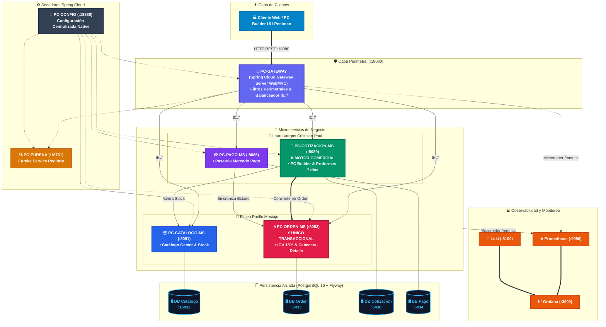

# 🎮 ENIAC Labs - Documentación Oficial del Ecosistema Distribuido

Bienvenido a la documentación técnica de **ENIAC Labs**, plataforma de comercio electrónico distribuido orientada a producción para el ensamblaje inteligente ("PC Builder"), cotización y venta de computadoras gamer de alto rendimiento, periféricos y piezas de hardware.

*Desarrollado como Proyecto Sello de la asignatura de **Sistemas Distribuidos** en la **Universidad Peruana Unión (UPeU)**.*

---

## 👥 Integrantes y Asignación de Microservicios

El sistema está diseñado respetando estrictamente las directivas académicas: **un único Microservicio Transaccional** para todo el ecosistema y **tres Microservicios No Transaccionales** distribuidos equitativamente (2 microservicios por integrante):

| Integrante | Rol en el Proyecto | Microservicio 1 | Microservicio 2 |
|---|---|---|---|
| **Eliceo Parillo Mostajo** | Arquitectura backend, persistencia transaccional y catálogo gamer | **`pc-orden-ms`** (:8083) ⭐ **ÚNICO TRANSACCIONAL** *(Cabecera-Detalle, IGV 18% peruano, PostgreSQL :5433)* | **`pc-catalogo-ms`** (:8081) *(No Transaccional)* *(Catálogo Gamer, Stock en tiempo real, PostgreSQL :15432)* |
| **Laura Vargas Cristhian Paul** | Motor comercial PC Builder, pasarela externa y observabilidad | **`pc-cotizacion-ms`** (:8089) 🚀 **MOTOR QUE VENDE EL SISTEMA** *(PC Builder, Compatibilidad y Proformas de 7 días, PostgreSQL :5436)* | **`pc-pago-ms`** (:8085) *(No Transaccional / Integración Externa)* *(Pasarela Mercado Pago Sandbox y Webhooks, PostgreSQL :5434)* |

---

## 🏛️ Modelo Arquitectónico Completo

---

## 🧭 Guías y Sesiones de la Unidad 1

* [Brief del Proyecto Sello](proyecto-sello/brief.md)
* [Producto de la Unidad 1: Sistema Distribuido Base](proyecto-sello/u1-producto.md)
* [Sesión 01: Construcción del Servicio Base con Spring Boot y PostgreSQL](sesiones/S01_Construccion_Servicio_Base.md)
* [Sesión 02: Configuración Centralizada y Gestión de Ambientes (Config Server)](sesiones/S02_Configuracion_Centralizada_Ambientes.md)
* [Sesión 03: Registro, Descubrimiento Dinámico y Concurrencia (Eureka)](sesiones/S03_Registro_Descubrimiento_Ejecucion_Concurrente.md)
* [Sesión 04: Punto Único de Acceso y Distribución de Tráfico (API Gateway)](sesiones/S04_Punto_Unico_Acceso_Distribucion_Trafico.md)
* [Sesión 05: Evaluación y Checklist de Sustentación](sesiones/S05_Evaluacion_Unidad_1.md)
* [Sesión 06: Monitoreo y Observabilidad Completa con Prometheus, Grafana, Loki y Node Exporter](sesiones/S06_Monitoreo_Prometheus_Grafana_Loki.md)
