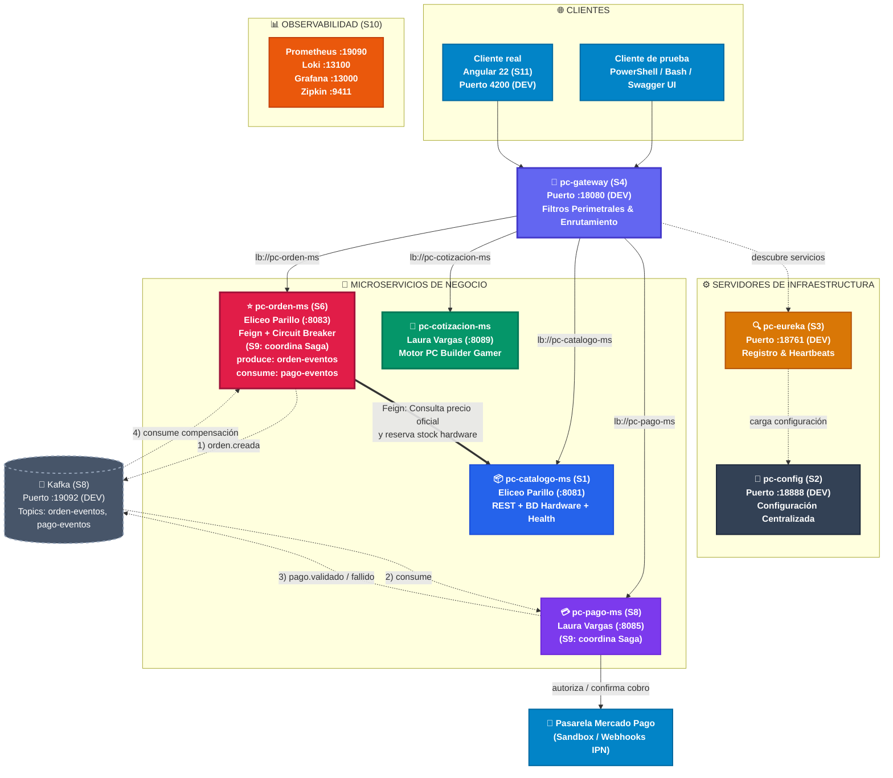

# S6 - Comunicación Síncrona Resiliente entre Servicios

> **Proyecto Sello de Sistemas Distribuidos — ENIAC Labs**  
> **Integrantes:**  
> - **Eliceo Parillo Mostajo** (`pc-orden-ms`, `pc-catalogo-ms`)  
> - **Laura Vargas Cristhian Paul** (`pc-cotizacion-ms`, `pc-pago-ms`, `pc-auth-ms`)  
> **Docente:** Angel Sullon Macalupu (@asullom) / Mg. Juan Carlos Condori  
> **Unidad:** U2 - Sistema distribuido robusto  

---

## 1. Introducción

**Tiempo estimado:** 20 min.

### 1.1 Presentación de la Sesión
Hasta la sesión S5, **`pc-catalogo-ms`** fue el único microservicio con CRUD completo en el ecosistema ENIAC Labs — cada operación resolvía todo con su propia base de datos (`eniaclabs_catalogo_db`), sin depender de otro servicio. Esta sesión construye **`pc-orden-ms`**, el **segundo microservicio y único transaccional del proyecto**, y con él surge un problema nuevo:
> Para registrar una orden de compra, **`pc-orden-ms`** necesita conocer y certificar el precio real y stock de cada componente de hardware gamer (CPUs Ryzen/Intel, GPUs RTX/Radeon, placas base, memorias RAM) — un dato que vive exclusivamente en la base de datos de **`pc-catalogo-ms`**, no en la suya propia.

Esta sesión resuelve ese problema en dos partes, en estricto orden:
1. **Cómo se hace la llamada entre microservicios:** Comunicación declarativa y balanceada con **OpenFeign**.
2. **Qué hacer cuando esa llamada falla:** Tolerancia a fallos y protección contra fallos en cascada mediante un **Circuit Breaker (Resilience4j)**.

### 1.2 Índice
1. Comunicación declarativa entre microservicios (OpenFeign + Client-Side Service Discovery).
2. Circuit Breaker: respuesta controlada ante fallos (Resilience4j).
3. Observabilidad, métricas y diagnóstico (Prometheus, Grafana, Logs correlacionados con MDC).

### 1.3 Propósito de Aprendizaje
Al concluir la clase, el estudiante estará en condiciones de:
> Construir e implementar un segundo microservicio persistente y observable (**`pc-orden-ms`**), que consulta a otro microservicio ya existente (**`pc-catalogo-ms`**) de forma declarativa por su nombre lógico en el registro de servicios (**`pc-eureka`**), protegiendo esa llamada con un patrón de tolerancia a fallos (**Circuit Breaker**) que evita que un servicio caído tumbe también al que lo consulta (*Cascading Failure*).

### 1.4 Producto de Sesión
**`pc-orden-ms`** funcional:
- Con CRUD de órdenes cabecera-detalle y cálculo automático del **IGV (18%) peruano**.
- Conectado a **`pc-config`** (`:18888`) y registrado en **`pc-eureka`** (`:18761`).
- Al registrar una orden, consulta a **`pc-catalogo-ms`** (por Feign) para validar y copiar el precio oficial de cada producto gamer.
- Con una respuesta controlada y elegante (**Circuit Breaker**) si **`pc-catalogo-ms`** no responde o sufre sobrecarga.

### 1.5 Metodología de la Sesión
| Actividades a Realizar | Orientaciones Metodológicas | Material de Estudio Recomendado |
|---|---|---|
| **Revisión previa individual** | Confirmar que `pc-config`, `pc-eureka`, `pc-gateway` y `pc-catalogo-ms` arrancan en DEV. Revisar el estado de `pc-orden-ms`. Trabajo individual antes de clase. | Evidencia individual de S2-S4, arquitectura base en `docs/index.md`. |
| **Clase presencial** | Construcción guiada de `pc-orden-ms` de punta a punta, conexión Feign hacia `pc-catalogo-ms` y protección con Circuit Breaker. | Pasos 3.1 a 3.23 de esta guía. |
| **Evaluación formativa** | Demostración en vivo de creación de orden con precio real (caso exitoso) y con `pc-catalogo-ms` detenido (caso de error controlado con circuito `OPEN`). | Indicaciones de entrega y rúbrica de evaluación. |

---

### 1.6 Motivación: La Orden Gamer que Necesita un Precio que No es Suyo

#### 1.6.1 Caso en ENIAC Labs
`pc-orden-ms` guarda órdenes de compra y sus líneas de detalle (`ordenes_compra_detalle`). Cada línea necesita un precio — pero `pc-orden-ms` **no es dueño de ningún precio**: los precios viven en los productos y componentes gamer dentro de la base de datos de `pc-catalogo-ms`.

- **Copiar el precio a mano (pedirle al cliente que lo mande en el request JSON) es inaceptable:** Cualquiera podría alterar la llamada y enviar `"precio": 10.00` por una GPU NVIDIA RTX 4080 cuyo valor real es `S/. 4,500.00`.
- **La única fuente confiable del precio oficial es consultar directamente a `pc-catalogo-ms`.**
- **El dilema de la red:** Si justo cuando alguien intenta crear una orden, `pc-catalogo-ms` está caído, sufre lentitud o responde con error, esa llamada sin protección bloqueará los hilos del servidor Tomcat de `pc-orden-ms`, provocando saturación (*Thread Starvation*) y contagiando el colapso a todo el ecosistema.

#### Preguntas de Análisis (Defensa Técnica)

**Activación de conocimientos previos:**
1. *¿Por qué `pc-orden-ms` no puede simplemente copiar la tabla `productos` en su propia base de datos?*  
   **Respuesta:** Viola el principio *Database-per-Service*. Crearía duplicidad y desincronización inmediata de datos (si el precio o stock de una GPU cambia en el catálogo, la tabla de órdenes quedaría desfasada). El catálogo es el único dueño del producto; la orden solo almacena un snapshot inmutable (precio pactado al momento de comprar).
2. *Si `pc-catalogo-ms` no respondiera justo cuando alguien crea una orden, ¿qué debería pasar con esa orden?*  
   **Respuesta:** No debe responder con un error `HTTP 500` no controlado ni colapsar los hilos. Debe activar un *fallback* controlado: rechazo limpio (`HTTP 503 Service Unavailable`) informando que el catálogo no está disponible, o retener la orden en estado `PENDIENTE_VALIDACION_PRECIO` (o `CARRITO`), pero jamás persistir una venta con precios ficticios.

**Comprensión de comunicación resiliente:**
3. *¿Qué diferencia hay entre llamar a otro microservicio por su dirección fija (`http://localhost:8081`) y llamarlo por su nombre lógico en Eureka (`lb://pc-catalogo-ms`)?*  
   **Respuesta:** La dirección fija genera acoplamiento estático de infraestructura. Si `pc-catalogo-ms` escala a 3 instancias concurrentes o cambia de nodo en Docker, la dirección fija no balancea ni detecta nodos caídos. Con Eureka y Feign se aplica *Client-Side Service Discovery*, balanceando las peticiones y detectando instancias vivas por heartbeats.
4. *¿Por qué "esperar más tiempo" (un timeout más largo) no es lo mismo que "dejar de intentar" (un circuito abierto)?*  
   **Respuesta:** Un timeout largo empeora el problema: retiene los hilos de `pc-orden-ms` bloqueados durante segundos. Si llegan 50 peticiones simultáneas, el pool de hilos se agota (*Cascading Failure*). El Circuit Breaker en estado `OPEN` "deja de intentar" inmediatamente (Fail-Fast a 0 ms), protegiendo la memoria y CPU de ambos servicios.

---

### 1.7 Ubicación en el Curso

- **Unidad:** U2 - Sistema distribuido robusto.
- **Producto del curso:** Proyecto Sello: sistema distribuido de microservicios end-to-end, configurable, escalable, seguro, resiliente, consistente, observable, integrado con frontend y defendido técnicamente.
- **Avance en esta sesión:** Segundo microservicio del proyecto (**`pc-orden-ms`**), con comunicación síncrona resiliente hacia **`pc-catalogo-ms`**.

#### Figura 1. Roadmap del Producto de la Unidad (ENIAC Labs)



**Leyenda y Relaciones con la Infraestructura:**
- **Verde**: Construido en sesiones previas (`pc-config`, `pc-eureka`, `pc-gateway`, `pc-catalogo-ms`).
- **Amarillo (Trabajo de hoy)**: `pc-orden-ms`, con Feign y Circuit Breaker hacia `pc-catalogo-ms`.
- **Gris punteado**: Componentes posteriores (`pc-pago-ms`, Kafka, Observabilidad completa S10, cliente Angular S11).
- **Azul**: Integración externa (Mercado Pago).
- **Relaciones de infraestructura:**
  - `pc-config` (:18888): Todos los servicios cargan su configuración al arrancar.
  - `pc-eureka` (:18761): Cada servicio se registra y el Gateway resuelve rutas `lb://`.
  - **Eureka vs. Observabilidad:** Eureka solo verifica si la IP está registrada y viva por heartbeat. No mide latencia ni circuitos abiertos. Si el Circuit Breaker de `pc-orden-ms` está en `OPEN`, Eureka sigue marcando `UP`. Observabilidad (Prometheus/Grafana) es quien detecta el estado interno del circuito.

---

## 2. Explica

### 2.1 Arquitectura de la Sesión

#### Figura 2. De `pc-orden-ms` a `pc-catalogo-ms`, con Feign y Circuit Breaker
```
  [ Cliente HTTP ]
         │ 1. POST /api/v1/ordenes (crear orden)
         ▼
  [ pc-orden-ms ] ──▶ 2. delega en ──▶ [ Feign: ProductoClient ]
                                                │ (resuelve en pc-eureka)
                                                ▼
                                     [ Circuit Breaker ]
                                     (CLOSED / OPEN / HALF_OPEN)
                                      ┌─────────┴─────────┐
                   3a. Circuito CLOSED│                   │3b. Circuito OPEN
                      (llamada real)  │                   │   (sin llamar)
                                      ▼                   ▼
                           [ pc-catalogo-ms ]     [ Fallback Method ]
                         GET /api/v1/productos/id  (orden en PENDIENTE_PRECIO)
                                      │                   │
                                      ▼                   ▼
                               4a. Precio real     4b. Sin precio confirmado
                                      └─────────┬─────────┘
                                                │ 4. Persiste orden
                                                ▼
                                      [ Base de Datos :5433 ]
```

**Lectura del flujo:** `pc-orden-ms` nunca invoca a una IP fija. Llama a través de Feign (1-2), resolviendo el nombre lógico en Eureka. Esa llamada queda envuelta por el Circuit Breaker (3) que, según el historial de fallos, decide si ejecuta la llamada real (3a) o salta de inmediato al fallback (3b).

#### Figura 3. La misma llamada Feign en DEV y en Producción Local
```
PRODUCCIÓN LOCAL (Docker Compose - Red: eniaclabs-network)
  pc-orden-ms (8080 interno, mapeado a :8083)
         │
         ▼ Feign: http://pc-catalogo-ms:8080 (vía http://pc-eureka:8761/eureka)
  pc-catalogo-ms (8080 interno, mapeado a :8081)

─────────────────────────────────────────────────────────────

DESARROLLO (DEV - Ejecución en el Host con Maven)
  pc-orden-ms (puerto :8083 en localhost)
         │
         ▼ Feign: http://pc-catalogo-ms (vía http://localhost:18761/eureka)
  pc-catalogo-ms (puerto :8081 en localhost)
```

En ambos ambientes, el código Java de `ProductoClient` no cambia una sola línea: Feign y Eureka resuelven la topología de red de forma transparente.

---

### 2.2 Comunicación Declarativa entre Microservicios

- **Client-Side Service Discovery:** `pc-orden-ms` consulta directamente a `pc-eureka` para obtener las instancias activas de `pc-catalogo-ms`, balanceando la carga en el cliente sin pasar por el Gateway para llamadas internas Este-Oeste (*East-West traffic*).
- **OpenFeign:** Permite declarar clientes HTTP mediante interfaces Java con anotaciones Spring MVC (`@GetMapping`, `@PathVariable`). Spring Cloud genera la implementación dinámica en runtime.
- **DTO entre servicios:** `pc-orden-ms` no importa la entidad JPA de catálogo. Utiliza un contrato desacoplado (`ProductoDto`) con los atributos estrictamente necesarios (`id`, `nombre`, `precio`, `stock`).
- **Aislamiento de Persistencia:** En `eniaclabs_orden_db`, la tabla `ordenes_compra_detalle` almacena `producto_id BIGINT NOT NULL` **sin clave foránea (`FOREIGN KEY`)** hacia la base de datos del catálogo. La integridad referencial entre microservicios se coordina por software.

---

### 2.3 Circuit Breaker: Respuesta Controlada ante Fallos (Resilience4j)

El Circuit Breaker evita que los fallos del catálogo se propaguen hacia el servicio de órdenes.

#### Tabla 2. Los tres estados del Circuit Breaker
| Estado | Qué hace | Cuándo pasa al siguiente |
|---|---|---|
| **CLOSED** (Cerrado) | Deja pasar las llamadas normalmente hacia `pc-catalogo-ms`. | Si la tasa de fallos supera el umbral configurado (ej. 50%), pasa a **OPEN**. |
| **OPEN** (Abierto) | Corta el circuito: ninguna llamada viaja por la red; ejecuta el fallback de inmediato (Fail-Fast a 0 ms). | Al expirar el tiempo de espera configurado (ej. 10s), pasa a **HALF_OPEN**. |
| **HALF_OPEN** (Semiabierto) | Permite un número limitado de llamadas de prueba hacia el servicio real. | Si tienen éxito vuelve a **CLOSED**; si fallan, regresa a **OPEN**. |

#### Figura 4. Ciclo de Estados de Resilience4j
```
      ┌─────────────────────────┐
      │         CLOSED          │◀────────────────────────┐
      │  (Llamadas pasan normal)│                         │
      └────────────┬────────────┘                         │
                   │ Tasa de fallos >= 50%                │ Llamadas de prueba
                   │ en las últimas 5 llamadas            │ tienen éxito
                   ▼                                      │
      ┌─────────────────────────┐                         │
      │          OPEN           │                         │
      │  (Corta circuito / FB)  │                         │
      └────────────┬────────────┘                         │
                   │ Expira tiempo de espera              │
                   │ (wait-duration: 10s)                 │
                   ▼                                      │
      ┌─────────────────────────┐                         │
      │        HALF_OPEN        │─────────────────────────┘
      │ (Prueba pocas llamadas) │
      └────────────┬────────────┘
                   │ Llamadas de prueba vuelven a fallar
                   └──────────────────▶ (Regresa a OPEN)
```

#### Ventana Deslizante Basada en Conteo (*Count-based Sliding Window*)
ENIAC Labs implementa una ventana por conteo:
- `sliding-window-size: 5`
- `failure-rate-threshold: 50`
- Si en las últimas 5 llamadas se registran 3 o más fallos (60% ≥ 50%), el circuito salta a `OPEN`.

> **Comparación:** La ventana basada en tiempo (*Time-based*) evalúa por ejemplo los últimos 60 segundos; sin embargo, con tráfico moderado en desarrollo, puede tomar decisiones con muestras insuficientes. Por ello, la ventana basada en conteo es la opción estándar y predecible.

---

### 2.4 Observabilidad y Diagnóstico

Para rastrear y diagnosticar peticiones entre servicios:
1. **`CorrelationIdFilter`:** Propaga `X-Correlation-Id` en los headers y lo inyecta en el `MDC` de SLF4J, asociando cada línea de log a la misma transacción.
2. **Spring Boot Actuator Health:** Expone `/actuator/health` mostrando el estado individual de cada Circuit Breaker.
3. **Métricas en Prometheus:** Expone `/actuator/prometheus`, donde la métrica `resilience4j_circuitbreaker_state{name="catalogoPrecio"}` indica en tiempo real si el circuito está `closed` (1.0) u `open` (1.0).

---

## 3. Aplica: Actividad Práctica Guiada

**Tiempo estimado:** 4 horas.  
**Propósito:** Construir `pc-orden-ms` de punta a punta, integrarlo con `pc-catalogo-ms` vía Feign y blindarlo con Circuit Breaker ante caídas simuladas.

---

### Parte A — Construir `pc-orden-ms`

#### 3.1 Configuración Base del Microservicio
- **Grupo:** `pe.edu.upeu.eniaclabs`
- **Artefacto:** `pc-orden-ms`
- **Paquete:** `pe.edu.upeu.eniaclabs.orden`
- **Java:** 21 LTS | **Spring Boot:** 3.4.1
- **Puerto DEV:** `8083` (en host) | **Puerto Docker:** `8080` (mapeado a `8083:8080`)
- **Base de datos:** PostgreSQL 16 Alpine (`eniaclabs_orden_db`, puerto `5433:5432`)

#### 3.2 Levantar la Base de Datos PostgreSQL de `pc-orden-ms`

Archivo: `pc-orden-ms/compose-dev.yml`
```yaml
name: eniaclabs-orden-dev

services:
  postgres-orden-dev:
    image: postgres:16-alpine
    container_name: eniaclabs-db-orden
    restart: unless-stopped
    environment:
      POSTGRES_DB: eniaclabs_orden_db
      POSTGRES_USER: eniaclabs
      POSTGRES_PASSWORD: ${DB_PASSWORD:eniaclabs}
    ports:
      - "5433:5432"
    volumes:
      - eniaclabs_orden_dev_data:/var/lib/postgresql/data
    healthcheck:
      test: ["CMD-SHELL", "pg_isready -U eniaclabs -d eniaclabs_orden_db"]
      interval: 5s
      timeout: 3s
      retries: 5

volumes:
  eniaclabs_orden_dev_data:
```

Comandos de verificación en consola (PowerShell):
```powershell
cd pc-orden-ms
docker compose -f compose-dev.yml up -d
docker exec -it eniaclabs-db-orden psql -U eniaclabs -d eniaclabs_orden_db -c "SELECT current_database();"
docker exec -it eniaclabs-db-orden psql -U eniaclabs -d eniaclabs_orden_db -c "\dt"
```

---

#### 3.2.1 Crear Excepciones y Manejador Global

**`exception/ResourceNotFoundException.java`:**
```java
package pe.edu.upeu.eniaclabs.orden.exception;

public class ResourceNotFoundException extends RuntimeException {
    public ResourceNotFoundException(String mensaje) {
        super(mensaje);
    }
}
```

**`exception/GlobalExceptionHandler.java`:**
```java
package pe.edu.upeu.eniaclabs.orden.exception;

import org.springframework.http.HttpStatus;
import org.springframework.http.ResponseEntity;
import org.springframework.web.bind.MethodArgumentNotValidException;
import org.springframework.web.bind.annotation.ExceptionHandler;
import org.springframework.web.bind.annotation.RestControllerAdvice;

import java.time.Instant;
import java.util.HashMap;
import java.util.Map;

@RestControllerAdvice
public class GlobalExceptionHandler {

    @ExceptionHandler(ResourceNotFoundException.class)
    public ResponseEntity<Map<String, Object>> handleNotFound(ResourceNotFoundException ex) {
        Map<String, Object> body = new HashMap<>();
        body.put("timestamp", Instant.now().toString());
        body.put("status", HttpStatus.NOT_FOUND.value());
        body.put("error", "Not Found");
        body.put("message", ex.getMessage());
        return ResponseEntity.status(HttpStatus.NOT_FOUND).body(body);
    }

    @ExceptionHandler(MethodArgumentNotValidException.class)
    public ResponseEntity<Map<String, Object>> handleValidation(MethodArgumentNotValidException ex) {
        Map<String, Object> body = new HashMap<>();
        body.put("timestamp", Instant.now().toString());
        body.put("status", HttpStatus.BAD_REQUEST.value());
        body.put("error", "Bad Request");
        body.put("message", "Error de validación en los datos de la orden");
        return ResponseEntity.status(HttpStatus.BAD_REQUEST).body(body);
    }

    @ExceptionHandler(IllegalStateException.class)
    public ResponseEntity<Map<String, Object>> handleIllegalState(IllegalStateException ex) {
        Map<String, Object> body = new HashMap<>();
        body.put("timestamp", Instant.now().toString());
        body.put("status", HttpStatus.SERVICE_UNAVAILABLE.value());
        body.put("error", "Service Unavailable");
        body.put("message", ex.getMessage());
        return ResponseEntity.status(HttpStatus.SERVICE_UNAVAILABLE).body(body);
    }
}
```

---

#### 3.2.2 Filtro de Trazabilidad y Configuración de Logs

**`filter/CorrelationIdFilter.java`:**
```java
package pe.edu.upeu.eniaclabs.orden.filter;

import jakarta.servlet.FilterChain;
import jakarta.servlet.ServletException;
import jakarta.servlet.http.HttpServletRequest;
import jakarta.servlet.http.HttpServletResponse;
import org.slf4j.MDC;
import org.springframework.core.Ordered;
import org.springframework.core.annotation.Order;
import org.springframework.stereotype.Component;
import org.springframework.util.StringUtils;
import org.springframework.web.filter.OncePerRequestFilter;

import java.io.IOException;
import java.util.UUID;

@Component
@Order(Ordered.HIGHEST_PRECEDENCE)
public class CorrelationIdFilter extends OncePerRequestFilter {

    public static final String CORRELATION_ID_HEADER = "X-Correlation-Id";
    public static final String MDC_KEY = "correlationId";

    @Override
    protected void doFilterInternal(HttpServletRequest request, HttpServletResponse response, FilterChain filterChain)
            throws ServletException, IOException {
        String correlationId = request.getHeader(CORRELATION_ID_HEADER);
        if (!StringUtils.hasText(correlationId)) {
            correlationId = UUID.randomUUID().toString();
        }

        try {
            MDC.put(MDC_KEY, correlationId);
            response.setHeader(CORRELATION_ID_HEADER, correlationId);
            filterChain.doFilter(request, response);
        } finally {
            MDC.remove(MDC_KEY);
        }
    }
}
```

**`src/main/resources/logback-spring.xml`:**
```xml
<?xml version="1.0" encoding="UTF-8"?>
<configuration>
    <include resource="org/springframework/boot/logging/logback/defaults.xml"/>
    <property name="LOG_PATTERN" value="%d{yyyy-MM-dd HH:mm:ss.SSS} [%X{correlationId}] %-5level %logger{36} - %msg%n"/>

    <appender name="CONSOLE" class="ch.qos.logback.core.ConsoleAppender">
        <encoder>
            <pattern>${LOG_PATTERN}</pattern>
        </encoder>
    </appender>

    <appender name="FILE" class="ch.qos.logback.core.rolling.RollingFileAppender">
        <file>logs/orden.log</file>
        <encoder>
            <pattern>${LOG_PATTERN}</pattern>
        </encoder>
        <rollingPolicy class="ch.qos.logback.core.rolling.TimeBasedRollingPolicy">
            <fileNamePattern>logs/orden-%d{yyyy-MM-dd}.log</fileNamePattern>
            <maxHistory>7</maxHistory>
        </rollingPolicy>
    </appender>

    <root level="INFO">
        <appender-ref ref="CONSOLE"/>
        <appender-ref ref="FILE"/>
    </root>
</configuration>
```

---

#### 3.3 Migración Flyway: `db/migration/V1__init_schema.sql`

```sql
CREATE TABLE IF NOT EXISTS ordenes_compra (
    id BIGSERIAL PRIMARY KEY,
    codigo_orden VARCHAR(50) NOT NULL UNIQUE,
    cliente_id BIGINT NOT NULL,
    cliente_nombre VARCHAR(150) NOT NULL,
    cliente_email VARCHAR(150) NOT NULL,
    subtotal NUMERIC(12, 2) NOT NULL,
    igv NUMERIC(12, 2) NOT NULL,
    total NUMERIC(12, 2) NOT NULL,
    estado VARCHAR(30) NOT NULL DEFAULT 'PENDIENTE',
    metodo_pago VARCHAR(50),
    direccion_envio VARCHAR(255),
    observaciones VARCHAR(500),
    fecha_creacion TIMESTAMP NOT NULL DEFAULT CURRENT_TIMESTAMP,
    fecha_actualizacion TIMESTAMP
);

CREATE TABLE IF NOT EXISTS ordenes_compra_detalle (
    id BIGSERIAL PRIMARY KEY,
    orden_compra_id BIGINT NOT NULL,
    producto_id BIGINT NOT NULL,        -- Sin clave foránea física (Database-per-Service)
    sku VARCHAR(60) NOT NULL,
    producto_nombre VARCHAR(150) NOT NULL,
    precio_unitario NUMERIC(12, 2) NOT NULL,
    cantidad INT NOT NULL,
    subtotal_linea NUMERIC(12, 2) NOT NULL,
    CONSTRAINT fk_detalle_orden FOREIGN KEY (orden_compra_id) REFERENCES ordenes_compra (id) ON DELETE CASCADE
);

CREATE INDEX IF NOT EXISTS idx_ordenes_codigo ON ordenes_compra(codigo_orden);
CREATE INDEX IF NOT EXISTS idx_ordenes_cliente ON ordenes_compra(cliente_id);
CREATE INDEX IF NOT EXISTS idx_detalle_orden ON ordenes_compra_detalle(orden_compra_id);
```

---

#### 3.4 Entidades del Dominio

**`entity/EstadoOrden.java`:**
```java
package pe.edu.upeu.eniaclabs.orden.entity;

public enum EstadoOrden {
    PENDIENTE,
    PENDIENTE_PAGO,
    PAGADA,
    EN_PROCESO,
    CANCELADA,
    EXPIRADA
}
```

**`entity/OrdenCompra.java`:**
```java
package pe.edu.upeu.eniaclabs.orden.entity;

import jakarta.persistence.*;
import lombok.*;
import java.math.BigDecimal;
import java.time.LocalDateTime;
import java.util.ArrayList;
import java.util.List;

@Entity
@Table(name = "ordenes_compra")
@Getter
@Setter
@NoArgsConstructor
@AllArgsConstructor
@Builder
public class OrdenCompra {

    @Id
    @GeneratedValue(strategy = GenerationType.IDENTITY)
    private Long id;

    @Column(nullable = false, unique = true, length = 50)
    private String codigoOrden;

    @Column(nullable = false)
    private Long clienteId;

    @Column(nullable = false, length = 150)
    private String clienteNombre;

    @Column(nullable = false, length = 150)
    private String clienteEmail;

    @Column(nullable = false, precision = 12, scale = 2)
    private BigDecimal subtotal;

    @Column(nullable = false, precision = 12, scale = 2)
    private BigDecimal igv; // 18% peruano

    @Column(nullable = false, precision = 12, scale = 2)
    private BigDecimal total;

    @Enumerated(EnumType.STRING)
    @Column(nullable = false, length = 30)
    @Builder.Default
    private EstadoOrden estado = EstadoOrden.PENDIENTE;

    @Column(length = 50)
    private String metodoPago;

    @Column(length = 255)
    private String direccionEnvio;

    @Column(length = 500)
    private String observaciones;

    @Column(nullable = false)
    private LocalDateTime fechaCreacion;

    private LocalDateTime fechaActualizacion;

    @OneToMany(mappedBy = "ordenCompra", cascade = CascadeType.ALL, orphanRemoval = true, fetch = FetchType.LAZY)
    @Builder.Default
    private List<OrdenCompraDetalle> detalles = new ArrayList<>();

    @PrePersist
    public void prePersist() {
        this.fechaCreacion = LocalDateTime.now();
        this.fechaActualizacion = LocalDateTime.now();
    }
}
```

**`entity/OrdenCompraDetalle.java`:**
```java
package pe.edu.upeu.eniaclabs.orden.entity;

import jakarta.persistence.*;
import lombok.*;
import java.math.BigDecimal;

@Entity
@Table(name = "ordenes_compra_detalle")
@Getter
@Setter
@NoArgsConstructor
@AllArgsConstructor
@Builder
public class OrdenCompraDetalle {

    @Id
    @GeneratedValue(strategy = GenerationType.IDENTITY)
    private Long id;

    @ManyToOne(fetch = FetchType.LAZY)
    @JoinColumn(name = "orden_compra_id", nullable = false)
    private OrdenCompra ordenCompra;

    @Column(nullable = false)
    private Long productoId;

    @Column(nullable = false, length = 60)
    private String sku;

    @Column(nullable = false, length = 150)
    private String productoNombre;

    @Column(nullable = false, precision = 12, scale = 2)
    private BigDecimal precioUnitario;

    @Column(nullable = false)
    private Integer cantidad;

    @Column(nullable = false, precision = 12, scale = 2)
    private BigDecimal subtotalLinea;
}
```

---

#### 3.5 DTOs de Entrada y Salida

**`dto/DetalleOrdenRequest.java`:**
```java
package pe.edu.upeu.eniaclabs.orden.dto;

import jakarta.validation.constraints.NotNull;
import jakarta.validation.constraints.Positive;
import lombok.*;

@Getter
@Setter
@Builder
@NoArgsConstructor
@AllArgsConstructor
public class DetalleOrdenRequest {
    @NotNull(message = "El ID del producto es obligatorio")
    private Long productoId;

    @NotNull(message = "La cantidad es obligatoria")
    @Positive(message = "La cantidad debe ser mayor a 0")
    private Integer cantidad;
}
```

**`dto/OrdenRequest.java`:**
```java
package pe.edu.upeu.eniaclabs.orden.dto;

import jakarta.validation.Valid;
import jakarta.validation.constraints.NotBlank;
import jakarta.validation.constraints.NotEmpty;
import jakarta.validation.constraints.NotNull;
import lombok.*;
import java.util.List;

@Getter
@Setter
@Builder
@NoArgsConstructor
@AllArgsConstructor
public class OrdenRequest {
    @NotNull(message = "El clienteId es obligatorio")
    private Long clienteId;

    @NotBlank(message = "El nombre del cliente es obligatorio")
    private String clienteNombre;

    @NotBlank(message = "El email del cliente es obligatorio")
    private String clienteEmail;

    @NotBlank(message = "El método de pago es obligatorio")
    private String metodoPago;

    private String direccionEnvio;

    @NotEmpty(message = "La orden debe tener al menos un producto")
    @Valid
    private List<DetalleOrdenRequest> detalles;
}
```

**`dto/DetalleOrdenResponse.java`:**
```java
package pe.edu.upeu.eniaclabs.orden.dto;

import lombok.*;
import java.math.BigDecimal;

@Getter
@Setter
@Builder
@NoArgsConstructor
@AllArgsConstructor
public class DetalleOrdenResponse {
    private Long id;
    private Long productoId;
    private String sku;
    private String productoNombre;
    private Integer cantidad;
    private BigDecimal precioUnitario;
    private BigDecimal subtotalLinea;
}
```

**`dto/OrdenResponse.java`:**
```java
package pe.edu.upeu.eniaclabs.orden.dto;

import lombok.*;
import java.math.BigDecimal;
import java.time.LocalDateTime;
import java.util.List;

@Getter
@Setter
@Builder
@NoArgsConstructor
@AllArgsConstructor
public class OrdenResponse {
    private Long id;
    private String codigoOrden;
    private Long clienteId;
    private String clienteNombre;
    private String clienteEmail;
    private BigDecimal subtotal;
    private BigDecimal igv;
    private BigDecimal total;
    private String estado;
    private String metodoPago;
    private LocalDateTime fechaCreacion;
    private List<DetalleOrdenResponse> detalles;
}
```

---

#### 3.6 Repositorio, Servicio y Controlador Base

**`repository/OrdenRepository.java`:**
```java
package pe.edu.upeu.eniaclabs.orden.repository;

import pe.edu.upeu.eniaclabs.orden.entity.OrdenCompra;
import org.springframework.data.jpa.repository.JpaRepository;
import java.util.Optional;

public interface OrdenRepository extends JpaRepository<OrdenCompra, Long> {
    Optional<OrdenCompra> findByCodigoOrden(String codigoOrden);
}
```

**`controller/OrdenController.java`:**
```java
package pe.edu.upeu.eniaclabs.orden.controller;

import pe.edu.upeu.eniaclabs.orden.dto.OrdenRequest;
import pe.edu.upeu.eniaclabs.orden.dto.OrdenResponse;
import pe.edu.upeu.eniaclabs.orden.service.OrdenService;
import jakarta.validation.Valid;
import lombok.RequiredArgsConstructor;
import org.springframework.http.HttpStatus;
import org.springframework.web.bind.annotation.*;

import java.util.List;

@RestController
@RequestMapping("/api/v1/ordenes")
@RequiredArgsConstructor
public class OrdenController {

    private final OrdenService ordenService;

    @PostMapping
    @ResponseStatus(HttpStatus.CREATED)
    public OrdenResponse crear(@Valid @RequestBody OrdenRequest request) {
        return ordenService.crear(request);
    }

    @GetMapping
    public List<OrdenResponse> listar() {
        return ordenService.listar();
    }

    @GetMapping("/{id}")
    public OrdenResponse findById(@PathVariable Long id) {
        return ordenService.findById(id);
    }
}
```

---

#### 3.7 Conectar `pc-orden-ms` a `pc-config`

En `pc-orden-ms/src/main/resources/application.yml`:
```yaml
spring:
  application:
    name: pc-orden-ms
  profiles:
    active: dev
  config:
    import: "optional:configserver:${CONFIG_SERVER_URL:http://localhost:18888}"
```

En `infra/pc-config/config-repo/pc-orden-ms-dev.yml`:
```yaml
server:
  port: 8083

spring:
  datasource:
    url: jdbc:postgresql://localhost:5433/eniaclabs_orden_db
    username: eniaclabs
    password: ${DB_PASSWORD:eniaclabs}
    driver-class-name: org.postgresql.Driver
  flyway:
    enabled: true
    locations: classpath:db/migration
  jpa:
    hibernate:
      ddl-auto: validate
    show-sql: true
    properties:
      hibernate:
        format_sql: true

springdoc:
  swagger-ui:
    path: /swagger-ui.html

logging:
  level:
    pe.edu.upeu.eniaclabs.orden: DEBUG

management:
  endpoints:
    web:
      exposure:
        include: health,info,metrics,prometheus
  endpoint:
    health:
      show-details: always
```

En `infra/pc-config/config-repo/pc-orden-ms-prod.yml`:
```yaml
server:
  port: 8080

spring:
  datasource:
    url: jdbc:postgresql://${DB_HOST:eniaclabs-db-orden}:${DB_PORT:5432}/${DB_NAME:eniaclabs_orden_db}
    username: ${DB_USER:eniaclabs}
    password: ${DB_PASS:eniaclabs}
    driver-class-name: org.postgresql.Driver
  flyway:
    enabled: true
    locations: classpath:db/migration
  jpa:
    hibernate:
      ddl-auto: validate
    show-sql: false

management:
  endpoints:
    web:
      exposure:
        include: health,info,metrics,prometheus
  endpoint:
    health:
      show-details: never

eureka:
  instance:
    prefer-ip-address: true
    instance-id: ${spring.application.name}:${random.value}
  client:
    service-url:
      defaultZone: http://pc-eureka:8761/eureka
```

Comprobación en terminal:
```powershell
Invoke-RestMethod -Method Get -Uri "http://localhost:18888/pc-orden-ms/dev"
```

---

#### 3.8 Conectar `pc-orden-ms` a `pc-eureka`

Agregar al final de `infra/pc-config/config-repo/pc-orden-ms-dev.yml`:
```yaml
eureka:
  instance:
    hostname: localhost
    prefer-ip-address: false
    instance-id: ${spring.application.name}:${server.port}
  client:
    service-url:
      defaultZone: http://localhost:18761/eureka
```

---

#### 3.9 Agregar la Ruta de `pc-orden-ms` al Gateway

En `infra/pc-config/config-repo/pc-gateway-dev.yml` y `pc-gateway-prod.yml`:
```yaml
spring:
  cloud:
    gateway:
      routes:
        - id: pc-orden-ordenes
          uri: lb://pc-orden-ms
          predicates:
            - Path=/api/v1/ordenes/**
```

---

#### 3.9.1 Probar `pc-orden-ms` de Punta a Punta (Sin Feign todavía)

Con `pc-config`, `pc-eureka` y `pc-orden-ms` corriendo en DEV, crear una orden inicial directa a `:8083`:
```powershell
Invoke-RestMethod -Method Post -Uri "http://localhost:8083/api/v1/ordenes" `
  -ContentType "application/json" `
  -Body '{"clienteId": 1, "clienteNombre": "Carlos Gamer", "clienteEmail": "carlos@eniaclabs.pe", "metodoPago": "TARJETA", "detalles": [{"productoId": 1, "cantidad": 2}]}'
```
*Resultado esperado:* Retorna `201 Created` con estado `PENDIENTE`, total `0.00` y subtotal `0.00`, confirmando que el microservicio, la base de datos y la trazabilidad funcionan antes de conectar Feign.

---

### Parte B — OpenFeign: `pc-orden-ms` Consulta a `pc-catalogo-ms`

#### 3.10 Agregar Dependencia OpenFeign en `pom.xml`
```xml
<dependency>
    <groupId>org.springframework.cloud</groupId>
    <artifactId>spring-cloud-starter-openfeign</artifactId>
</dependency>
```

Habilitar en `pe.edu.upeu.eniaclabs.orden.PcOrdenApplication`:
```java
package pe.edu.upeu.eniaclabs.orden;

import org.springframework.boot.SpringApplication;
import org.springframework.boot.autoconfigure.SpringBootApplication;
import org.springframework.cloud.client.discovery.EnableDiscoveryClient;
import org.springframework.cloud.openfeign.EnableFeignClients;

@SpringBootApplication
@EnableDiscoveryClient
@EnableFeignClients
public class PcOrdenApplication {
    public static void main(String[] args) {
        SpringApplication.run(PcOrdenApplication.class, args);
    }
}
```

#### 3.11 Crear DTO de Producto: `dto/ProductoDto.java`
```java
package pe.edu.upeu.eniaclabs.orden.dto;

import lombok.*;
import java.math.BigDecimal;

@Getter
@Setter
@Builder
@NoArgsConstructor
@AllArgsConstructor
public class ProductoDto {
    private Long id;
    private String sku;
    private String nombre;
    private BigDecimal precio;
    private Integer stock;
}
```

#### 3.12 Crear Cliente Feign: `client/ProductoClient.java`
```java
package pe.edu.upeu.eniaclabs.orden.client;

import pe.edu.upeu.eniaclabs.orden.dto.ProductoDto;
import org.springframework.cloud.openfeign.FeignClient;
import org.springframework.web.bind.annotation.GetMapping;
import org.springframework.web.bind.annotation.PathVariable;

@FeignClient(name = "pc-catalogo-ms")
public interface ProductoClient {

    @GetMapping("/api/v1/productos/{id}")
    ProductoDto obtenerProductoPorId(@PathVariable("id") Long id);
}
```

---

### Parte C — Circuit Breaker con Resilience4j

#### 3.14 Probar el Problema sin Protección
Deteniendo `pc-catalogo-ms`, cualquier petición a `crear()` lanzará un `FeignException` no controlado, propagando un `500 Internal Server Error` y saturando los hilos.

#### 3.15 Agregar Dependencia Resilience4j en `pom.xml`
```xml
<dependency>
    <groupId>org.springframework.cloud</groupId>
    <artifactId>spring-cloud-starter-circuitbreaker-resilience4j</artifactId>
</dependency>
```

#### 3.16 Configurar el Circuit Breaker Nombrado `catalogoPrecio`
En `infra/pc-config/config-repo/pc-orden-ms-dev.yml`:
```yaml
resilience4j:
  circuitbreaker:
    instances:
      catalogoPrecio:
        sliding-window-type: COUNT_BASED
        sliding-window-size: 5
        minimum-number-of-calls: 3
        failure-rate-threshold: 50
        wait-duration-in-open-state: 10s
        permitted-number-of-calls-in-half-open-state: 2
        automatic-transition-from-open-to-half-open-enabled: true
```

#### Tabla 4. Qué Decide Cada Parámetro de Resilience4j
| Parámetro | Qué decide |
|---|---|
| `sliding-window-size: 5` | Cuántas llamadas recientes se cuentan para calcular la tasa de fallos. |
| `failure-rate-threshold: 50` | Porcentaje de fallos (≥ 50%) dentro de esa ventana que abre el circuito a `OPEN`. |
| `wait-duration-in-open-state: 10s` | Cuánto tiempo permanece en `OPEN` antes de pasar a `HALF_OPEN` para reintentar. |
| `permitted-number-of-calls-in-half-open-state: 2` | Cuántas llamadas de prueba se permiten en `HALF_OPEN` antes de decidir volver a `CLOSED` o reabrir a `OPEN`. |

---

#### 3.17 Proteger la Llamada: El Problema de la Auto-Invocación (Self-Invocation)

> **⚠️ Alerta de Arquitectura Spring AOP:**  
> Si colocas `@CircuitBreaker` dentro de `OrdenServiceImpl` y lo llamas con `this.consultarProducto(...)`, **Spring AOP no intercepta la llamada** porque se ejecuta de Java a Java sin cruzar el Proxy de Spring. El Circuit Breaker se ignorará en silencio.  
> **Solución Arquitectónica:** Extraer la llamada protegida a un componente dedicado: **`ProductoConsultaService`**.

#### Figura 7. Auto-Invocación vs. Separación de Bean en ENIAC Labs
```
❌ INCORRECTO (Auto-invocación dentro de OrdenServiceImpl):
OrdenController ──▶ [ Proxy OrdenServiceImpl ] ──▶ OrdenServiceImpl real.crear()
                                                            │
                                                            ▼ this.consultarProducto()
                                                    (Java puro, @CircuitBreaker IGNORADO)

✅ CORRECTO (Separación de Beans):
OrdenController ──▶ [ Proxy OrdenServiceImpl ] ──▶ OrdenServiceImpl.crear()
                                                            │
                                                            ▼ Invocación externa a otro bean
                                                  [ Proxy ProductoConsultaService ]
                                                            │ (@CircuitBreaker ACTIVO)
                                                            ▼
                                                  ProductoConsultaService.consultarProducto()
```

#### Componente Dedicado: `service/ProductoConsultaService.java`
```java
package pe.edu.upeu.eniaclabs.orden.service;

import io.github.resilience4j.circuitbreaker.annotation.CircuitBreaker;
import pe.edu.upeu.eniaclabs.orden.client.ProductoClient;
import pe.edu.upeu.eniaclabs.orden.dto.ProductoDto;
import lombok.RequiredArgsConstructor;
import lombok.extern.slf4j.Slf4j;
import org.springframework.stereotype.Service;

import java.math.BigDecimal;

@Slf4j
@Service
@RequiredArgsConstructor
public class ProductoConsultaService {

    private final ProductoClient productoClient;

    @CircuitBreaker(name = "catalogoPrecio", fallbackMethod = "fallbackConsultarProducto")
    public ProductoDto consultarProducto(Long productoId) {
        log.info("Consultando producto ID {} en pc-catalogo-ms mediante Feign", productoId);
        return productoClient.obtenerProductoPorId(productoId);
    }

    public ProductoDto fallbackConsultarProducto(Long productoId, Throwable ex) {
        log.warn("⚠️ CIRCUIT BREAKER ACTIVADO para producto {}. Motivo: {}", productoId, ex.getMessage());
        return null; // Retorna null controlado para que la orden se degrade a CARRITO/PENDIENTE_PRECIO
    }
}
```

#### Integración en `service/OrdenServiceImpl.java`:
```java
package pe.edu.upeu.eniaclabs.orden.service;

import pe.edu.upeu.eniaclabs.orden.dto.*;
import pe.edu.upeu.eniaclabs.orden.entity.*;
import pe.edu.upeu.eniaclabs.orden.exception.ResourceNotFoundException;
import pe.edu.upeu.eniaclabs.orden.repository.OrdenRepository;
import lombok.RequiredArgsConstructor;
import lombok.extern.slf4j.Slf4j;
import org.springframework.stereotype.Service;
import org.springframework.transaction.annotation.Transactional;

import java.math.BigDecimal;
import java.math.RoundingMode;
import java.util.ArrayList;
import java.util.List;
import java.util.UUID;
import java.util.stream.Collectors;

@Slf4j
@Service
@RequiredArgsConstructor
public class OrdenServiceImpl implements OrdenService {

    private final OrdenRepository ordenRepository;
    private final ProductoConsultaService productoConsultaService;
    private static final BigDecimal TASA_IGV = new BigDecimal("0.18");

    @Override
    @Transactional
    public OrdenResponse crear(OrdenRequest request) {
        log.info("Iniciando creación de orden gamer para cliente: {}", request.getClienteNombre());

        String codigoGenerado = "ORD-" + UUID.randomUUID().toString().substring(0, 8).toUpperCase();

        OrdenCompra orden = OrdenCompra.builder()
                .codigoOrden(codigoGenerado)
                .clienteId(request.getClienteId())
                .clienteNombre(request.getClienteNombre())
                .clienteEmail(request.getClienteEmail())
                .metodoPago(request.getMetodoPago())
                .direccionEnvio(request.getDireccionEnvio())
                .build();

        BigDecimal subtotalAcumulado = BigDecimal.ZERO;
        boolean validacionCompleta = true;
        List<OrdenCompraDetalle> detalles = new ArrayList<>();

        for (DetalleOrdenRequest item : request.getDetalles()) {
            ProductoDto producto = productoConsultaService.consultarProducto(item.getProductoId());

            if (producto == null || producto.getPrecio() == null) {
                validacionCompleta = false;
                detalles.add(OrdenCompraDetalle.builder()
                        .ordenCompra(orden)
                        .productoId(item.getProductoId())
                        .sku("PENDIENTE-SKU")
                        .productoNombre("Hardware Gamer #" + item.getProductoId() + " (Precio no confirmado)")
                        .precioUnitario(null)
                        .cantidad(item.getCantidad())
                        .subtotalLinea(null)
                        .build());
                continue;
            }

            BigDecimal subtotalLinea = producto.getPrecio().multiply(BigDecimal.valueOf(item.getCantidad()));
            subtotalAcumulado = subtotalAcumulado.add(subtotalLinea);

            detalles.add(OrdenCompraDetalle.builder()
                    .ordenCompra(orden)
                    .productoId(item.getProductoId())
                    .sku(producto.getSku())
                    .productoNombre(producto.getNombre())
                    .precioUnitario(producto.getPrecio())
                    .cantidad(item.getCantidad())
                    .subtotalLinea(subtotalLinea)
                    .build());
        }

        if (validacionCompleta) {
            BigDecimal igv = subtotalAcumulado.multiply(TASA_IGV).setScale(2, RoundingMode.HALF_UP);
            BigDecimal total = subtotalAcumulado.add(igv);
            orden.setSubtotal(subtotalAcumulado);
            orden.setIgv(igv);
            orden.setTotal(total);
            orden.setEstado(EstadoOrden.PENDIENTE_PAGO);
        } else {
            orden.setSubtotal(null);
            orden.setIgv(null);
            orden.setTotal(null);
            orden.setEstado(EstadoOrden.PENDIENTE); // Mantiene estado de contingencia
        }

        orden.setDetalles(detalles);
        OrdenCompra guardada = ordenRepository.save(orden);
        return toResponse(guardada);
    }

    @Override
    @Transactional(readOnly = true)
    public OrdenResponse findById(Long id) {
        OrdenCompra orden = ordenRepository.findById(id)
                .orElseThrow(() -> new ResourceNotFoundException("Orden no encontrada: " + id));
        return toResponse(orden);
    }

    @Override
    @Transactional(readOnly = true)
    public List<OrdenResponse> listar() {
        return ordenRepository.findAll().stream().map(this::toResponse).collect(Collectors.toList());
    }

    private OrdenResponse toResponse(OrdenCompra orden) {
        List<DetalleOrdenResponse> detallesDto = orden.getDetalles().stream()
                .map(d -> DetalleOrdenResponse.builder()
                        .id(d.getId())
                        .productoId(d.getProductoId())
                        .sku(d.getSku())
                        .productoNombre(d.getProductoNombre())
                        .cantidad(d.getCantidad())
                        .precioUnitario(d.getPrecioUnitario())
                        .subtotalLinea(d.getSubtotalLinea())
                        .build())
                .collect(Collectors.toList());

        return OrdenResponse.builder()
                .id(orden.getId())
                .codigoOrden(orden.getCodigoOrden())
                .clienteId(orden.getClienteId())
                .clienteNombre(orden.getClienteNombre())
                .clienteEmail(orden.getClienteEmail())
                .subtotal(orden.getSubtotal())
                .igv(orden.getIgv())
                .total(orden.getTotal())
                .estado(orden.getEstado().name())
                .metodoPago(orden.getMetodoPago())
                .fechaCreacion(orden.getFechaCreacion())
                .detalles(detallesDto)
                .build();
    }
}
```

---

#### 3.18 a 3.23 Verificación y Pruebas en DEV

```powershell
# 3.18 Levantar Servidores de Infraestructura en terminales separadas
cd infra/pc-config; mvn spring-boot:run
cd infra/pc-eureka; mvn spring-boot:run
cd infra/pc-gateway; mvn spring-boot:run

# 3.19 Levantar Microservicios de Negocio
cd pc-catalogo-ms; mvn spring-boot:run
cd pc-orden-ms; mvn spring-boot:run
```

#### 3.20 Probar Flujo Correcto (Feign Funcionando)
```powershell
Invoke-RestMethod -Method Post -Uri "http://localhost:18080/api/v1/ordenes" `
  -ContentType "application/json" `
  -Body '{"clienteId": 1, "clienteNombre": "Juan Pérez", "clienteEmail": "juan@gamer.pe", "metodoPago": "TARJETA", "detalles": [{"productoId": 1, "cantidad": 1}]}'
```
*Resultado:* Estado `PENDIENTE_PAGO`, precio real obtenido del catálogo (ej. `S/. 2,850.00`) e IGV (18%) calculado.

#### 3.21 Probar el Fallback con `pc-catalogo-ms` Caído
1. Detener `pc-catalogo-ms` (`Ctrl+C` en su terminal).
2. Repetir la solicitud anterior: responde `201 Created` con `estado: PENDIENTE`, `total: null` y sin arrojar error 500.

#### 3.22 Provocar la Apertura del Circuito a `OPEN`
Enviar 5 solicitudes seguidas. Resilience4j detecta la tasa de fallos del 100% (≥ 50%) y abre el circuito.
En el endpoint de métricas:
`http://localhost:8083/actuator/metrics/resilience4j.circuitbreaker.state`
Se verifica la serie:
```json
{
  "name": "resilience4j.circuitbreaker.state",
  "measurements": [{ "statistic": "VALUE", "value": 1.0 }],
  "availableTags": [{ "tag": "state", "values": ["open"] }]
}
```

#### 3.23 Validar Trazabilidad en Logs
En `logs/orden.log`, las líneas registran el mismo `correlationId`:
```
2026-09-29 15:50:12.104 [a7b1c890-41e2] INFO  pe.edu.upeu.eniaclabs.orden.service.ProductoConsultaService - Consultando producto ID 1 en pc-catalogo-ms
2026-09-29 15:50:14.112 [a7b1c890-41e2] WARN  pe.edu.upeu.eniaclabs.orden.service.ProductoConsultaService - ⚠️ CIRCUIT BREAKER ACTIVADO para producto 1...
```

---

## 4. Crea: Actividad Autónoma

**Tiempo estimado:** 4 horas fuera del aula.

### 4.1 Actividad: Replicación del Patrón en `pc-cotizacion-ms`
En ENIAC Labs, el equipo está conformado por:
- **Eliceo Parillo Mostajo:** Responsable de `pc-orden-ms` y `pc-catalogo-ms`.
- **Laura Vargas Cristhian Paul:** Responsable de `pc-cotizacion-ms` y `pc-pago-ms`.

**Entregables obligatorios:**
1. Replicar el patrón de cliente Feign y Circuit Breaker en **`pc-cotizacion-ms`** para consultar el stock y características de hardware gamer hacia **`pc-catalogo-ms`** (ej. validar compatibilidad de zócalo CPU y chipset de placa madre).
2. Documentar la prueba del caso exitoso y del error controlado cuando `pc-catalogo-ms` se detiene.
3. Explicar por qué no se comparte base de datos entre los microservicios del proyecto.
4. Registrar el aporte individual verificable.

### 4.2 Indicaciones de Entrega
- Formato: Archivo PDF denominado:  
  `S06_EquipoENIAC_ParilloEliceo.pdf` o `S06_EquipoENIAC_LauraCristhian.pdf`
- Cada captura de pantalla debe mostrar sin recortar el **reloj del sistema (fecha y hora)** y el usuario/entorno visible.

### 4.3 Estructura del Informe Técnico
1. **Datos del estudiante:** Nombre, Equipo ENIAC Labs, Rol y link a GitHub.
2. **Evidencia técnica:**
   - `pc-orden-ms` registrado en Eureka y leyendo configuración externa.
   - Petición Feign exitosa con precio oficial de catálogo.
   - Captura del Circuit Breaker en estado `OPEN` con catálogo detenido.
   - Replicación del patrón en el microservicio asignado (`pc-cotizacion-ms`).
3. **Error o hallazgo real:** Descripción técnica (ej. error de auto-invocación resuelto con `ProductoConsultaService`).
4. **Reflexión técnica:** Diferencia entre timeout vs. Circuit Breaker en un e-commerce de alto tráfico.

---

### 4.5 Preguntas de Defensa (S06)
1. **¿Por qué `producto_id` en `ordenes_compra_detalle` no lleva `FOREIGN KEY`, a diferencia de `orden_compra_id`?**  
   *Respuesta:* `orden_compra_id` apunta a una entidad dentro del mismo agregado transaccional en la misma base de datos (`eniaclabs_orden_db`). `producto_id` pertenece a otro microservicio (`pc-catalogo-ms`). Forzar una clave foránea entre bases de datos independientes violaría el principio de autonomía y desacoplamiento (*Database-per-Service*).
2. **¿Qué problema resuelve Feign que no resolvía llamar con una dirección fija?**  
   *Respuesta:* Resuelve el balanceo de carga en cliente (*Client-Side Load Balancing*) y la resolución dinámica de instancias mediante Eureka, permitiendo escalado horizontal sin reconfiguración estática.
3. **¿Qué diferencia hay entre un timeout y un Circuit Breaker?**  
   *Respuesta:* Un timeout interrumpe una llamada que excede un tiempo límite, pero la siguiente petición vuelve a esperar el timeout completo. El Circuit Breaker pasa a `OPEN` tras acumular fallos y rechaza las llamadas en 0 ms (*Fail-Fast*), protegiendo los recursos.
4. **¿Qué pasa con una orden si `pc-catalogo-ms` está caído y por qué es mejor que un error 500?**  
   *Respuesta:* Se activa el fallback y la orden se retiene en estado no confirmado sin total definitivo. Es superior a un error 500 porque el cliente recibe una respuesta controlada y los hilos del servidor no colapsan.
5. **¿Cómo demuestras que el circuito pasó de `CLOSED` a `OPEN`?**  
   *Respuesta:* Consultando la métrica en `/actuator/metrics/resilience4j.circuitbreaker.state` con tag `state=open` y verificando que la respuesta del fallback ocurre en 0 ms sin delay de red.

---

### 4.6 Rúbrica de Evaluación
| Dimensión | Peso | 3 - Logro Destacado | 2 - Logro | 1 - Proceso | 0 - Inicio |
|---|:---:|---|---|---|---|
| **1. Microservicio base construido** | 2 | Entidades, DTOs, JPA, Flyway, Config Server y Eureka operativos. | Funcional con detalles menores. | Parcial. | No evidencia. |
| **2. Comunicación Feign** | 2 | Llamada declarativa por nombre lógico, sin dirección fija y con DTO desacoplado. | Funcional con Feign. | Parcial o poco clara. | No evidencia. |
| **3. Circuit Breaker** | 2 | Evidencia capturas de `CLOSED`, `OPEN` y `HALF_OPEN`, justificando el fallback. | Fallback funcional. | Configurado pero sin probar fallos. | No evidencia. |
| **4. Contrato y Datos** | 1 | DTOs propios sin exponer entidades JPA, cálculo correcto de IGV 18%. | Contrato funcional. | Confuso. | No evidencia. |
| **5. Observabilidad** | 1 | Logs correlacionados con `correlationId` en éxito y fallo, métricas Prometheus. | Logs suficientes. | Limitado. | No evidencia. |
| **6. Aporte individual** | 1 | Aporte verificable en su microservicio del proyecto. | Aporte identificable. | General. | No identificado. |
| **7. Orden y Reflexión** | 1 | Informe técnico impecable con reflexión profunda. | Suficiente. | Poco claro. | Insuficiente. |

---

## 5. Cierre

### Resumen Breve
Hoy el ecosistema **ENIAC Labs** consolidó su segundo microservicio (**`pc-orden-ms`**) y su primera **comunicación síncrona resiliente**: OpenFeign resuelve la llamada declarativa por nombre lógico contra Eureka, y el Circuit Breaker de Resilience4j evita que una falla en el catálogo de hardware tumbe las órdenes de compra.

### Proyección a las Siguientes Sesiones
- **S7 (Seguridad Distribuida):** Protección perimetral en `pc-gateway` con JWT y microservicio de autenticación (`pc-auth-ms`).
- **S8 (Mensajería Asíncrona):** Desacoplamiento temporal con **Apache Kafka**; `pc-orden-ms` publicará el evento `orden.creada` que será consumido por `pc-pago-ms` para procesar el cobro en Mercado Pago sin acoplamiento síncrono.
