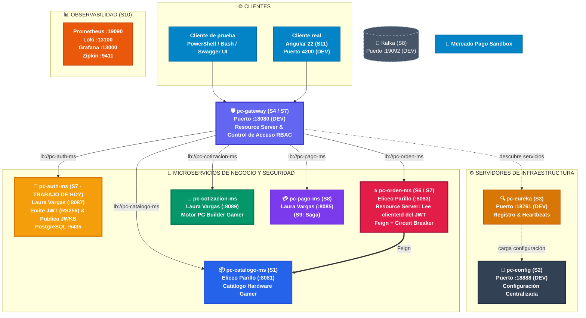

# S7 - Seguridad Distribuida y Control de Acceso

> **Proyecto Sello de Sistemas Distribuidos — ENIAC Labs**  
> **Integrantes:**  
> - **Laura Vargas Cristhian Paul** (`pc-auth-ms`, `pc-gateway`, `pc-cotizacion-ms`)  
> - **Eliceo Parillo Mostajo** (`pc-orden-ms`, `pc-catalogo-ms`)  
> **Docente:** Angel Sullon Macalupu (@asullom) / Mg. Juan Carlos Condori  
> **Unidad:** U2 - Sistema distribuido robusto  

---

## 1. Introducción

**Tiempo estimado:** 20 min.

### 1.1 Presentación de la Sesión
Hasta la sesión S6, **`pc-orden-ms`** confiaba a ciegas en el `clienteId` que el propio request HTTP declaraba — el DTO de entrada `CrearOrdenRequestDto` lo traía como un campo libre más, igual que `metodoPago`. Nada impedía que un usuario, a través de Swagger o una petición manual, escribiera `"clienteId": 1` y registrara una orden de compra a nombre del administrador o de otra persona: el sistema nunca preguntaba *quién eres*, solo confiaba en lo que el cuerpo del request decía ser.

Esta sesión cierra esa vulnerabilidad de raíz mediante tres acciones sincronizadas:
1. **`pc-auth-ms`**: Un microservicio nuevo de autenticación que valida credenciales en base de datos (`eniaclabs_auth_db`), emite un **JWT (JSON Web Token)** criptográficamente firmado con clave privada RSA (**RS256**) y publica su clave pública en `/.well-known/jwks.json`.
2. **`pc-gateway`**: Pasa a operar como **Resource Server** perimetral, exigiendo y validando la firma del JWT antes de dejar pasar cualquier petición hacia los microservicios downstream y aplicando control de acceso basado en roles (**RBAC**: `ADMIN` vs `CLIENTE`).
3. **`pc-orden-ms`**: Se convierte también en **Resource Server** secundario (Defensa en Profundidad), deja de aceptar `clienteId` en el request y lo toma directamente del claim del JWT verificado.

> **Propósito Estratégico:** `pc-auth-ms` es una pieza temporal de aprendizaje diseñada bajo los estándares de **OAuth2** y **OpenID Connect (OIDC)**. Cuando el proyecto migre hacia **Keycloak** en producción, solo cambiará una propiedad de configuración (`issuer-uri`), sin alterar una sola línea de código en el Gateway ni en los microservicios de negocio.

---

### 1.2 Índice
1. Autenticación stateless con JWT y criptografía asimétrica (RS256 / JWKS).
2. Autorización basada en roles (RBAC: `ADMIN` y `CLIENTE`).
3. OAuth2 y OpenID Connect: el estándar detrás de un proveedor de identidad.
4. Resource Server y validación perimetral de tokens con claves públicas.
5. Observabilidad, diagnóstico y trazabilidad de seguridad distribuida.

---

### 1.3 Propósito de Aprendizaje
Al concluir la clase, el estudiante estará en condiciones de:
> Implementar autenticación y autorización distribuida con JWT y Spring Security en el ecosistema **ENIAC Labs**, aplicando el modelo de OAuth2 (servidor de autorización, resource servers perimetrales e internos, claves públicas JWKS) para validar tokens en el Gateway y en los microservicios, y protegiendo rutas por rol con evidencia demostrable de accesos permitidos (`200 OK`, `201 Created`) y accesos denegados (`401 Unauthorized`, `403 Forbidden`).

---

### 1.4 Producto de Sesión
- **`pc-auth-ms`** funcional: con tablas `usuarios`, `roles` y `usuario_roles` en PostgreSQL (`eniaclabs_auth_db`: `5435`), contraseñas con hash BCrypt, endpoint de login que emite JWT (RS256), registro seguro de clientes y publicación de claves públicas JWKS, conectado a `pc-config` (`:18888`) y registrado en `pc-eureka` (`:18761`).
- **`pc-gateway`** protegido como Resource Server perimetral, con rutas restringidas por rol (`ADMIN` para modificar catálogo gamer; `CLIENTE` o `ADMIN` para órdenes de compra).
- **`pc-orden-ms`** operando como Resource Server, extrayendo el `clienteId` del claim del JWT validado, imposibilitando la suplantación de identidad en compras.

---

### 1.5 Metodología de la Sesión
| Actividades a Realizar | Orientaciones Metodológicas | Material de Estudio Recomendado |
|---|---|---|
| **Revisión previa individual** | Confirmar que `pc-config`, `pc-eureka`, `pc-gateway`, `pc-catalogo-ms` y `pc-orden-ms` arrancan en DEV. Comprobar que `clienteId` era un campo libre en `CrearOrdenRequestDto` de S6. | Evidencia individual de S6, arquitectura en `docs/index.md`. |
| **Clase presencial** | Construcción de `pc-auth-ms` paso a paso, protección del Gateway como Resource Server, y adaptación de `pc-orden-ms` para desacoplar la identidad. | Pasos 3.1 a 3.27 de esta guía. |
| **Evaluación formativa** | Sustentación de la matriz de accesos: login exitoso, denegado sin token (`401`), denegado por rol (`403`) y orden creada con identidad extraída del JWT. | Indicaciones de entrega y rúbrica formativa. |

---

### 1.6 Motivación: La Orden Gamer a Nombre de Otra Persona

#### 1.6.1 El Caso en ENIAC Labs
Durante las pruebas de compra de hardware gamer de alto valor (como tarjetas gráficas NVIDIA GeForce RTX 4080 o procesadores AMD Ryzen 7 7800X3D), un usuario prueba el endpoint `POST /api/v1/ordenes` a través de Swagger o Postman. Al enviar el JSON de ejemplo, escribe `"clienteId": 1` (perteneciente al administrador o a otro cliente registrado).

El sistema de S6 procesa la orden y calcula el IGV 18% sin objetar nada: nunca verificó *quién envió la petición*. Cualquier dato que el propio cliente declara sobre sí mismo (su identidad o rol) no es confiable. Para que la identidad sea irrefutable, debe provenir de un **JWT firmado por una autoridad de confianza (`pc-auth-ms`)** que nadie pueda alterar sin invalidar la firma criptográfica.

#### Preguntas de Análisis (Defensa Técnica)

**Activación de conocimientos previos:**
1. *¿Por qué un campo `clienteId` dentro del cuerpo de un request HTTP no es una prueba de identidad?*  
   **Respuesta:** Porque el cliente HTTP controla el 100% del JSON enviado y puede falsificar cualquier identificador. Un identificador solo es confiable si viaja dentro de un token firmado digitalmente por un servidor de autenticación confiable.
2. *Si `pc-gateway` ya rechaza peticiones sin token válido, ¿por qué `pc-orden-ms` necesita además validar el JWT por su cuenta?*  
   **Respuesta:** Por el principio de **Defensa en Profundidad (*Zero Trust*)**. En DEV los microservicios escuchan en puertos del host (ej. `8083`), y en redes internas un atacante o contenedor comprometido podría saltarse el Gateway. Cada microservicio debe ser autosuficiente para validar la firma del token.

**Comprensión de seguridad distribuida:**
3. *¿Qué diferencia hay entre "autenticar" (confirmar quién eres) y "autorizar" (confirmar qué puedes hacer)?*  
   **Respuesta:** **Autenticar** valida credenciales o firma digital para saber la identidad del sujeto. **Autorizar** inspecciona los roles o permisos de esa identidad comprobada frente a la política de la ruta solicitada.
4. *¿Qué pasaría si alguien intentara llamar a `pc-orden-ms` directo por su puerto (:8083) sin pasar por el Gateway?*  
   **Respuesta:** Al haber transformado a `pc-orden-ms` en Resource Server con Spring Security, rechazará la solicitud inmediatamente con `401 Unauthorized` si no presenta un JWT válido verificado contra el JWKS de `pc-auth-ms`.

---

### 1.7 Ubicación en el Curso

#### Figura 1. Roadmap del Producto de la Unidad (ENIAC Labs)



---

## 2. Explica

### 2.1 Arquitectura de la Sesión

#### Figura 2. Emisión de JWT con Claves Asimétricas (RS256 / JWKS) y Doble Validación
```
                         1. Autenticación y Emisión
  [ Cliente ] ──────────────────────────────────────────▶ [ pc-auth-ms (:8087) ]
      │  email + password                                       │ firma con RSA priv
      │                                                         ▼
      │◀───────────────────────────────────────────── access_token (JWT, RS256)
      │  200 OK con access_token, sub, roles, idCliente         │ publica JWKS
      │                                                         ▼
      │                                                [ /.well-known/jwks.json ]
      │                                                         ▲
      │ 2. Petición protegida por Gateway                       │ descarga clave
      ▼                                                         │ pública una vez
  [ pc-gateway (:18080) ] ──────────────────────────────────────┘
      │ (Resource Server perimetral: valida firma RS256 y rol)
      │
      ▼ 3. Reenvía header Authorization: Bearer <token>
  [ pc-orden-ms (:8083) ] ──────────────────────────────────────┐
        (Resource Server interno: valida firma RS256            │ descarga clave
         y extrae idCliente del claim del JWT)                  ▼ pública una vez
                                                       [ pc-auth-ms JWKS ]
```

**Tres responsabilidades desacopladas:**
1. **`pc-auth-ms` (Paso 1):** Valida contraseñas con hash BCrypt, firma el JWT con clave privada RSA de 2048 bits y publica la clave pública en `/.well-known/jwks.json`. No sabe nada de órdenes ni catálogo.
2. **`pc-gateway` (Paso 2):** Primera línea de defensa. Verifica la firma con la clave pública descargada y evalúa si el rol alcanza para la ruta solicitada.
3. **`pc-orden-ms` (Paso 3):** Segunda línea de defensa. Verifica la firma por su cuenta y extrae el `clienteId` legítimo para crear la orden.
4. **`pc-catalogo-ms`:** Permite consultas públicas (GET), pero las modificaciones (POST/PUT/DELETE) quedan restringidas a `ROLE_ADMIN` en el Gateway.

---

### 2.2 Autenticación Stateless con JWT

#### Tabla 2. Autenticación con Sesión vs. Autenticación Stateless con JWT
| Aspecto | Con Sesión (Stateful) | Con JWT Stateless (ENIAC Labs) |
|---|---|---|
| **Dónde vive el estado** | En el servidor (memoria de Tomcat o base de datos de sesiones). | Dentro del propio token firmado criptográficamente. |
| **Validación por nodo** | Requiere consultar el almacén central de sesiones en cada petición. | Validación matemática local con la clave pública sin llamadas a base de datos. |
| **Balanceo de carga** | Requiere sesiones persistentes (*Sticky Sessions*) o replicación de sesiones. | Transparente: cualquier réplica o pod de Docker valida el mismo token. |
| **Revocación anticipada** | Inmediata borrando la sesión en el servidor. | No trivial: exige listas negras o tiempos de expiración cortos (15 min en PROD). |

---

### 2.3 Autorización Basada en Roles (RBAC)

- **Autenticación:** Responde *¿Quién eres?* (Firma del token verificada).
- **Autorización:** Responde *¿Qué puedes hacer?* (Rol del usuario verificado contra las reglas de la ruta).

#### Figura 3. Comprobación RBAC en `pc-gateway`
```
Usuario: cliente@eniaclabs.pe (Rol: CLIENTE)
Petición: POST /api/v1/productos (crear hardware gamer)
                       │
                       ▼
             [ ¿Token JWT válido? ]
                  ├── NO ──▶ [ 401 Unauthorized ]
                  └── SÍ
                       │
                       ▼
          [ ¿Rol tiene permiso ADMIN? ]
                  ├── NO ──▶ [ 403 Forbidden ]
                  └── SÍ ──▶ [ 201 Created ]
```

- **401 Unauthorized:** Falló la autenticación (sin token, token alterado o expirado).
- **403 Forbidden:** La identidad es legítima, pero el rol no tiene privilegios suficientes.

---

### 2.4 OAuth2 y OpenID Connect

#### Tabla 3. Alcance de Cada Pieza en la Arquitectura
| Pieza | Qué es | Qué resuelve en ENIAC Labs |
|---|---|---|
| **OAuth 2.0** | Estándar de autorización delegada (RFC 6749). | Gateway y `pc-orden-ms` validan tokens de acceso de recursos protegidos. |
| **OpenID Connect (OIDC)** | Capa de identidad sobre OAuth 2.0. | Estandariza claims del usuario (`sub`, `preferred_username`, `email`). |
| **Spring Security** | Framework de seguridad perimetral. | Provee filtros, decodificadores JWT y conversores de roles. |
| **Keycloak** | Servidor de identidad empresarial (SSO, MFA). | Reemplazará a `pc-auth-ms` en producción sin alterar código de negocio. |

#### Tabla 4. Los Cuatro Actores de OAuth 2.0 en ENIAC Labs
| Actor | Qué es | En ENIAC Labs (Hoy) | Con Keycloak (Futuro) |
|---|---|---|---|
| **Resource Owner** | Persona dueña de los recursos. | Usuario gamer (`cliente@eniaclabs.pe`). | Igual. |
| **Client** | Aplicación que actúa por el usuario. | Swagger UI / Postman / PowerShell. | Frontend Angular 22 (S11). |
| **Authorization Server** | Autentica y emite tokens. | **`pc-auth-ms`** (`:8087`). | Servidor Keycloak. |
| **Resource Server** | API que protege y sirve recursos. | **`pc-gateway`** y **`pc-orden-ms`**. | Sin cambios de código. |

#### Tabla 5. Flujos de OAuth 2.0 y Cuándo se Usan
| Flujo | ¿Hay persona? | ¿Client guarda secreto? | Uso habitual | En ENIAC Labs |
|---|:---:|:---:|---|---|
| **Authorization Code** | Sí | Sí (backend confidencial) | Aplicaciones web tradicionales con backend propio. | No aplica hoy. |
| **Authorization Code + PKCE** | Sí | No (cliente público) | SPAs (Angular/React) y aplicaciones móviles (RFC 7636). | Cliente Angular en S11. |
| **Client Credentials** | No | Sí (servicio a servicio) | Comunicación máquina a máquina sin usuario humano. | No requerido hoy. |
| **Resource Owner Password** | Sí | No recomendado | Envío directo de usuario/password a la API (RFC 9700 prohibido en prod). | Imitado didácticamente por `pc-auth-ms`. |

---

### 2.5 Resource Server y Validación de Claves Asimétricas (RS256 vs HS256)

- **Firma Simétrica (HS256):** Una única clave secreta compartida (`jwt.secret`) firma y valida. Si 5 microservicios validan tokens, los 5 conocen el secreto; si uno se compromete, el atacante puede emitir tokens con rol `ADMIN`.
- **Firma Asimétrica (RS256):** Par de claves RSA de 2048 bits. La clave privada vive en `pc-auth-ms` para firmar; los Resource Servers solo consumen la clave pública expuesta en el endpoint JWKS. Comprometer el Gateway no otorga capacidad de emitir tokens falsificados.

---

### 2.6 Observabilidad y Diagnóstico de Seguridad

1. **401 Unauthorized:** Cabecera `Authorization` ausente o firma inválida.
2. **403 Forbidden:** Token válido pero rol insuficiente.
3. **503 Service Unavailable:** Gateway no pudo conectarse a `pc-auth-ms` para descargar el JWKS.
4. **Logs Correlacionados:** `CorrelationIdFilter` inyecta `traceId` en el `MDC` para auditar intentos denegados en `logs/auth.log` y `logs/gateway.log`.

---

## 3. Aplica: Actividad Práctica Guiada

---

### Parte A — Construir `pc-auth-ms`

#### 3.1 Configuración Base del Microservicio
- **Grupo:** `pe.edu.upeu.eniaclabs`
- **Artefacto:** `pc-auth-ms`
- **Paquete:** `pe.edu.upeu.eniaclabs.auth`
- **Java:** 21 LTS | **Spring Boot:** 3.4.1
- **Puerto DEV:** `8087` (en host) | **Puerto Docker:** `8080` (mapeado a `8087:8080`)
- **Base de datos:** PostgreSQL 16 Alpine (`eniaclabs_auth_db`, puerto host `5435:5432`)

#### Dependencias Clave en `pom.xml`:
```xml
<dependency>
    <groupId>org.springframework.boot</groupId>
    <artifactId>spring-boot-starter-security</artifactId>
</dependency>
<dependency>
    <groupId>org.springframework.security</groupId>
    <artifactId>spring-security-oauth2-jose</artifactId>
</dependency>
<dependency>
    <groupId>org.springframework.cloud</groupId>
    <artifactId>spring-cloud-starter-config</artifactId>
</dependency>
<dependency>
    <groupId>org.springframework.cloud</groupId>
    <artifactId>spring-cloud-starter-netflix-eureka-client</artifactId>
</dependency>
<dependency>
    <groupId>org.mapstruct</groupId>
    <artifactId>mapstruct</artifactId>
    <version>1.6.3</version>
</dependency>
```

---

#### 3.2 Levantar la Base de Datos PostgreSQL de `pc-auth-ms`

Archivo: `pc-auth-ms/compose-dev.yml`
```yaml
name: eniaclabs-auth-dev

services:
  eniaclabs-db-auth:
    image: postgres:16-alpine
    container_name: eniaclabs-db-auth
    restart: unless-stopped
    ports:
      - "5435:5432"
    environment:
      POSTGRES_DB: eniaclabs_auth_db
      POSTGRES_USER: eniaclabs
      POSTGRES_PASSWORD: eniaclabs
    volumes:
      - eniaclabs_auth_data:/var/lib/postgresql/data
    healthcheck:
      test: ["CMD-SHELL", "pg_isready -U eniaclabs -d eniaclabs_auth_db"]
      interval: 5s
      timeout: 3s
      retries: 5

volumes:
  eniaclabs_auth_data:
```

Comandos de verificación:
```powershell
cd pc-auth-ms
docker compose -f compose-dev.yml up -d
docker exec -it eniaclabs-db-auth psql -U eniaclabs -d eniaclabs_auth_db -c "SELECT current_database();"
```

---

#### 3.3 Migración Flyway: `db/migration/V1__create_usuarios_roles.sql`

```sql
CREATE TABLE IF NOT EXISTS roles (
    id BIGSERIAL PRIMARY KEY,
    nombre VARCHAR(50) NOT NULL UNIQUE
);

CREATE TABLE IF NOT EXISTS usuarios (
    id BIGSERIAL PRIMARY KEY,
    email VARCHAR(150) NOT NULL UNIQUE,
    password VARCHAR(100) NOT NULL,
    habilitado BOOLEAN NOT NULL DEFAULT TRUE,
    id_cliente BIGINT
);

CREATE TABLE IF NOT EXISTS usuario_roles (
    usuario_id BIGINT NOT NULL,
    rol_id BIGINT NOT NULL,
    PRIMARY KEY (usuario_id, rol_id),
    CONSTRAINT fk_usuario_roles_usuario FOREIGN KEY (usuario_id) REFERENCES usuarios (id) ON DELETE CASCADE,
    CONSTRAINT fk_usuario_roles_rol FOREIGN KEY (rol_id) REFERENCES roles (id) ON DELETE CASCADE
);

INSERT INTO roles (nombre) VALUES ('ADMIN'), ('CLIENTE');

-- Contraseñas con hash BCrypt:
-- admin@eniaclabs.pe -> admin123
-- cliente@eniaclabs.pe -> cliente123
INSERT INTO usuarios (email, password, habilitado, id_cliente) VALUES 
('admin@eniaclabs.pe', '$2a$10$ndX5v/xbbP8LAFlts57QweeqsmxNNDTkWZG4wpmShADMaVTON9bfC', TRUE, NULL),
('cliente@eniaclabs.pe', '$2a$10$zCONDt0UNbJJh4C936JZyubU7ceojmoItVznixqKnivxjuxsofAPC', TRUE, 1);

INSERT INTO usuario_roles (usuario_id, rol_id)
SELECT u.id, r.id FROM usuarios u JOIN roles r 
ON (u.email = 'admin@eniaclabs.pe' AND r.nombre = 'ADMIN') 
OR (u.email = 'cliente@eniaclabs.pe' AND r.nombre = 'CLIENTE');
```

---

#### 3.5 Configuración en Config Server (`infra/pc-config/config-repo/pc-auth-ms-dev.yml`)

```yaml
server:
  port: 8087

spring:
  datasource:
    url: jdbc:postgresql://localhost:5435/eniaclabs_auth_db
    username: eniaclabs
    password: ${DB_PASSWORD:eniaclabs}
    driver-class-name: org.postgresql.Driver
  flyway:
    enabled: true
    locations: classpath:db/migration
  jpa:
    hibernate:
      ddl-auto: validate
    show-sql: true

jwt:
  issuer: http://localhost:8087
  expiracion-segundos: 3600

eureka:
  instance:
    hostname: localhost
    instance-id: ${spring.application.name}:${server.port}
  client:
    service-url:
      defaultZone: http://localhost:18761/eureka
```

---

#### 3.6 Agregar Ruta al Gateway (`pc-gateway-dev.yml`)

```yaml
spring:
  cloud:
    gateway:
      routes:
        - id: pc-auth-service
          uri: lb://pc-auth-ms
          predicates:
            - Path=/api/v1/auth/**
```

---

#### 3.8 Entidades `Usuario` y `Rol`

**`entity/Rol.java`:**
```java
package pe.edu.upeu.eniaclabs.auth.entity;

import jakarta.persistence.*;
import lombok.*;

@Entity
@Table(name = "roles")
@Getter
@Setter
@Builder
@NoArgsConstructor
@AllArgsConstructor
public class Rol {
    @Id
    @GeneratedValue(strategy = GenerationType.IDENTITY)
    private Long id;

    @Column(nullable = false, unique = true, length = 50)
    private String nombre;
}
```

**`entity/Usuario.java`:**
```java
package pe.edu.upeu.eniaclabs.auth.entity;

import jakarta.persistence.*;
import lombok.*;
import java.util.HashSet;
import java.util.Set;

@Entity
@Table(name = "usuarios")
@Getter
@Setter
@Builder
@NoArgsConstructor
@AllArgsConstructor
public class Usuario {
    @Id
    @GeneratedValue(strategy = GenerationType.IDENTITY)
    private Long id;

    @Column(nullable = false, unique = true, length = 150)
    private String email;

    @Column(nullable = false, length = 100)
    private String password;

    @Column(nullable = false)
    @Builder.Default
    private boolean habilitado = true;

    @Column(name = "id_cliente")
    private Long idCliente;

    @ManyToMany(fetch = FetchType.EAGER)
    @JoinTable(
        name = "usuario_roles",
        joinColumns = @JoinColumn(name = "usuario_id"),
        inverseJoinColumns = @JoinColumn(name = "rol_id")
    )
    @Builder.Default
    private Set<Rol> roles = new HashSet<>();
}
```

---

#### 3.9 DTOs de Autenticación y Registro

**`dto/LoginRequest.java`:**
```java
package pe.edu.upeu.eniaclabs.auth.dto;

import jakarta.validation.constraints.Email;
import jakarta.validation.constraints.NotBlank;
import lombok.*;

@Getter
@Setter
@NoArgsConstructor
@AllArgsConstructor
public class LoginRequest {
    @NotBlank
    @Email
    private String email;

    @NotBlank
    private String password;
}
```

**`dto/LoginResponse.java`:**
```java
package pe.edu.upeu.eniaclabs.auth.dto;

import com.fasterxml.jackson.annotation.JsonProperty;
import lombok.*;

@Getter
@Builder
@AllArgsConstructor
public class LoginResponse {
    @JsonProperty("access_token")
    private String accessToken;

    @JsonProperty("token_type")
    private String tokenType;

    @JsonProperty("expires_in")
    private long expiresIn;
}
```

**`dto/RegistroRequest.java`:**
```java
package pe.edu.upeu.eniaclabs.auth.dto;

import jakarta.validation.constraints.Email;
import jakarta.validation.constraints.NotBlank;
import jakarta.validation.constraints.Size;
import lombok.*;

@Getter
@Setter
@NoArgsConstructor
@AllArgsConstructor
public class RegistroRequest {
    @NotBlank
    @Email
    @Size(max = 150)
    private String email;

    @NotBlank
    @Size(min = 8, max = 72) // 72 bytes es el límite de BCrypt
    private String password;
}
```

**`dto/RegistroResponse.java`:**
```java
package pe.edu.upeu.eniaclabs.auth.dto;

import lombok.*;

@Getter
@Builder
@AllArgsConstructor
public class RegistroResponse {
    private Long id;
    private String email;
}
```

---

#### 3.11 Generación de Claves RSA y Servicio JWT

**`config/JwtKeyConfig.java`:**
```java
package pe.edu.upeu.eniaclabs.auth.config;

import com.nimbusds.jose.jwk.JWKSet;
import com.nimbusds.jose.jwk.RSAKey;
import com.nimbusds.jose.jwk.source.ImmutableJWKSet;
import org.springframework.context.annotation.Bean;
import org.springframework.context.annotation.Configuration;
import org.springframework.security.oauth2.jwt.JwtEncoder;
import org.springframework.security.oauth2.jwt.NimbusJwtEncoder;

import java.security.KeyPair;
import java.security.KeyPairGenerator;
import java.security.interfaces.RSAPrivateKey;
import java.security.interfaces.RSAPublicKey;
import java.util.UUID;

@Configuration
public class JwtKeyConfig {

    @Bean
    public RSAKey rsaKey() throws Exception {
        KeyPairGenerator generator = KeyPairGenerator.getInstance("RSA");
        generator.initialize(2048);
        KeyPair pair = generator.generateKeyPair();
        return new RSAKey.Builder((RSAPublicKey) pair.getPublic())
                .privateKey((RSAPrivateKey) pair.getPrivate())
                .keyID(UUID.randomUUID().toString())
                .build();
    }

    @Bean
    public JwtEncoder jwtEncoder(RSAKey rsaKey) {
        return new NimbusJwtEncoder(new ImmutableJWKSet<>(new JWKSet(rsaKey)));
    }
}
```

**`service/JwtService.java`:**
```java
package pe.edu.upeu.eniaclabs.auth.service;

import com.nimbusds.jose.jwk.RSAKey;
import lombok.Getter;
import lombok.RequiredArgsConstructor;
import org.springframework.beans.factory.annotation.Value;
import org.springframework.security.oauth2.jose.jws.SignatureAlgorithm;
import org.springframework.security.oauth2.jwt.*;
import org.springframework.stereotype.Service;
import pe.edu.upeu.eniaclabs.auth.entity.Rol;
import pe.edu.upeu.eniaclabs.auth.entity.Usuario;

import java.time.Instant;
import java.util.List;
import java.util.Map;

@Service
@RequiredArgsConstructor
public class JwtService {

    private final JwtEncoder jwtEncoder;
    private final RSAKey rsaKey;

    @Value("${jwt.issuer:http://localhost:8087}")
    private String issuer;

    @Getter
    @Value("${jwt.expiracion-segundos:3600}")
    private long expiracionSegundos;

    public String generarToken(Usuario usuario) {
        Instant now = Instant.now();
        List<String> roles = usuario.getRoles().stream()
                .map(Rol::getNombre)
                .sorted()
                .toList();

        JwtClaimsSet.Builder claims = JwtClaimsSet.builder()
                .issuer(issuer)
                .subject(String.valueOf(usuario.getId()))
                .issuedAt(now)
                .expiresAt(now.plusSeconds(expiracionSegundos))
                .claim("preferred_username", usuario.getEmail())
                .claim("email", usuario.getEmail())
                .claim("realm_access", Map.of("roles", roles));

        if (usuario.getIdCliente() != null) {
            claims.claim("idCliente", usuario.getIdCliente());
        }

        JwsHeader header = JwsHeader.with(SignatureAlgorithm.RS256)
                .keyId(rsaKey.getKeyID())
                .build();

        return jwtEncoder.encode(JwtEncoderParameters.from(header, claims.build())).getTokenValue();
    }
}
```

---

#### 3.12 Servicios y Controladores de Autenticación y Registro

**`service/AuthService.java`:**
```java
package pe.edu.upeu.eniaclabs.auth.service;

import pe.edu.upeu.eniaclabs.auth.dto.LoginRequest;
import pe.edu.upeu.eniaclabs.auth.dto.LoginResponse;
import pe.edu.upeu.eniaclabs.auth.dto.RegistroRequest;
import pe.edu.upeu.eniaclabs.auth.dto.RegistroResponse;

public interface AuthService {
    LoginResponse login(LoginRequest request);
    RegistroResponse registrar(RegistroRequest request);
}
```

**`service/AuthServiceImpl.java`:**
```java
package pe.edu.upeu.eniaclabs.auth.service;

import lombok.RequiredArgsConstructor;
import org.springframework.security.authentication.AuthenticationManager;
import org.springframework.security.authentication.UsernamePasswordAuthenticationToken;
import org.springframework.security.crypto.password.PasswordEncoder;
import org.springframework.stereotype.Service;
import org.springframework.transaction.annotation.Transactional;
import pe.edu.upeu.eniaclabs.auth.dto.*;
import pe.edu.upeu.eniaclabs.auth.entity.Rol;
import pe.edu.upeu.eniaclabs.auth.entity.Usuario;
import pe.edu.upeu.eniaclabs.auth.exception.EmailYaRegistradoException;
import pe.edu.upeu.eniaclabs.auth.repository.RolRepository;
import pe.edu.upeu.eniaclabs.auth.repository.UsuarioRepository;

import java.util.HashSet;
import java.util.Set;

@Service
@RequiredArgsConstructor
public class AuthServiceImpl implements AuthService {

    private final AuthenticationManager authenticationManager;
    private final UsuarioRepository usuarioRepository;
    private final RolRepository rolRepository;
    private final PasswordEncoder passwordEncoder;
    private final JwtService jwtService;

    @Override
    public LoginResponse login(LoginRequest request) {
        authenticationManager.authenticate(
                new UsernamePasswordAuthenticationToken(request.getEmail(), request.getPassword()));
        Usuario usuario = usuarioRepository.findByEmail(request.getEmail()).orElseThrow();
        String token = jwtService.generarToken(usuario);
        return LoginResponse.builder()
                .accessToken(token)
                .tokenType("Bearer")
                .expiresIn(jwtService.getExpiracionSegundos())
                .build();
    }

    @Override
    @Transactional
    public RegistroResponse registrar(RegistroRequest request) {
        if (usuarioRepository.findByEmail(request.getEmail()).isPresent()) {
            throw new EmailYaRegistradoException(request.getEmail());
        }
        Rol rolCliente = rolRepository.findByNombre("CLIENTE").orElseThrow();
        Usuario usuario = usuarioRepository.save(Usuario.builder()
                .email(request.getEmail())
                .password(passwordEncoder.encode(request.getPassword()))
                .roles(new HashSet<>(Set.of(rolCliente)))
                .build());
        return RegistroResponse.builder()
                .id(usuario.getId())
                .email(usuario.getEmail())
                .build();
    }
}
```

**`controller/AuthController.java`:**
```java
package pe.edu.upeu.eniaclabs.auth.controller;

import jakarta.validation.Valid;
import lombok.RequiredArgsConstructor;
import org.springframework.http.HttpStatus;
import org.springframework.web.bind.annotation.*;
import pe.edu.upeu.eniaclabs.auth.dto.*;
import pe.edu.upeu.eniaclabs.auth.service.AuthService;

@RestController
@RequestMapping("/api/v1/auth")
@RequiredArgsConstructor
public class AuthController {

    private final AuthService authService;

    @PostMapping("/login")
    public LoginResponse login(@Valid @RequestBody LoginRequest request) {
        return authService.login(request);
    }

    @PostMapping("/registro")
    @ResponseStatus(HttpStatus.CREATED)
    public RegistroResponse registro(@Valid @RequestBody RegistroRequest request) {
        return authService.registrar(request);
    }
}
```

**`controller/JwksController.java`:**
```java
package pe.edu.upeu.eniaclabs.auth.controller;

import com.nimbusds.jose.jwk.JWKSet;
import com.nimbusds.jose.jwk.RSAKey;
import lombok.RequiredArgsConstructor;
import org.springframework.web.bind.annotation.GetMapping;
import org.springframework.web.bind.annotation.RestController;

import java.util.Map;

@RestController
@RequiredArgsConstructor
public class JwksController {

    private final RSAKey rsaKey;

    @GetMapping("/.well-known/jwks.json")
    public Map<String, Object> jwks() {
        return new JWKSet(rsaKey.toPublicJWK()).toJSONObject();
    }
}
```

---

### Parte B — Proteger `pc-gateway` como Resource Server

#### 3.16 Agregar Dependencia en `infra/pc-gateway/pom.xml`
```xml
<dependency>
    <groupId>org.springframework.boot</groupId>
    <artifactId>spring-boot-starter-security-oauth2-resource-server</artifactId>
</dependency>
```

#### 3.17 Configurar `jwk-set-uri` y Conversor de Roles

En `infra/pc-config/config-repo/pc-gateway-dev.yml`:
```yaml
spring:
  security:
    oauth2:
      resourceserver:
        jwt:
          jwk-set-uri: http://localhost:8087/.well-known/jwks.json
```

**Conversor de Roles y `SecurityFilterChain` en `infra/pc-gateway/src/main/java/pe/edu/upeu/eniaclabs/gateway/config/SecurityConfig.java`:**
```java
package pe.edu.upeu.eniaclabs.gateway.config;

import org.springframework.context.annotation.Bean;
import org.springframework.context.annotation.Configuration;
import org.springframework.http.HttpMethod;
import org.springframework.security.config.annotation.web.builders.HttpSecurity;
import org.springframework.security.core.GrantedAuthority;
import org.springframework.security.core.authority.SimpleGrantedAuthority;
import org.springframework.security.oauth2.server.resource.authentication.JwtAuthenticationConverter;
import org.springframework.security.web.SecurityFilterChain;

import java.util.Collection;
import java.util.List;
import java.util.Map;

@Configuration
public class SecurityConfig {

    @Bean
    public JwtAuthenticationConverter jwtAuthenticationConverter() {
        JwtAuthenticationConverter converter = new JwtAuthenticationConverter();
        converter.setJwtGrantedAuthoritiesConverter(jwt -> {
            Map<String, Object> realmAccess = jwt.getClaimAsMap("realm_access");
            Object roles = realmAccess == null ? null : realmAccess.get("roles");
            if (!(roles instanceof Collection<?> lista)) {
                return List.<GrantedAuthority>of();
            }
            return lista.stream()
                    .map(rol -> (GrantedAuthority) new SimpleGrantedAuthority("ROLE_" + rol))
                    .toList();
        });
        return converter;
    }

    @Bean
    public SecurityFilterChain securityFilterChain(HttpSecurity http, JwtAuthenticationConverter converter) throws Exception {
        http
            .csrf(csrf -> csrf.disable())
            .authorizeHttpRequests(auth -> auth
                .requestMatchers("/api/v1/auth/**", "/actuator/**").permitAll()
                .requestMatchers(HttpMethod.GET, "/api/v1/productos/**", "/api/v1/categorias/**").permitAll()
                .requestMatchers(HttpMethod.POST, "/api/v1/productos/**", "/api/v1/categorias/**").hasRole("ADMIN")
                .requestMatchers(HttpMethod.PUT, "/api/v1/productos/**", "/api/v1/categorias/**").hasRole("ADMIN")
                .requestMatchers(HttpMethod.DELETE, "/api/v1/productos/**", "/api/v1/categorias/**").hasRole("ADMIN")
                .requestMatchers("/api/v1/ordenes/**").hasAnyRole("CLIENTE", "ADMIN")
                .requestMatchers("/api/v1/cotizaciones/**").hasAnyRole("CLIENTE", "ADMIN")
                .anyRequest().authenticated()
            )
            .oauth2ResourceServer(oauth2 -> oauth2
                .jwt(jwt -> jwt.jwtAuthenticationConverter(converter))
            );
        return http.build();
    }
}
```

---

#### 3.19 Probar Accesos Permitidos y Denegados (Gateway :18080)

1. **Obtener tokens en terminal (PowerShell):**
```powershell
$tokenAdmin = (Invoke-RestMethod -Method Post -Uri "http://localhost:18080/api/v1/auth/login" `
  -ContentType "application/json" -Body '{"email": "admin@eniaclabs.pe", "password": "admin123"}').access_token

$tokenCliente = (Invoke-RestMethod -Method Post -Uri "http://localhost:18080/api/v1/auth/login" `
  -ContentType "application/json" -Body '{"email": "cliente@eniaclabs.pe", "password": "cliente123"}').access_token
```

2. **Caso 1: Sin Token (Ruta protegida) ➔ 401 Unauthorized:**
```powershell
try { Invoke-RestMethod -Method Get -Uri "http://localhost:18080/api/v1/ordenes" }
catch { $_.Exception.Response.StatusCode.value__ } # 401
```

3. **Caso 2: Token con Firma Alterada ➔ 401 Unauthorized:**
```powershell
$partes = $tokenAdmin.Split('.')
$primera = if ($partes[2][0] -eq 'X') { 'Y' } else { 'X' }
$tokenAlterado = "$($partes[0]).$($partes[1]).$primera$($partes[2].Substring(1))"
try { Invoke-RestMethod -Method Get -Uri "http://localhost:18080/api/v1/ordenes" -Headers @{ Authorization = "Bearer $tokenAlterado" } }
catch { $_.Exception.Response.StatusCode.value__ } # 401
```

4. **Caso 3: Token de CLIENTE modificando catálogo (Rol incorrecto) ➔ 403 Forbidden:**
```powershell
try {
  Invoke-RestMethod -Method Post -Uri "http://localhost:18080/api/v1/productos" `
    -Headers @{ Authorization = "Bearer $tokenCliente" } `
    -ContentType "application/json" `
    -Body '{"nombre": "GPU RTX 4090", "precio": 8500.0, "stock": 2, "categoriaId": 1}'
} catch { $_.Exception.Response.StatusCode.value__ } # 403
```

5. **Caso 4: Token de ADMIN en la misma ruta ➔ 201 Created:**
```powershell
Invoke-RestMethod -Method Post -Uri "http://localhost:18080/api/v1/productos" `
  -Headers @{ Authorization = "Bearer $tokenAdmin" } `
  -ContentType "application/json" `
  -Body '{"nombre": "GPU RTX 4090", "precio": 8500.0, "stock": 2, "categoriaId": 1}'
```

---

### Parte C — `pc-orden-ms` Valida el JWT y Extrae `clienteId`

#### 3.20 Quitar `clienteId` de `OrdenRequest.java`
El DTO ya no acepta `clienteId`: la identidad la inyecta el token firmado.

#### 3.21 Configurar `pc-orden-ms` como Resource Server
En `infra/pc-config/config-repo/pc-orden-ms-dev.yml`:
```yaml
spring:
  security:
    oauth2:
      resourceserver:
        jwt:
          jwk-set-uri: http://localhost:8087/.well-known/jwks.json
```

**`SecurityConfig.java` en `pc-orden-ms`:**
```java
package pe.edu.upeu.eniaclabs.orden.config;

import org.springframework.context.annotation.Bean;
import org.springframework.context.annotation.Configuration;
import org.springframework.security.config.Customizer;
import org.springframework.security.config.annotation.web.builders.HttpSecurity;
import org.springframework.security.web.SecurityFilterChain;

@Configuration
public class SecurityConfig {

    @Bean
    public SecurityFilterChain securityFilterChain(HttpSecurity http) throws Exception {
        http
            .csrf(csrf -> csrf.disable())
            .authorizeHttpRequests(auth -> auth
                .requestMatchers("/actuator/**", "/swagger-ui.html", "/swagger-ui/**", "/v3/api-docs/**").permitAll()
                .anyRequest().authenticated()
            )
            .oauth2ResourceServer(oauth2 -> oauth2.jwt(Customizer.withDefaults()));
        return http.build();
    }
}
```

#### 3.22 Extracción de `clienteId` en el Controlador
```java
@PostMapping
@ResponseStatus(HttpStatus.CREATED)
public OrdenResponse crear(@Valid @RequestBody OrdenRequest request, @AuthenticationPrincipal Jwt jwt) {
    Number claimId = jwt.getClaim("idCliente");
    if (claimId == null) {
        throw new IllegalArgumentException("Token sin idCliente: solo un CLIENTE autenticado puede crear órdenes");
    }
    return ordenService.crear(request, claimId.longValue());
}
```

---

#### 3.24 Comprobación del Llamado Directo a `pc-orden-ms` (:8083)
Si alguien invoca directamente a `http://localhost:8083/api/v1/ordenes` sin pasar por el Gateway:
- Con token alterado: `401 Unauthorized` (`WWW-Authenticate: Bearer error="invalid_token"`).
- Con token válido de `CLIENTE`: `201 Created` con `clienteId: 1`.

---

### 3.25 Matriz de Roles y Accesos Verificada

| Ruta | Método | Rol Requerido | Sin Token | Token ADMIN | Token CLIENTE |
|---|:---:|---|:---:|:---:|:---:|
| `/api/v1/auth/login` | `POST` | Público | `200 OK` | `200 OK` | `200 OK` |
| `/api/v1/auth/registro` | `POST` | Público | `201 Created` | `201 Created` | `201 Created` |
| `/api/v1/productos/**` | `GET` | Público | `200 OK` | `200 OK` | `200 OK` |
| `/api/v1/productos/**` | `POST` | `ROLE_ADMIN` | `401 Unauthorized` | `201 Created` | `403 Forbidden` |
| `/api/v1/ordenes/**` | `POST` | `ROLE_CLIENTE` o `ADMIN` | `401 Unauthorized` | `400 Bad Request` (sin idCliente) | `201 Created` |
| `/api/v1/ordenes/**` | `GET` | `ROLE_CLIENTE` o `ADMIN` | `401 Unauthorized` | `200 OK` | `200 OK` |

---

### Parte D — Verificación Avanzada

#### 3.26 Revisión de Accesos y Revocación de Rol
Al revocar un rol en la base de datos:
```powershell
docker exec -it eniaclabs-db-auth psql -U eniaclabs -d eniaclabs_auth_db -c "DELETE FROM usuario_roles WHERE usuario_id = (SELECT id FROM usuarios WHERE email = 'cliente@eniaclabs.pe');"
```
- **Con el token previamente emitido:** Sigue funcionando hasta que expire (naturaleza *stateless* del JWT).
- **Al solicitar un token nuevo:** El token se emite con `"realm_access": { "roles": [] }`, y al invocar `POST /api/v1/ordenes` responde `403 Forbidden`.

#### 3.27 Ver PKCE en Acción (PowerShell)
```powershell
function Get-Pkce([string]$verifier) {
    $hash = [System.Security.Cryptography.SHA256]::Create().ComputeHash([System.Text.Encoding]::ASCII.GetBytes($verifier))
    [Convert]::ToBase64String($hash).TrimEnd('=').Replace('+','-').Replace('/','_')
}
$bytes = New-Object byte[] 48
[System.Security.Cryptography.RandomNumberGenerator]::Create().GetBytes($bytes)
$codeVerifier = [Convert]::ToBase64String($bytes).TrimEnd('=').Replace('+','-').Replace('/','_')
"code_verifier: $codeVerifier"
"code_challenge: $(Get-Pkce $codeVerifier)"
"challenge con 1 char mas: $(Get-Pkce ($codeVerifier + 'x'))"
```
*Demostración:* Un solo carácter adicional cambia el hash completamente. Quien intercepte el redirect del navegador solo ve el `code_challenge`, siendo incapaz de invertirlo para obtener el `code_verifier`.

---

## 4. Crea: Actividad Autónoma

**Tiempo estimado:** 4 horas fuera del aula.

### 4.1 Actividad: Protección de `pc-cotizacion-ms`
En el marco de la división de responsabilidades del equipo ENIAC Labs:
1. Proteger el motor de cotizaciones gamer **`pc-cotizacion-ms`** (`:8089`) como Resource Server.
2. Definir permisos: consulta de proformas públicas (`GET`), generación de cotización con validación de sockets de hardware (`ROLE_CLIENTE` o `ROLE_ADMIN`).
3. Probar casos permitidos y denegados con capturas.

### 4.2 Indicaciones del Informe
- Entregar archivo PDF: `S07_EquipoENIAC_ApellidoNombre.pdf`.
- Capturas con reloj visible del sistema y usuario de Windows/VS Code.
- Cuestionario de feedback y preguntas de defensa resueltas.

---

### 4.5 Preguntas de Defensa (S07)

1. **¿Por qué el mensaje de error de un login fallido no distingue entre "email no existe" y "contraseña incorrecta"?**  
   *Respuesta:* Para mitigar ataques de enumeración de usuarios (*User Enumeration*). Revelar que el correo no existe permite a un atacante identificar cuentas legítimas para ataques de fuerza bruta.
2. **¿Por qué el Gateway y `pc-orden-ms` pueden verificar un token sin guardar secretos?**  
   *Respuesta:* Porque utilizan criptografía asimétrica (**RS256**). Solo necesitan la clave pública descargada del endpoint JWKS de `pc-auth-ms`. Si un Resource Server es vulnerado, no se compromete la firma de nuevos tokens.
3. **¿Qué diferencia hay entre que el Gateway rechace con 401 vs 403?**  
   *Respuesta:* `401 Unauthorized` indica falta o invalidez de autenticación (identidad no comprobada). `403 Forbidden` indica que la identidad fue comprobada pero carece del rol necesario.
4. **¿Qué cambiará el día que `pc-auth-ms` se reemplace por Keycloak?**  
   *Respuesta:* Solo cambiará una línea de configuración en el Config Server (`issuer-uri` apuntando al realm de Keycloak). El código de `pc-gateway` y `pc-orden-ms` permanece intacto porque el formato del token y los claims (`realm_access.roles`, `sub`) siguen el mismo estándar OIDC.

---

### 4.6 Rúbrica de Evaluación
| Dimensión | Peso | 3 - Logro Destacado | 2 - Logro | 1 - Proceso | 0 - Inicio |
|---|:---:|---|---|---|---|
| **1. `pc-auth-ms` construido** | 2 | Login completo, JWT RS256, JWKS publicado, hash BCrypt y registro funcional. | Login funcional con detalles menores. | Parcial. | No evidencia. |
| **2. Gateway como Resource Server** | 2 | Cuatro casos demostrados con capturas (`401` sin token, `401` alterado, `403`, éxito). | Funcional con algún caso omitido. | Parcial. | No evidencia. |
| **3. `pc-orden-ms` Resource Server** | 2 | `clienteId` tomado de claims del JWT verificado; llamado directo protegido. | Funcional. | Incompleto. | Acepta `clienteId` del body. |
| **4. Servicio autónomo protegido** | 1 | Microservicio complementario protegido con RBAC y matriz documentada. | Funcional. | Parcial. | No evidencia. |
| **5. Matriz de roles y accesos** | 1 | Matriz exhaustiva verificada contra respuestas reales. | Documentada. | Parcial. | No documentada. |
| **6. Aporte individual** | 1 | Aporte verificable en su módulo de fin de curso. | Identificable. | General. | No identificado. |
| **7. Orden y Reflexión** | 1 | Informe técnico impecable con reflexión técnica de 5-8 líneas. | Suficiente. | Confuso. | Insuficiente. |

---

## 5. Cierre

### Resumen Breve
El ecosistema **ENIAC Labs** implementó su tercera pieza arquitectónica (**`pc-auth-ms`**) y su primera capa de seguridad distribuida perimetral y en profundidad:
- Claves privadas protegidas en el emisor.
- Validación perimetral por roles en **`pc-gateway`**.
- Eliminación de suplantación de identidad en **`pc-orden-ms`**.
- Preparación total para la integración de **Keycloak** en producción.

### Proyección a Siguientes Sesiones
- **S8 (Mensajería Asíncrona con Kafka):** `pc-orden-ms`, con la identidad validada del cliente, publicará el evento `orden.creada` en Kafka para ser procesado por `pc-pago-ms` sin bloqueo síncrono.
- **S11 (Frontend Angular 22):** El cliente web consumirá estos mismos endpoints mediante el flujo **Authorization Code + PKCE**, enviando el Bearer token en cada interacción.
