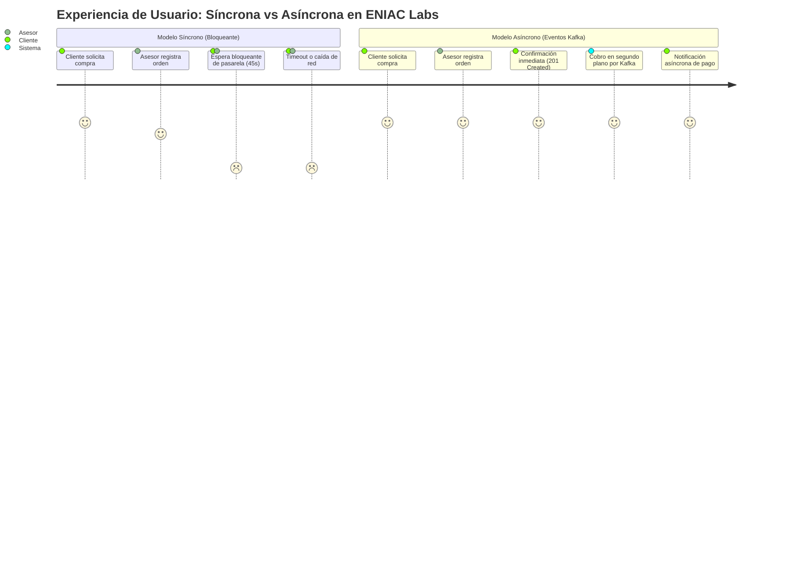
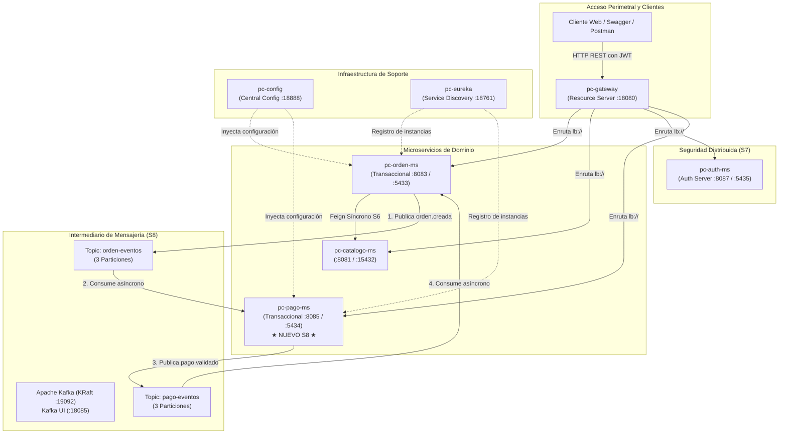
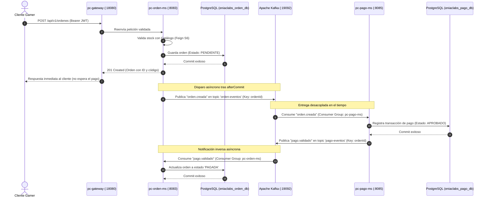

# S8 - Mensajería Asíncrona entre Servicios

> **Proyecto Sello de Sistemas Distribuidos — ENIAC Labs**  
> **Integrantes:**  
> - **Laura Vargas Cristhian Paul** (`pc-pago-ms`, `pc-auth-ms`, `pc-gateway`, `pc-cotizacion-ms`)  
> - **Eliceo Parillo Mostajo** (`pc-orden-ms`, `pc-catalogo-ms`)  
> **Docente:** Angel Sullon Macalupu (@asullom) / Mg. Juan Carlos Condori  
> **Unidad:** U2 - Sistema distribuido robusto  

---

## 1. Introducción

**Tiempo estimado:** 20 min.

### 1.1 Presentación de la Sesión
Hasta la sesión S7, cuando un cliente creaba una orden de compra en **ENIAC Labs**, todo lo que debía ocurrir después dependía de que otro servicio respondiera en ese mismo instante. Procesar el pago de componentes gamer (tarjetas de video RTX, procesadores, fuentes certificadas) es un trabajo de naturaleza distinta: es más lento, involucra pasarelas externas (Mercado Pago, redes bancarias, billeteras digitales) y está expuesto a intermitencias de red ajenas a nuestra infraestructura. No tiene sentido que el cliente que registra una orden quede congelado esperando una llamada síncrona a la pasarela de pagos.

Esta sesión cambia radicalmente el paradigma de comunicación entre microservicios: en lugar de esperar una respuesta síncrona bloqueante, un microservicio **anuncia un hecho ocurrido (evento)** y otro servicio **reacciona de forma autónoma cuando puede**. 

Aparece **`pc-pago-ms`**, el cuarto microservicio del ecosistema ENIAC Labs encargado de gestionar las transacciones de pago, y entre él y **`pc-orden-ms`** se instala un broker de eventos distribuido de alta concurrencia: **Apache Kafka** en modo KRaft (*Kafka Raft*).

```
[ Cliente Gamer ] ──POST /api/v1/ordenes──> [ pc-orden-ms ] (201 Created inmediato)
                                                  │
                                          (publica orden.creada)
                                                  ▼
                                      ╔═════════════════════════╗
                                      ║   Apache Kafka (KRaft)  ║
                                      ║  Topic: orden-eventos   ║
                                      ╚═════════════════════════╝
                                                  │
                                          (consume asíncrono)
                                                  ▼
                                           [ pc-pago-ms ]
                                                  │
                                          (valida y persiste pago)
                                                  │
                                          (publica pago.validado)
                                                  ▼
                                      ╔═════════════════════════╗
                                      ║   Apache Kafka (KRaft)  ║
                                      ║   Topic: pago-eventos   ║
                                      ╚═════════════════════════╝
                                                  │
                                          (consume y actualiza)
                                                  ▼
                                           [ pc-orden-ms ] ──> Orden pasa a PAGADA
```

---

### 1.2 Índice
1. Comunicación síncrona frente a comunicación asíncrona por eventos.
2. Broker de mensajes, topic, particiones, productor, consumidor y offsets.
3. Evento de negocio y su contrato inmutable (desacople sin bibliotecas compartidas).
4. Desacople temporal entre servicios y su evidencia experimental.
5. Observabilidad, diagnóstico y correlación de eventos en Kafka.

---

### 1.3 Propósito de Aprendizaje
Al concluir la sesión, el estudiante estará en condiciones de:
> Implementar comunicación asíncrona basada en eventos entre microservicios desacoplados utilizando **Apache Kafka** como intermediario de mensajería, publicando y consumiendo eventos de negocio (`orden.creada` y `pago.validado`), evidenciando el desacople temporal real mediante pruebas de resiliencia con servicios fuera de línea y diagnosticando el flujo a través de Kafka UI y logs estructurados.

---

### 1.4 Producto de Sesión
1. **Infraestructura Kafka KRaft y Kafka UI** desplegada en contenedor Docker para desarrollo (DEV: puertos `19092` y `18085`) y con manifiesto listo para producción local (PROD: `29092` y `28085`).
2. **Topics `orden-eventos` y `pago-eventos`** configurados con 3 particiones y particionamiento por clave (`ordenId`).
3. **Scripts de prueba rápida en Python** (`uso-rapido/eniaclabs-eventos-py/`) validando tráfico continuo y tolerancia a mensajes corruptos.
4. **`pc-pago-ms`** construido como cuarto microservicio del proyecto (puerto DEV `8085`, BD PostgreSQL `5434`), consumiendo `orden.creada` y emitiendo `pago.validado`.
5. **`pc-orden-ms`** adaptado para publicar `orden.creada` únicamente tras confirmar la transacción de base de datos (`afterCommit`) y consumiendo `pago.validado` para transicionar la orden a `PAGADA`.
6. **Contratos de eventos documentados formalmente** en formato JSON Schema.
7. **Evidencia empírica de desacople temporal**: apagar `pc-pago-ms`, registrar una orden en `pc-orden-ms` sin errores (recibiendo `201 Created` en estado `PENDIENTE`), observar la acumulación de mensajes (*consumer lag*) en Kafka UI, encender `pc-pago-ms` y constatar cómo procesa los pendientes y actualiza la orden a `PAGADA`.

---

### 1.5 Metodología de la Sesión
| Actividades a Realizar | Orientaciones Metodológicas | Material de Estudio Recomendado |
|---|---|---|
| **Revisión previa individual** | Confirmar que `pc-config`, `pc-eureka`, `pc-gateway`, `pc-auth-ms`, `pc-catalogo-ms` y `pc-orden-ms` siguen levantando en DEV y que es posible obtener un token JWT de rol `CLIENTE`. | Evidencia individual de S7, diagramas de arquitectura en `docs/index.md`. |
| **Clase presencial guiada** | Despliegue de Kafka en DEV, validación manual por consola y Kafka UI, implementación de `pc-pago-ms` y configuración de productores/consumidores en Spring Boot. | Pasos 3.1 al 3.20 de esta guía. |
| **Evaluación formativa** | Demostración en vivo del ciclo completo de eventos y de la prueba de desacople apagando `pc-pago-ms`. | Rúbrica de evaluación y matriz de criterios de aceptación (sección 4). |

---

### 1.6 Motivación: La Caja que Hizo Esperar a Todos

#### Caso de Negocio: Venta de Hardware en ENIAC Labs
En una tienda de componentes gamer, un asesor de ventas atiende a un cliente que desea ensamblar una PC de alto rendimiento. En el modelo síncrono tradicional, cuando el asesor genera la orden en el terminal, el sistema bloquea la pantalla y espera a que el datáfono bancario o la pasarela web confirme el pago. Si la pasarela bancaria demora 45 segundos o experimenta lentitud por alta congestión de fin de mes, el asesor no puede atender a la siguiente persona en la fila, los carritos de compra se congelan y los clientes abandonan la tienda.

En una tienda optimizada con arquitectura orientada a eventos, el asesor emite la orden de compra, el sistema entrega un comprobante de pedido en estado `PENDIENTE` en menos de 100 milisegundos y el cliente pasa cómodamente al área de validación de pagos o realiza la transferencia desde su móvil. La caja o pasarela atiende las órdenes a su propio ritmo. Si el servidor de pagos se desconecta durante 5 minutos para mantenimiento, las órdenes de compra siguen registrándose sin interrupción; cuando el sistema de pagos vuelve a estar en línea, procesa las órdenes pendientes acumuladas sin perder una sola transacción.



#### Preguntas de Activación
1. **¿Qué ocurre en un sistema distribuido cuando un microservicio que atiende usuarios depende de la respuesta inmediata de otro servicio que procesa transacciones externas lentas?**
2. **En S6 utilizamos Feign y Resilience4j con Circuit Breaker. ¿Por qué el Circuit Breaker no es suficiente para resolver el cobro de una orden de compra?** (Pista: si el circuito se abre y se ejecuta un fallback, ¿la orden se cobró o se descartó?).
3. **¿Cuál es la diferencia fundamental entre invocar una acción ("Cobra esta orden ahora") y emitir un evento ("OrdenCreada")?**
4. **Si el microservicio de pagos está caído, ¿qué debe suceder con las órdenes emitidas por los clientes?**

---

### 1.7 Ubicación en el Ecosistema Distribuido



---

## 2. Explica: Fundamentos de Arquitectura de Eventos

### 2.1 Arquitectura de la Sesión
La interacción entre el cliente, el API Gateway, `pc-orden-ms` y `pc-pago-ms` se produce desacoplando temporalmente la fase de registro de la fase de cobro:



---

### 2.2 Comunicación Síncrona vs Asíncrona
La diferencia crucial entre la comunicación síncrona (utilizada en S6 con Feign) y la comunicación asíncrona por eventos radica en el **acoplamiento temporal**:

| Criterio | Comunicación Síncrona (Feign - S6) | Comunicación Asíncrona (Eventos Kafka - S8) |
|---|---|---|
| **Quién espera** | El cliente o servicio emisor queda bloqueado hasta recibir la respuesta HTTP. | Nadie espera: el servicio emisor publica el evento y continúa atendiendo otras peticiones. |
| **Disponibilidad requerida** | Ambos microservicios deben estar activos y accesibles en el mismo milisegundo. | Disponibilidad desacoplada: el emisor puede publicar aunque el receptor esté caído o apagado. |
| **Manejo de caídas** | La petición falla de inmediato; requiere timeouts, reintentos y Circuit Breakers con fallback. | El mensaje se almacena de forma persistente y segura en Kafka hasta que el consumidor se restablezca. |
| **Semántica del mensaje** | Comando imperativo ("Haz esto ahora y dime el resultado"). | Notificación de hecho consumado ("Esto ocurrió en el negocio, actúa según tus reglas"). |
| **Consistencia** | Inmediata (a costa de fragilidad en cascada). | Consistencia eventual (garantizada en el tiempo sin bloquear al usuario). |
| **Caso en ENIAC Labs** | Consultar el precio vigente de una tarjeta gráfica antes de registrar la orden. | Cobrar la orden de compra y enviar la confirmación contable y de despacho. |

---

### 2.3 Conceptos Esenciales de Apache Kafka
Apache Kafka es un registro de confirmación (*commit log*) distribuido, particionado y tolerante a fallos:

```
TOPIC: orden-eventos (3 Particiones)

Partición 0: [msg 0] [msg 1] [msg 2] [msg 3] ──> Offset = 4
                     ▲ (Key: ordenId=102, 105)

Partición 1: [msg 0] [msg 1] [msg 2] ───────────> Offset = 3
                     ▲ (Key: ordenId=100, 103)

Partición 2: [msg 0] [msg 1] ───────────────────> Offset = 2
                     ▲ (Key: ordenId=101, 104)
```

1. **Broker:** Servidor central de Kafka que recibe, almacena en disco y distribuye los mensajes. En nuestro entorno DEV corre en el contenedor `eniaclabs-kafka-dev` (puerto `19092`).
2. **Topic:** Categoría o canal lógico con nombre al que se emiten mensajes de un mismo dominio de negocio (`orden-eventos`, `pago-eventos`).
3. **Partition (Partición):** Unidad de paralelismo y almacenamiento físico de un topic. Dentro de una misma partición, el orden de los mensajes está estrictamente garantizado.
4. **Producer (Productor):** Aplicación que publica registros en uno o más topics (`pc-orden-ms` utiliza `KafkaTemplate`).
5. **Consumer (Consumidor):** Aplicación que se suscribe a topics y procesa los registros recibidos (`pc-pago-ms` utiliza `@KafkaListener`).
6. **Consumer Group (Grupo de Consumidores):** Mecanismo de escalamiento horizontal. Cada mensaje de una partición es entregado a un único consumidor dentro del mismo grupo.
7. **Offset:** Identificador numérico secuencial que marca la posición exacta de un mensaje dentro de una partición. El grupo de consumidores persiste periódicamente el offset alcanzado para poder reiniciar exactamente donde se quedó tras una caída.
8. **Message Key (Clave del Mensaje):** Valor utilizado por el algoritmo de particionamiento (`murmur2(key) % partitions`). Al usar el `ordenId` como key, garantizamos que todos los eventos relativos a la misma orden ingresen siempre a la misma partición y se procesen en orden cronológico exacto.
9. **KRaft (Kafka Raft Metadata Mode):** Arquitectura moderna de Kafka que prescinde de Apache ZooKeeper, unificando el plano de datos y el consenso distribuido en el propio motor de Kafka.

---

### 2.4 Evento de Negocio y su Contrato
Un **evento de negocio** describe un hecho que ya aconteció en el dominio, nombrado en tiempo verbal pasado: `orden.creada`, `pago.validado`. 

A diferencia de un comando REST ("crear-pago"), un evento contiene todos los datos necesarios para que el suscriptor trabaje de forma autónoma sin tener que consultar nuevamente por HTTP al emisor:

```json
{
  "tipoEvento": "orden.creada",
  "ordenId": 501,
  "idCliente": 8,
  "total": 3550.00,
  "metodoPago": "TARJETA",
  "origen": "pc-orden-ms",
  "timestamp": 1743504000000
}
```

> **Principio de Desacople de Código:** Cada microservicio mantiene su propia clase DTO del evento en su paquete local (`pe.edu.upeu.eniaclabs.orden.event` y `pe.edu.upeu.eniaclabs.pago.event`). **No se utiliza una biblioteca JAR compartida** (*shared common library*), ya que vincularía a ambos microservicios al mismo ciclo de compilación y despliegue, violando la independencia de los equipos y reintroduciendo acoplamiento binario. Lo que mantiene la compatibilidad es el **contrato JSON Schema**.

---

### 2.5 Desacople Temporal y Regla Transaccional "afterCommit"
Un error frecuente y de graves consecuencias en arquitecturas de eventos es publicar el evento en Kafka **antes** de que la base de datos confirme la transacción:

```java
// ❌ ERROR FATAL: Publicar dentro de la transacción de base de datos
@Transactional
public OrdenResponseDto crearOrden(CrearOrdenRequestDto req) {
    OrdenCompra orden = ordenRepository.save(map(req));
    kafkaTemplate.send("orden-eventos", orden.getId(), evento); // Si luego falla la BD, Kafka ya tiene el mensaje fantasma!
    // Si la conexión a BD se cae aquí, la transacción hace ROLLBACK,
    // pero pc-pago-ms ya cobró dinero real por una orden que no existe!
    return mapToDto(orden);
}
```

**La Solución Correcta:** Utilizar `TransactionSynchronizationManager.registerSynchronization` con el hook `afterCommit()`. El evento hacia Kafka se despacha únicamente cuando la base de datos local ha emitido el `COMMIT` definitivo y los datos están persistidos en disco.

---

### 2.6 Observabilidad y Trazabilidad en Mensajería
Para correlacionar eventos a través de múltiples microservicios sin una herramienta compleja, adoptamos un formato de log estructurado estándar en clave-valor:

```text
2026-09-29 16:15:30.120 [traceId-101] INFO  p.e.u.e.o.s.OrdenEventProducer - component=producer eventType=orden.creada ordenId=501 partition=1 offset=12 status=published
2026-09-29 16:15:30.250 [traceId-102] INFO  p.e.u.e.p.s.OrdenEventConsumer - component=consumer eventType=orden.creada ordenId=501 idCliente=8 metodoPago=TARJETA total=3550.00 partition=1 offset=12 status=consumed
2026-09-29 16:15:30.310 [traceId-102] INFO  p.e.u.e.p.s.PagoEventProducer  - component=producer eventType=pago.validado ordenId=501 partition=0 offset=8 status=published
2026-09-29 16:15:30.410 [traceId-103] INFO  p.e.u.e.o.s.PagoEventConsumer  - component=consumer eventType=pago.validado ordenId=501 pagoId=101 estado=APROBADO partition=0 offset=8 status=consumed
```

Con este formato, basta ejecutar un `grep ordenId=501` para reconstruir con precisión de milisegundos todo el ciclo de vida del evento.

---

## 3. Aplica: Actividad Práctica Guiada Paso a Paso

### 3.1 Verificar el Punto de Partida
Asegúrate de que los servicios base de infraestructura y seguridad de S7 están operativos:
1. `pc-config` en el puerto `18888`.
2. `pc-eureka` en el puerto `18761`.
3. `pc-gateway` en el puerto `18080`.
4. `pc-auth-ms` en el puerto `8087`.
5. `pc-catalogo-ms` en el puerto `8081`.
6. `pc-orden-ms` en el puerto `8083`.

Obtén un token JWT válido de cliente a través del API Gateway para las pruebas finales:

**PowerShell:**
```powershell
$login = Invoke-RestMethod -Method Post -Uri "http://localhost:18080/api/v1/auth/login" `
  -ContentType "application/json" `
  -Body '{"email": "cliente@eniaclabs.pe", "password": "cliente123"}'
$tokenCliente = $login.token
Write-Host "Token JWT Obtenido: $tokenCliente"
```

**Bash / cURL:**
```bash
TOKEN_CLIENTE=$(curl -s -X POST http://localhost:18080/api/v1/auth/login \
  -H "Content-Type: application/json" \
  -d '{"email": "cliente@eniaclabs.pe", "password": "cliente123"}' | jq -r '.token')
echo "Token: $TOKEN_CLIENTE"
```

---

### 3.2 Levantar Kafka y Kafka UI con Docker Compose
Creamos la configuración de Apache Kafka en la carpeta `kafka/` del proyecto.

#### `kafka/compose-dev.yml` (Entorno de Desarrollo)
```yaml
name: eniaclabs-kafka-dev

services:
  kafka:
    image: apache/kafka:4.3.1
    container_name: eniaclabs-kafka-dev
    restart: unless-stopped
    ports:
      - "19092:19092"
    environment:
      KAFKA_NODE_ID: 1
      KAFKA_PROCESS_ROLES: broker,controller
      KAFKA_LISTENERS: INTERNAL://0.0.0.0:9092,EXTERNAL://0.0.0.0:19092,CONTROLLER://0.0.0.0:9093
      KAFKA_ADVERTISED_LISTENERS: INTERNAL://kafka:9092,EXTERNAL://localhost:19092
      KAFKA_LISTENER_SECURITY_PROTOCOL_MAP: INTERNAL:PLAINTEXT,EXTERNAL:PLAINTEXT,CONTROLLER:PLAINTEXT
      KAFKA_INTER_BROKER_LISTENER_NAME: INTERNAL
      KAFKA_CONTROLLER_LISTENER_NAMES: CONTROLLER
      KAFKA_CONTROLLER_QUORUM_VOTERS: 1@kafka:9093
      KAFKA_OFFSETS_TOPIC_REPLICATION_FACTOR: 1
      KAFKA_GROUP_INITIAL_REBALANCE_DELAY_MS: 0
      KAFKA_AUTO_CREATE_TOPICS_ENABLE: "false"
    networks:
      eniaclabs-kafka-dev-net:
        aliases:
          - kafka

  kafka-ui:
    image: ghcr.io/kafbat/kafka-ui:v1.5.0
    container_name: eniaclabs-kafka-ui-dev
    restart: unless-stopped
    ports:
      - "18085:8080"
    depends_on:
      - kafka
    environment:
      KAFKA_CLUSTERS_0_NAME: eniaclabs-dev
      KAFKA_CLUSTERS_0_BOOTSTRAPSERVERS: kafka:9092
    networks:
      - eniaclabs-kafka-dev-net

networks:
  eniaclabs-kafka-dev-net:
    name: eniaclabs-kafka-dev-net
```

> **Explicación de Listeners:** 
> - `INTERNAL` (`kafka:9092`): Dirección que emplean los servicios que residen en la misma red Docker (como Kafka UI y los scripts Python).
> - `EXTERNAL` (`localhost:19092`): Dirección expuesta hacia la máquina anfitriona para que los microservicios Spring Boot ejecutados en el IDE o terminal (`mvn spring-boot:run`) se conecten sin problemas de resolución DNS.
> - `KAFKA_AUTO_CREATE_TOPICS_ENABLE: "false"`: Obliga a definir explícitamente los topics con sus particiones, evitando la creación accidental de topics erróneos de una sola partición.

Levantar el broker en DEV:
```bash
docker compose -f kafka/compose-dev.yml up -d
```

Verificar que Kafka UI responda abriendo en el navegador: [http://localhost:18085](http://localhost:18085).

---

### 3.3 Probar Kafka por Consola
Accedemos a la consola interactiva del contenedor de Kafka para crear el topic y validar comunicación cruda:

```bash
docker compose -f kafka/compose-dev.yml exec kafka bash
```

Dentro del contenedor, creamos los topics con **3 particiones** cada uno:
```bash
/opt/kafka/bin/kafka-topics.sh --create \
  --topic orden-eventos \
  --bootstrap-server kafka:9092 \
  --partitions 3 \
  --replication-factor 1

/opt/kafka/bin/kafka-topics.sh --create \
  --topic pago-eventos \
  --bootstrap-server kafka:9092 \
  --partitions 3 \
  --replication-factor 1
```

Listar topics para confirmar su existencia:
```bash
/opt/kafka/bin/kafka-topics.sh --list --bootstrap-server kafka:9092
```
*Salida esperada:*
```text
orden-eventos
pago-eventos
```

En una **Terminal A (Consumidor)**:
```bash
docker compose -f kafka/compose-dev.yml exec kafka /opt/kafka/bin/kafka-console-consumer.sh \
  --topic orden-eventos \
  --bootstrap-server kafka:9092 \
  --from-beginning
```

En una **Terminal B (Productor)**:
```bash
docker compose -f kafka/compose-dev.yml exec kafka /opt/kafka/bin/kafka-console-producer.sh \
  --topic orden-eventos \
  --bootstrap-server kafka:9092
```
Escribe un mensaje de prueba como `hola kafka eniaclabs` y presiona Enter. Comprobarás que aparece inmediatamente en la Terminal A.

---

### 3.4 Verificar en Kafka UI
Abre [http://localhost:18085](http://localhost:18085):
1. El clúster `eniaclabs-dev` debe figurar en estado **Online**.
2. En la sección **Topics**, aparecen `orden-eventos` y `pago-eventos`, ambos con 3 particiones.
3. Al hacer clic en `orden-eventos` > pestaña **Messages**, se visualiza el mensaje ingresado en el paso 3.3 con su partition y su offset asignado.

---

### 3.5 Probar el Contrato del Evento desde Kafka UI
En la pestaña **Messages** del topic `orden-eventos` en Kafka UI:
1. Haz clic en **Produce Message**.
2. En **Key**, ingresa: `321`.
3. En **Value**, pega el JSON canónico de `orden.creada`:
```json
{
  "tipoEvento": "orden.creada",
  "ordenId": 321,
  "idCliente": 5,
  "total": 1280.00,
  "metodoPago": "TARJETA",
  "origen": "kafka-ui",
  "timestamp": 1743504100000
}
```
4. Haz clic en **Send**. Confirma que el mensaje aparece con key `321` y que el consumidor de consola del paso 3.3 lo imprime sin errores.

---

### 3.6 Probar con Python (Tráfico Continuo y Tolerancia a Fallos)
Para garantizar que el broker tolera ráfagas y flujos continuos antes de conectar Spring Boot, ejecutamos el banco de pruebas Python en `uso-rapido/eniaclabs-eventos-py/`:

Levantar el contenedor Python:
```bash
cd uso-rapido/eniaclabs-eventos-py
docker compose up -d --build
```

En una terminal, arrancar el consumidor Python:
```bash
docker compose exec eniaclabs-eventos-py python /app/consumer_ordenes.py
```

En otra terminal, arrancar el productor continuo (emite un evento cada 2 segundos):
```bash
docker compose exec eniaclabs-eventos-py python /app/producer_ordenes.py
```

El consumidor imprimirá logs estructurados en JSON en tiempo real:
```json
{"component": "consumer", "eventType": "orden.creada", "ordenId": 501, "idCliente": 7, "metodoPago": "TARJETA", "total": 850.5, "partition": 2, "offset": 5, "status": "consumed"}
```

Para detener las pruebas, presiona `Ctrl + C` en ambas terminales.

---

### 3.7 Levantar la Base de Datos de `pc-pago-ms`
El microservicio `pc-pago-ms` cuenta con su base de datos PostgreSQL independiente en el puerto host `5434` (convención ENIAC Labs):

`pc-pago-ms/compose-dev.yml`:
```yaml
name: eniaclabs-pago-dev

services:
  eniaclabs-db-pago:
    image: postgres:16-alpine
    container_name: eniaclabs-db-pago
    restart: unless-stopped
    ports:
      - "5434:5432"
    environment:
      POSTGRES_DB: eniaclabs_pago_db
      POSTGRES_USER: eniaclabs
      POSTGRES_PASSWORD: eniaclabs
    volumes:
      - eniaclabs_pago_data:/var/lib/postgresql/data
    healthcheck:
      test: ["CMD-SHELL", "pg_isready -U eniaclabs -d eniaclabs_pago_db"]
      interval: 5s
      timeout: 3s
      retries: 5

volumes:
  eniaclabs_pago_data:
```

Levantar el contenedor:
```bash
cd pc-pago-ms
docker compose -f compose-dev.yml up -d
```

---

### 3.8 Configurar Dependencias en `pc-pago-ms`
En `pc-pago-ms/pom.xml`, incorporamos `spring-kafka`:

```xml
<dependency>
    <groupId>org.springframework.kafka</groupId>
    <artifactId>spring-kafka</artifactId>
</dependency>
```

---

### 3.9 Configurar `pc-pago-ms` en el Repositorio Central (`config-repo`)
Editamos `infra/pc-config/config-repo/pc-pago-ms-dev.yml` para suministrar la configuración de Kafka, serializers y deserializadores resistentes a fallos:

```yaml
server:
  port: 8085

spring:
  datasource:
    url: ${SPRING_DATASOURCE_URL:jdbc:postgresql://localhost:5434/eniaclabs_pago_db}
    username: ${DB_USER:eniaclabs}
    password: ${DB_PASS:eniaclabs}
    driver-class-name: ${SPRING_DATASOURCE_DRIVER:org.postgresql.Driver}
  jpa:
    hibernate:
      ddl-auto: update
    show-sql: false
  flyway:
    enabled: true
    locations: classpath:db/migration

  kafka:
    bootstrap-servers: localhost:19092
    producer:
      key-serializer: org.apache.kafka.common.serialization.StringSerializer
      value-serializer: org.springframework.kafka.support.serializer.JacksonJsonSerializer
      properties:
        spring.json.add.type.headers: false
    consumer:
      group-id: pc-pago-ms
      auto-offset-reset: earliest
      key-deserializer: org.apache.kafka.common.serialization.StringDeserializer
      value-deserializer: org.springframework.kafka.support.serializer.ErrorHandlingDeserializer
      properties:
        spring.deserializer.value.delegate.class: org.springframework.kafka.support.serializer.JacksonJsonDeserializer
        spring.json.value.default.type: pe.edu.upeu.eniaclabs.pago.event.OrdenCreadaEvento
        spring.json.trusted.packages: pe.edu.upeu.eniaclabs.pago.event
        spring.json.use.type.headers: false

app:
  kafka:
    topic:
      ordenes: orden-eventos
      pagos: pago-eventos

logging:
  level:
    pe.edu.upeu.eniaclabs: DEBUG

management:
  endpoints:
    web:
      exposure:
        include: health,info,metrics,prometheus
  endpoint:
    health:
      show-details: always

eureka:
  instance:
    hostname: localhost
    instance-id: ${spring.application.name}:${server.port}
  client:
    service-url:
      defaultZone: http://localhost:18761/eureka
```

> **Clave de Resiliencia:** `ErrorHandlingDeserializer` envuelve a `JacksonJsonDeserializer`. Si entra un mensaje con formato incorrecto o basura, Kafka no se bloquea en un bucle infinito de reintentos; el error es interceptado y el consumidor continúa con el siguiente mensaje.

---

### 3.10 Conectar `pc-pago-ms` a `pc-config` y a `pc-eureka`, y Crear su Migración
**Producto del paso:** `pc-pago-ms` que recupera su configuración centralizada desde `pc-config`, se registra como instancia en `pc-eureka` y dispone de su migración Flyway para la tabla `pagos`.

#### `services/pc-pago-ms/src/main/resources/application.yml`
```yaml
spring:
  application:
    name: pc-pago-ms
  profiles:
    active: dev
  config:
    import: "optional:configserver:${CONFIG_SERVER_URL:http://localhost:18888}"
```

#### Migración Flyway: `services/pc-pago-ms/src/main/resources/db/migration/V1__create_pagos.sql`
```sql
CREATE TABLE IF NOT EXISTS pagos (
    id BIGINT GENERATED BY DEFAULT AS IDENTITY,
    orden_id BIGINT NOT NULL,
    monto NUMERIC(12, 2) NOT NULL,
    metodo_pago VARCHAR(20) NOT NULL,
    estado VARCHAR(20) NOT NULL,
    fecha_pago TIMESTAMP NOT NULL,
    PRIMARY KEY (id),
    CONSTRAINT uk_pagos_orden UNIQUE (orden_id)
);
```

> **Decisión Arquitectural:** `orden_id` posee una restricción `UNIQUE` porque una orden solo debe pagarse una sola vez. No se declara una clave foránea (`FOREIGN KEY`) hacia órdenes porque la tabla `ordenes_compra` reside en una base de datos físicamente desacoplada (`eniaclabs_orden_db`); `pc-pago-ms` únicamente preserva el identificador numérico de negocio.

---

### 3.11 Configurar `pc-pago-ms` en `config-repo` y Verificar Config Server
**Producto del paso:** Archivos de configuración DEV y PROD de `pc-pago-ms`, integrando la conexión con Apache Kafka.

#### `infra/pc-config/config-repo/pc-pago-ms-dev.yml`:
```yaml
server:
  port: 8085

spring:
  datasource:
    url: ${SPRING_DATASOURCE_URL:jdbc:postgresql://localhost:5434/eniaclabs_pago_db}
    username: ${DB_USER:eniaclabs}
    password: ${DB_PASS:eniaclabs}
    driver-class-name: ${SPRING_DATASOURCE_DRIVER:org.postgresql.Driver}
  flyway:
    enabled: true
    locations: classpath:db/migration
  jpa:
    hibernate:
      ddl-auto: update
    show-sql: false

  kafka:
    bootstrap-servers: localhost:19092
    producer:
      key-serializer: org.apache.kafka.common.serialization.StringSerializer
      value-serializer: org.springframework.kafka.support.serializer.JacksonJsonSerializer
      properties:
        spring.json.add.type.headers: false
    consumer:
      group-id: pc-pago-ms
      auto-offset-reset: earliest
      key-deserializer: org.apache.kafka.common.serialization.StringDeserializer
      value-deserializer: org.springframework.kafka.support.serializer.ErrorHandlingDeserializer
      properties:
        spring.deserializer.value.delegate.class: org.springframework.kafka.support.serializer.JacksonJsonDeserializer
        spring.json.value.default.type: pe.edu.upeu.eniaclabs.pago.event.OrdenCreadaEvento
        spring.json.trusted.packages: pe.edu.upeu.eniaclabs.pago.event
        spring.json.use.type.headers: false

app:
  kafka:
    topic:
      ordenes: orden-eventos
      pagos: pago-eventos

logging:
  level:
    pe.edu.upeu.eniaclabs: DEBUG

management:
  endpoints:
    web:
      exposure:
        include: health,info,metrics,prometheus
  endpoint:
    health:
      show-details: always

eureka:
  instance:
    hostname: localhost
    instance-id: ${spring.application.name}:${server.port}
  client:
    service-url:
      defaultZone: http://localhost:18761/eureka
```

#### Verificación del Config Server
Comprueba que `pc-config` sirve ambos ambientes (`dev` y `prod`):

**PowerShell:**
```powershell
Invoke-RestMethod -Method Get -Uri "http://localhost:18888/pc-pago-ms/dev"
Invoke-RestMethod -Method Get -Uri "http://localhost:18888/pc-pago-ms/prod"
```

**Bash / Linux / macOS:**
```bash
curl http://localhost:18888/pc-pago-ms/dev
curl http://localhost:18888/pc-pago-ms/prod
```

---

### 3.12 Crear la Entidad `Pago` y su Repositorio
**Producto del paso:** Mapeo JPA de la tabla `pagos` para registrar cobros validados.

#### `pe.edu.upeu.eniaclabs.pago.entity.EstadoPago`
```java
package pe.edu.upeu.eniaclabs.pago.entity;

public enum EstadoPago {
    PENDIENTE,
    VALIDADO,
    APROBADO,
    EN_PROCESO,
    RECHAZADO,
    REEMBOLSADO
}
```

#### `pe.edu.upeu.eniaclabs.pago.entity.Pago`
```java
package pe.edu.upeu.eniaclabs.pago.entity;

import jakarta.persistence.*;
import lombok.*;
import java.math.BigDecimal;
import java.time.LocalDateTime;

@Entity
@Table(name = "pagos")
@Getter
@Setter
@Builder
@NoArgsConstructor
@AllArgsConstructor
public class Pago {

    @Id
    @GeneratedValue(strategy = GenerationType.IDENTITY)
    private Long id;

    @Column(name = "orden_id", nullable = false, unique = true)
    private Long ordenId;

    @Column(nullable = false, precision = 12, scale = 2)
    private BigDecimal monto;

    @Column(name = "metodo_pago", nullable = false, length = 20)
    private String metodoPago;

    @Enumerated(EnumType.STRING)
    @Column(nullable = false, length = 20)
    private EstadoPago estado;

    @Column(name = "fecha_pago", nullable = false)
    private LocalDateTime fechaPago;
}
```

#### `pe.edu.upeu.eniaclabs.pago.repository.PagoRepository`
```java
package pe.edu.upeu.eniaclabs.pago.repository;

import org.springframework.data.jpa.repository.JpaRepository;
import pe.edu.upeu.eniaclabs.pago.entity.Pago;
import java.util.Optional;

public interface PagoRepository extends JpaRepository<Pago, Long> {
    Optional<Pago> findByOrdenId(Long ordenId);
}
```

---

### 3.13 Crear el Contrato de los Eventos en `pc-pago-ms`
**Producto del paso:** Clases que modelan `orden.creada` y `pago.validado`.

#### `pe.edu.upeu.eniaclabs.pago.event.OrdenCreadaEvento`
```java
package pe.edu.upeu.eniaclabs.pago.event;

import lombok.AllArgsConstructor;
import lombok.Builder;
import lombok.Data;
import lombok.NoArgsConstructor;
import java.math.BigDecimal;

@Data
@Builder
@NoArgsConstructor
@AllArgsConstructor
public class OrdenCreadaEvento {
    private String tipoEvento;
    private Long ordenId;
    private Long idCliente;
    private BigDecimal total;
    private String metodoPago;
    private String origen;
    private Long timestamp;
}
```

#### `pe.edu.upeu.eniaclabs.pago.event.PagoValidadoEvento`
```java
package pe.edu.upeu.eniaclabs.pago.event;

import lombok.AllArgsConstructor;
import lombok.Builder;
import lombok.Data;
import lombok.NoArgsConstructor;
import java.math.BigDecimal;

@Data
@Builder
@NoArgsConstructor
@AllArgsConstructor
public class PagoValidadoEvento {
    private String tipoEvento;
    private Long ordenId;
    private Long pagoId;
    private BigDecimal monto;
    private String metodoPago;
    private String estado;
    private String origen;
    private Long timestamp;
}
```

---

### 3.14 Consumir `orden.creada` y Publicar `pago.validado`
**Producto del paso:** Flujo asíncrono completo en `pc-pago-ms`: auto-creación de tópicos, escucha en `orden-eventos`, persistencia en BD y publicación en `pago-eventos`.

#### `pe.edu.upeu.eniaclabs.pago.config.KafkaTopicsConfig`
```java
package pe.edu.upeu.eniaclabs.pago.config;

import org.apache.kafka.clients.admin.NewTopic;
import org.springframework.beans.factory.annotation.Value;
import org.springframework.context.annotation.Bean;
import org.springframework.context.annotation.Configuration;
import org.springframework.kafka.config.TopicBuilder;

@Configuration
public class KafkaTopicsConfig {

    @Bean
    public NewTopic ordenEventos(@Value("${app.kafka.topic.ordenes:orden-eventos}") String nombre) {
        return TopicBuilder.name(nombre).partitions(3).replicas(1).build();
    }

    @Bean
    public NewTopic pagoEventos(@Value("${app.kafka.topic.pagos:pago-eventos}") String nombre) {
        return TopicBuilder.name(nombre).partitions(3).replicas(1).build();
    }
}
```

#### `pe.edu.upeu.eniaclabs.pago.messaging.PagoEventosProducer`
```java
package pe.edu.upeu.eniaclabs.pago.messaging;

import lombok.RequiredArgsConstructor;
import lombok.extern.slf4j.Slf4j;
import org.springframework.beans.factory.annotation.Value;
import org.springframework.kafka.core.KafkaTemplate;
import org.springframework.stereotype.Component;
import org.springframework.transaction.support.TransactionSynchronization;
import org.springframework.transaction.support.TransactionSynchronizationManager;
import pe.edu.upeu.eniaclabs.pago.event.PagoValidadoEvento;

@Slf4j
@Component
@RequiredArgsConstructor
public class PagoEventosProducer {

    private final KafkaTemplate<String, PagoValidadoEvento> kafkaTemplate;

    @Value("${app.kafka.topic.pagos:pago-eventos}")
    private String topicPagos;

    public void publicarTrasCommit(PagoValidadoEvento evento) {
        if (TransactionSynchronizationManager.isSynchronizationActive()) {
            TransactionSynchronizationManager.registerSynchronization(new TransactionSynchronization() {
                @Override
                public void afterCommit() {
                    enviar(evento);
                }
            });
        } else {
            enviar(evento);
        }
    }

    private void enviar(PagoValidadoEvento evento) {
        kafkaTemplate.send(topicPagos, String.valueOf(evento.getOrdenId()), evento)
                .whenComplete((resultado, ex) -> {
                    if (ex != null) {
                        log.error("component=producer topic={} eventType={} ordenId={} status=error error=\"{}\"",
                                topicPagos, evento.getTipoEvento(), evento.getOrdenId(), ex.getMessage());
                        return;
                    }
                    log.info("component=producer topic={} partition={} offset={} eventType={} ordenId={} status=published",
                            resultado.getRecordMetadata().topic(),
                            resultado.getRecordMetadata().partition(),
                            resultado.getRecordMetadata().offset(),
                            evento.getTipoEvento(),
                            evento.getOrdenId());
                });
    }
}
```

#### `pe.edu.upeu.eniaclabs.pago.messaging.OrdenEventosConsumer`
```java
package pe.edu.upeu.eniaclabs.pago.messaging;

import lombok.RequiredArgsConstructor;
import lombok.extern.slf4j.Slf4j;
import org.springframework.kafka.annotation.KafkaListener;
import org.springframework.stereotype.Component;
import pe.edu.upeu.eniaclabs.pago.event.OrdenCreadaEvento;
import pe.edu.upeu.eniaclabs.pago.service.PagoService;

@Slf4j
@Component
@RequiredArgsConstructor
public class OrdenEventosConsumer {

    private static final String ORDEN_CREADA = "orden.creada";
    private final PagoService pagoService;

    @KafkaListener(topics = "${app.kafka.topic.ordenes:orden-eventos}")
    public void alRecibirOrden(OrdenCreadaEvento evento) {
        if (evento == null || !ORDEN_CREADA.equals(evento.getTipoEvento())) {
            log.warn("component=consumer eventType={} status=ignored", evento != null ? evento.getTipoEvento() : "null");
            return;
        }
        log.info("component=consumer eventType={} ordenId={} status=consumed", evento.getTipoEvento(), evento.getOrdenId());
        pagoService.procesar(evento);
    }
}
```

#### `pe.edu.upeu.eniaclabs.pago.service.impl.PagoServiceImpl`
```java
    @Override
    @Transactional
    public void procesar(OrdenCreadaEvento orden) {
        log.info("component=service ordenId={} status=processing", orden.getOrdenId());
        Pago pago = pagoRepository.save(Pago.builder()
                .ordenId(orden.getOrdenId())
                .monto(orden.getTotal())
                .metodoPago(orden.getMetodoPago() != null ? orden.getMetodoPago() : "TARJETA")
                .estado(EstadoPago.VALIDADO)
                .fechaPago(LocalDateTime.now())
                .build());

        pagoEventosProducer.publicarTrasCommit(PagoValidadoEvento.builder()
                .tipoEvento("pago.validado")
                .ordenId(pago.getOrdenId())
                .pagoId(pago.getId())
                .monto(pago.getMonto())
                .metodoPago(pago.getMetodoPago())
                .estado(pago.getEstado().name())
                .origen(nombreServicio)
                .timestamp(Instant.now().toEpochMilli())
                .build());

        log.info("component=processor ordenId={} estado={} status=processed", pago.getOrdenId(), pago.getEstado());
    }
```

---

### 3.15 Levantar `pc-pago-ms` y Comprobar que Escucha
**Producto del paso:** `pc-pago-ms` ejecutándose, con migración aplicada y particiones asignadas.

```powershell
cd pc-pago-ms
.\mvnw.cmd spring-boot:run
```

Verificaciones en consola y navegador:
1. El log confirma que la configuración fue obtenida desde `http://localhost:18888`.
2. Flyway ejecuta `V1__create_pagos.sql`.
3. Kafka anuncia particiones asignadas: `partitions assigned: [orden-eventos-0, orden-eventos-1, orden-eventos-2]`.
4. En [http://localhost:18761](http://localhost:18761) figura la instancia `PC-PAGO-MS`.
5. En PostgreSQL, constata la existencia de la tabla:
```bash
docker exec -it eniaclabs-db-pago psql -U eniaclabs -d eniaclabs_pago_db -c "\dt"
```
*Salida esperada:* `pagos`, `flyway_schema_history`.

---

### 3.16 Publicar `orden.creada` desde `pc-orden-ms`
**Producto del paso:** `pc-orden-ms` publicando `orden.creada` al confirmar una orden en estado `PENDIENTE`.

1. En `pc-orden-ms/src/main/java/pe/edu/upeu/eniaclabs/orden/config/KafkaTopicsConfig.java`, se declaran los topics `orden-eventos` y `pago-eventos` (3 particiones).
2. En `pc-orden-ms/src/main/java/pe/edu/upeu/eniaclabs/orden/messaging/OrdenEventosProducer.java`, se implementa el productor con `publicarTrasCommit`.
3. En `OrdenServiceImpl.java`:
```java
        detalles.forEach(orden::addDetalle);
        OrdenCompra ordenGuardada = ordenRepository.save(orden);

        // Publicación asíncrona desacoplada: emitir orden.creada únicamente tras el commit ACID de la BD
        if (TransactionSynchronizationManager.isActualTransactionActive()) {
            TransactionSynchronizationManager.registerSynchronization(new TransactionSynchronization() {
                @Override
                public void afterCommit() {
                    OrdenCreadaEvento evento = OrdenCreadaEvento.builder()
                            .tipoEvento("orden.creada")
                            .ordenId(ordenGuardada.getId())
                            .idCliente(ordenGuardada.getClienteId())
                            .total(ordenGuardada.getTotal())
                            .metodoPago(ordenGuardada.getMetodoPago())
                            .origen("pc-orden-ms")
                            .timestamp(System.currentTimeMillis())
                            .build();
                    ordenEventProducer.publicarOrdenCreada(evento);
                }
            });
        }
```

---

### 3.17 Consumir `pago.validado` en `pc-orden-ms`
**Producto del paso:** `pc-orden-ms` pasando la orden de `PENDIENTE` a `PAGADA`.

#### `pe.edu.upeu.eniaclabs.orden.messaging.PagoEventosConsumer`
```java
package pe.edu.upeu.eniaclabs.orden.messaging;

import lombok.RequiredArgsConstructor;
import lombok.extern.slf4j.Slf4j;
import org.springframework.kafka.annotation.KafkaListener;
import org.springframework.stereotype.Component;
import pe.edu.upeu.eniaclabs.orden.event.PagoValidadoEvento;
import pe.edu.upeu.eniaclabs.orden.service.OrdenService;

@Slf4j
@Component
@RequiredArgsConstructor
public class PagoEventosConsumer {

    private static final String PAGO_VALIDADO = "pago.validado";
    private final OrdenService ordenService;

    @KafkaListener(topics = "${app.kafka.topic.pagos:pago-eventos}")
    public void alRecibirPago(PagoValidadoEvento evento) {
        if (evento == null || !PAGO_VALIDADO.equals(evento.getTipoEvento())) {
            log.warn("component=consumer eventType={} status=ignored", evento != null ? evento.getTipoEvento() : "null");
            return;
        }
        log.info("component=consumer eventType={} ordenId={} status=consumed", evento.getTipoEvento(), evento.getOrdenId());
        ordenService.marcarPagada(evento.getOrdenId());
    }
}
```

#### En `OrdenServiceImpl.java`:
```java
    @Override
    @Transactional
    public void marcarPagada(Long ordenId) {
        OrdenCompra orden = ordenRepository.findById(ordenId).orElse(null);
        if (orden == null || (orden.getEstado() != EstadoOrden.PENDIENTE)) {
            log.warn("component=processor ordenId={} status=ignored motivo=\"la orden no existe o no esta pendiente de pago\"", ordenId);
            return;
        }
        orden.setEstado(EstadoOrden.PAGADA);
        ordenRepository.save(orden);
        log.info("component=processor ordenId={} estado={} status=processed", ordenId, orden.getEstado());
    }
```

---

### 3.18 Probar de Punta a Punta
Con todos los servicios en ejecución, se crea una orden a través del API Gateway con el token de cliente:

**PowerShell:**
```powershell
$orden = Invoke-RestMethod -Method Post -Uri "http://localhost:18080/api/v1/ordenes" `
  -Headers @{ Authorization = "Bearer $tokenCliente" } `
  -ContentType "application/json" `
  -Body '{"metodoPago": "TARJETA", "items": [{"productoId": 1, "sku": "GPU-RTX-4090", "productoNombre": "RTX 4090", "precioUnitario": 8500.00, "cantidad": 1}]}'

Write-Host "Estado Inicial:" $orden.estado
```

**Evidencias Recolectadas:**
1. **Log `pc-orden-ms`:** `component=producer topic=orden-eventos partition=1 offset=3 eventType=orden.creada ordenId=1 status=published`
2. **Log `pc-pago-ms`:** `component=consumer eventType=orden.creada ordenId=1 status=consumed`, seguido de `component=processor ... estado=VALIDADO status=processed` y `component=producer topic=pago-eventos ... eventType=pago.validado status=published`
3. **Log `pc-orden-ms`:** `component=consumer eventType=pago.validado ordenId=1 status=consumed` y `component=processor ordenId=1 estado=PAGADA status=processed`
4. **Base de Datos de Pagos:**
```bash
docker exec -it eniaclabs-db-pago psql -U eniaclabs -d eniaclabs_pago_db -c "SELECT id, orden_id, monto, metodo_pago, estado FROM pagos ORDER BY id;"
```
5. **Consulta de la Orden (ahora PAGADA):**
```powershell
(Invoke-RestMethod -Method Get -Uri "http://localhost:18080/api/v1/ordenes/$($orden.id)" `
  -Headers @{ Authorization = "Bearer $tokenCliente" }).estado
```
*Resultado:* `PAGADA`.

---

### 3.19 Probar el Desacople Temporal (Prueba de Fuego)
1. **Apagar `pc-pago-ms`:** Presiona `Ctrl + C` en su terminal. En Eureka, desaparece tras el timeout de heartbeat.
2. **Crear una orden con `pc-pago-ms` apagado:** Ejecuta la creación de orden por PowerShell/cURL.
   - *Resultado:* `201 Created` inmediato. `pc-orden-ms` registra la orden sin trabarse y publica `orden.creada`.
3. **Verificar estado en BD:** La orden permanece en `PENDIENTE` en `pc-orden-ms`.
4. **Verificar Kafka UI ([http://localhost:18085](http://localhost:18085)):**
   - En **Consumers** > `pc-pago-ms`, se constata un **Consumer Lag de 1**. El mensaje no se perdió; espera en disco en la partición de Kafka.
5. **Encender nuevamente `pc-pago-ms`:**
   - Al iniciar, detecta el offset pendiente, procesa el pago y emite `pago.validado`.
   - `pc-orden-ms` lo recibe y la orden pasa automáticamente a `PAGADA`.
   - El lag vuelve a `0`.

---

### 3.20 Documentación de Contratos de Eventos

#### Tabla 6. Contrato del Evento `orden.creada`
| Parámetro | Detalle |
|---|---|
| **Topic** | `orden-eventos` (3 particiones) |
| **Productor** | `pc-orden-ms` |
| **Consumidor** | `pc-pago-ms` |
| **Key** | `ordenId` (Garantiza particionamiento ordenado) |
| **Momento de emisión** | Al confirmar la transacción de creación de orden (`afterCommit`). |

```json
{
  "tipoEvento": "orden.creada",
  "ordenId": 101,
  "idCliente": 5,
  "total": 3500.00,
  "metodoPago": "TARJETA",
  "origen": "pc-orden-ms",
  "timestamp": 1743504100000
}
```

| Campo | Tipo | Descripción |
|---|---|---|
| `tipoEvento` | `string` | Siempre `orden.creada`. |
| `ordenId` | `number` | Identificador de la orden; clave del mensaje Kafka. |
| `idCliente` | `number` | Identificador del cliente extraído del token JWT. |
| `total` | `number` | Monto total validado por el servidor. |
| `metodoPago` | `string` | Método de pago (`TARJETA`, `YAPE`, `MERCADO_PAGO`). |
| `origen` | `string` | Servicio emisor (`pc-orden-ms`). |
| `timestamp` | `number` | Epoch time en milisegundos. |

#### Tabla 7. Contrato del Evento `pago.validado`
| Parámetro | Detalle |
|---|---|
| **Topic** | `pago-eventos` (3 particiones) |
| **Productor** | `pc-pago-ms` |
| **Consumidor** | `pc-orden-ms` |
| **Key** | `ordenId` |
| **Momento de emisión** | Cuando el cobro ha sido persistido como `VALIDADO` / `APROBADO`. |

```json
{
  "tipoEvento": "pago.validado",
  "ordenId": 101,
  "monto": 3500.00,
  "estado": "VALIDADO",
  "origen": "pc-pago-ms",
  "timestamp": 1743504100500
}
```

| Campo | Tipo | Descripción |
|---|---|---|
| `tipoEvento` | `string` | Siempre `pago.validado` (en S9 se añadirá `pago.fallido`). |
| `ordenId` | `number` | Orden pagada; clave del mensaje Kafka. |
| `monto` | `number` | Importe validado. |
| `estado` | `string` | Estado del cobro (`VALIDADO`). |
| `origen` | `string` | Servicio emisor (`pc-pago-ms`). |
| `timestamp` | `number` | Epoch time en milisegundos. |

---

## 4. Crea: Evaluación y Actividad Autónoma

### 4.1 Actividad Autónoma
**Tiempo estimado:** 4 horas fuera del aula.  
Integración de un evento de negocio adicional propio en el ecosistema **ENIAC Labs** con evidencia demostrable de publicación, consumo y desacople temporal.

#### Tareas a Desarrollar:
1. **Elegir un evento de negocio adicional:** Por ejemplo, en ENIAC Labs:
   - `pago.validado` consumido por `pc-cotizacion-ms` o un servicio de notificaciones para emitir el comprobante electrónico al cliente.
   - O `orden.cancelada` publicado por `pc-orden-ms` para que `pc-catalogo-ms` restituya stock automáticamente vía eventos asíncronos.
2. **Definir su contrato formal:** Nombre del evento, topic, clave de partición, campos y JSON Schema.
3. **Publicar tras `afterCommit`:** Emitir el evento únicamente tras confirmar la transacción de base de datos con logs estructurados.
4. **Consumir en un microservicio distinto:** Configurar un nuevo `@KafkaListener` con su propio `group-id` dedicado.
5. **Demostrar el desacople temporal:** Apagar el consumidor, emitir el evento, evidenciar el lag en Kafka UI y comprobar el consumo al encenderlo.

---

### 4.2 Indicaciones del Informe Individual
- **Nombre de archivo:** `S08_Equipo##_ApellidoNombre.pdf`
- **Requisito Obligatorio de Capturas:** Cada captura de pantalla debe mostrar, sin recortar, el **reloj del sistema (fecha y hora)** y el **usuario visible** en pantalla (Windows/VS Code/Terminal).

#### Estructura del Informe:
1. **Datos del Estudiante:** Nombre, Equipo, Sesión S08, Rol/Aporte y Enlace a GitHub.
2. **Evidencia Técnica (4 bloques):**
   - *Kafka y pc-pago-ms:* Captura de Kafka UI con los topics y 3 particiones, registro en Eureka y tabla `pagos`.
   - *Eventos entre pc-orden-ms y pc-pago-ms:* Logs de publicación y consumo, mensaje en Kafka UI y orden en `PAGADA`.
   - *Desacople evidenciado:* Orden creada con `pc-pago-ms` apagado, lag de 1 en Kafka UI y procesamiento automático al volver.
   - *Evento propio adicional:* Contrato, logs de publicación/consumo y prueba de desacople del evento autónomo.
3. **Error o Hallazgo Diagnosticado:** Descripción de una incidencia real (ej. problema de red con listener interno/externo, deserialización fallida o nombre de topic discordante).
4. **Reflexión Técnica Breve (5 a 8 líneas):**
   - *¿Qué información tuvo que llevar el evento `orden.creada` para que `pc-pago-ms` pudiera cobrar sin llamar de vuelta por HTTP a `pc-orden-ms`, y qué se perdería en independencia si solo llevara el número de orden?*
5. **Anexo: Feedback de la Sesión** (última página del PDF con las respuestas cualitativas y cuantitativas).

---

### 4.3 Criterios Mínimos de Aceptación
- PDF nombrado correctamente.
- Kafka KRaft y `pc-pago-ms` evidenciados (topics de 3 particiones, registro Eureka, tabla PostgreSQL).
- Publicación y consumo de `orden.creada` y `pago.validado` con orden transicionando a `PAGADA`.
- Evidencia de desacople: orden creada con consumidor apagado, lag visible en UI y resolución al encender.
- Evento adicional con contrato documentado y desacople probado.
- Capturas sin recortar con reloj y usuario visibles.
- Error técnico y reflexión técnica completados.
- Anexo de feedback respondido.

---

### 4.4 Preguntas de Sustentación Técnica (Defensa de Laboratorio)
1. **¿Por qué `pc-orden-ms` responde 201 sin esperar a que el pago se cobre, y qué cambia respecto a Feign en S6?**
   - *Respuesta:* Desacopla la latencia y la disponibilidad. El usuario no queda bloqueado por la pasarela de pagos externa; el cobro se efectúa asíncronamente con consistencia eventual.
2. **¿Qué ocurre con un evento publicado mientras el consumidor está apagado?**
   - *Respuesta:* Kafka lo retiene en disco en la partición correspondiente; cuando el consumidor arranca, consulta su último offset comprometido y retoma la lectura sin pérdida de datos.
3. **¿Por qué el evento se publica después de confirmar la transacción (`afterCommit`) y no antes?**
   - *Respuesta:* Para prevenir eventos fantasma. Si se publica antes y la base de datos local hace rollback, el broker distribuiría un mensaje de una orden inexistente.
4. **¿Para qué sirve la key del mensaje y por qué es el `ordenId`?**
   - *Respuesta:* Kafka garantiza el orden cronológico estricto únicamente dentro de una partición. Asignar el `ordenId` como clave asegura que todos los eventos de esa orden caigan en la misma partición y se procesen en orden.
5. **¿Qué se gana con que cada servicio tenga su propia copia de las clases de eventos en vez de un JAR compartido?**
   - *Respuesta:* Autonomía de despliegue y desacople de ciclo de vida. Si compartieran un JAR, quedarían atados a la misma versión de Java y dependencias binarias comunes.
6. **¿Qué garantiza `ErrorHandlingDeserializer` ante un mensaje corrupto?**
   - *Respuesta:* Evita el "veneno" de la partición (*poison pill*). Captura la excepción de deserialización, la registra en el log y permite que el consumidor continúe con el siguiente mensaje sin trabar el consumo del topic.

---

### 4.5 Rúbrica Detallada de Evaluación

| Dimensión | Peso | 3 - Logro Destacado | 2 - Logro | 1 - Proceso | 0 - Inicio |
|---|:---:|---|---|---|---|
| **1. Kafka y `pc-pago-ms` construidos** | 2 | Kafka con sus topics de 3 particiones en Kafka UI, `pc-pago-ms` en Eureka, con config externa y tabla `pagos`. | Kafka y servicio funcionales, con aspectos menores incompletos. | Broker o servicio operando a medias. | No evidencia broker ni servicio funcionando. |
| **2. Eventos entre órdenes y pagos** | 2 | Publicación y consumo de ambos eventos evidenciados en logs y Kafka UI, con orden pasando a `PAGADA`. | Flujo funcional con evidencia parcial de algún tramo. | Un solo sentido del flujo o evidencia poco clara. | No evidencia comunicación por eventos. |
| **3. Desacople temporal evidenciado** | 2 | Orden registrada con consumidor apagado, lag visible en UI y cobro procesado al volver, explicado rigurosamente. | Prueba realizada con explicación incompleta. | Prueba parcial o sin captura del lag. | No demuestra el desacople. |
| **4. Evento de negocio adicional propio** | 2 | Evento propio con contrato documentado, publicado tras `afterCommit`, consumido por otro servicio y con desacople probado. | Evento publicado y consumido, con contrato o prueba de desacople incompleta. | Evento propio parcial. | No integra evento adicional. |
| **5. Contrato de eventos** | 1 | Contratos completos y rigurosamente coherentes con el código y logs. | Contratos completos con discrepancias menores. | Contratos incompletos. | No documenta contratos. |
| **6. Aporte individual** | 1 | Aporte individual claro, relevante y verificable en GitHub. | Aporte identificable. | Aporte general. | Sin aporte evidenciado. |
| **7. Orden y reflexión técnica** | 1 | PDF impecable, reflexión técnica sólida y anexo respondido. | Evidencia suficiente. | Evidencia poco clara o desordenada. | Informe deficiente. |

$$\text{Puntuación Acumulada} = \sum (\text{Peso} \times \text{Puntuación})$$

$$\text{Nota Final} = \left(\frac{\text{Puntuación Acumulada}}{30}\right) \times 20$$

> **Instrucción para Evaluación con IA:**  
> *"Evalúa el PDF usando la rúbrica de la sesión S08. Para cada dimensión selecciona la puntuación (0 a 3). Justifica cada nota. Verifica que cada captura muestre reloj del sistema y usuario visible sin recortar, coherente con GitHub. Calcula la puntuación acumulada y la nota sobre 20. Señala 2 fortalezas y 2 recomendaciones."*

---

## 5. Cierre de la Sesión

**Tiempo estimado:** 5 min.

### 5.1 Resumen Breve
En esta sesión, **ENIAC Labs** abandonó la dependencia de que todos los microservicios deban estar activos en el mismo instante:
- `pc-orden-ms` registra la orden de compra y anuncia el hecho ocurrido emitiendo `orden.creada`.
- `pc-pago-ms`, un microservicio independiente, reacciona cuando puede y anuncia el resultado con `pago.validado`.
- **Apache Kafka** actúa como intermediario durable, salvaguardando los avisos en disco cuando algún servicio se detiene.
- La orden pasó a estado `PAGADA` sin que ningún microservicio realizara una invocación directa por HTTP, y la prueba de desacople demostró que apagar un servicio no arrastra al otro.

### 5.2 Dinámica Participativa y Metacognición
- **Dinámica:** En una ronda rápida, comparte el valor de *Consumer Lag* observado en Kafka UI al apagar `pc-pago-ms` y explica qué significaba ese valor para la partición.
- **Metacognición:** *¿Qué representó el mayor cambio de mentalidad hoy: asimilar que `pc-orden-ms` responde al cliente antes de que exista el cobro, o comprender cómo un evento espera en Kafka de forma persistente sin perderse?*

### 5.3 Proyección a S9 (Patrón Saga y Compensación)
En la sesión S8 nos concentramos en el camino ideal: el pago siempre se valida.  
En la sesión **S9**, nos enfrentaremos a la complejidad de los sistemas distribuidos reales:
- ¿Qué sucede si la tarjeta del cliente no cuenta con fondos suficientes o la pasarela rechaza la transacción?
- Introduciremos el evento **`pago.fallido`** y el patrón **Saga Coreografiada**.
- Implementaremos **transacciones compensatorias** para cancelar la orden y devolver el stock reservado en `pc-catalogo-ms`, asegurando la consistencia eventual entre múltiples bases de datos.
