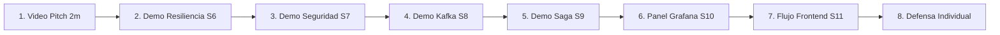

# S12 - Evaluación de la Unidad II

> **Proyecto Sello de Sistemas Distribuidos — ENIAC Labs**  
> **Integrantes:**  
> - **Laura Vargas Cristhian Paul** (`pc-pago-ms`, `pc-auth-ms`, `pc-gateway`, `pc-cotizacion-ms`)  
> - **Eliceo Parillo Mostajo** (`pc-orden-ms`, `pc-catalogo-ms`)  
> **Docente:** Angel Sullon Macalupu (@asullom) / Mg. Juan Carlos Condori  
> **Unidad:** U2 - Sistema distribuido robusto  

---

## 1. Propósito de la Evaluación

Esta sesión no introduce contenido nuevo: **cierra formalmente la Unidad II** de la asignatura **Desarrollo de Aplicaciones Distribuidas**. El sílabo define dos actividades fundamentales e indispensables para esta evaluación:
1. **Resolver la evaluación teórico-práctica** de los temas de la Unidad II (sesiones S6 a S11).
2. **Presentar y sustentar el sistema distribuido:** Demostrar que el ecosistema **ENIAC Labs** opera como un sistema distribuido seguro, resiliente, consistente, observable e integrado con su cliente frontend.

> **Alcance Estricto:** Esta sesión no repite lo evaluado en S5. La Unidad I (servicio base, configuración centralizada con Config Server, descubrimiento dinámico con Eureka, Gateway perimetral y balanceo de carga `lb://`) ya quedó acreditada. La evaluación de S12 se enfoca exclusivamente en los **atributos de calidad construidos en las sesiones S6 a S11**.

---

## 2. Producto Evaluado

Conforme al sílabo, el producto de la Unidad II se define como:
> *"Fortalece el sistema distribuido incorporando atributos de calidad, integración frontend y evidencias técnicas de operación real."*

El documento oficial del producto de la unidad se encuentra consolidado en:  
👉 **[u2-producto.md (Documento Oficial del Producto Unidad II)](../proyecto-sello/u2-producto.md)**.

En dicho documento se detalla la arquitectura de los seis pilares de calidad implementados sobre el dominio comercial gamer de **ENIAC Labs**:
- **Comunicación Síncrona Resiliente (S6):** Feign + Resilience4j Circuit Breaker entre órdenes y catálogo.
- **Seguridad Distribuida y Control de Acceso (S7):** JWT asimétrico (RS256 / JWKS) y Gateway Resource Server con RBAC (`ADMIN` vs `CLIENTE`).
- **Mensajería Asíncrona entre Servicios (S8):** Apache Kafka KRaft con tópicos particionados y desacople temporal.
- **Consistencia Distribuida (S9):** Saga Coreografiada con transacciones compensatorias e idempotencia.
- **Observabilidad y Diagnóstico (S10):** Prometheus, Grafana, Loki y Micrometer Tracing unificado con `X-Trace-ID`.
- **Integración con Cliente Frontend (S11):** Aplicación cliente SPA consumiendo exclusivamente a través del Gateway.

---

## 3. Evaluación Teórico-Práctica (S6 - S11)

Cubre los seis temas avanzados desarrollados a lo largo de la unidad. El docente evalúa el dominio conceptual y la justificación técnica de las decisiones implementadas en el código.

### Tabla 1. Temario de la Evaluación Teórico-Práctica
| Sesión | Tema Principal | Qué Evalúa el Docente | Implementación en ENIAC Labs |
|---|---|---|---|
| **S6** | **Comunicación síncrona resiliente entre servicios** | Timeout, reintentos, fallback y por qué un fallo en un servicio downstream no debe propagarse en cascada al resto del sistema. | Resilience4j Circuit Breaker en `pc-orden-ms` al consultar precios en `pc-catalogo-ms`. |
| **S7** | **Seguridad distribuida y control de acceso** | Autenticación stateless, autorización RBAC, claves públicas JWKS, y por qué cada microservicio debe validar el token (defensa en profundidad) y no solo el Gateway. | `pc-auth-ms` emitiendo JWT con RS256; `pc-gateway` filtrando por rol; `pc-orden-ms` extrayendo el `clienteId` inmutable del claim. |
| **S8** | **Mensajería asíncrona entre servicios** | Publicación y consumo de eventos en Kafka, desacople temporal entre productor y consumidor, y diferencia con una llamada síncrona REST/Feign. | Kafka KRaft (puertos 19092/18085) conectando `pc-orden-ms` (`orden.creada`) y `pc-pago-ms` (`pago.validado`) mediante topics con 3 particiones. |
| **S9** | **Consistencia distribuida en procesos de negocio** | Consistencia eventual, transacciones compensatorias e idempotencia — por qué un proceso distribuido no puede usar una transacción ACID única entre bases de datos separadas. | Saga Coreografiada: si la pasarela de pagos rechaza el cobro (`pago.fallido`), se cancela la orden y se restituye el stock en Catálogo automáticamente. |
| **S10** | **Observabilidad y diagnóstico de sistemas distribuidos** | Logs centralizados, health checks, métricas de latencia y para qué sirve correlacionar evidencia entre servicios distintos ante un fallo de producción. | Stack Prometheus (:9090), Grafana (:3000), Loki (:3100) y trazabilidad distribuida propagando `X-Trace-ID`. |
| **S11** | **Integración con cliente frontend** | Por qué el cliente frontend consume la API exclusivamente a través del Gateway, y cómo se protegen las rutas según el rol del usuario autenticado. | Cliente Web SPA interactuando con el Gateway (:18080) mediante interceptores HTTP, guards de navegación y almacenamiento seguro del JWT. |

---

### Preguntas de Referencia y Respuestas Modelo para ENIAC Labs

#### 1. Si el servicio de catálogo está caído o sufre latencia extrema, ¿qué evita que `pc-orden-ms` también quede colgado esperando una respuesta que nunca llega?
- **Respuesta Técnica:**  
  Lo evita la implementación de un **Circuit Breaker con Resilience4j** configurado sobre el cliente OpenFeign de catálogo. Al detectar una tasa de fallos superior al umbral configurado (ej. 50% de fallos en una ventana deslizante de 5 llamadas), el circuito transiciona al estado `OPEN`. A partir de ese momento, interrumpe de inmediato cualquier intento de conexión por red (*fail-fast*) y desvía la ejecución hacia un método de **fallback controlado**. Esto previene el agotamiento de los hilos del pool del servidor Tomcat en `pc-orden-ms`, protegiendo la disponibilidad de las órdenes y evitando caídas en cascada.

#### 2. ¿Por qué no basta con proteger las rutas en el API Gateway, y qué riesgo existe si un microservicio interno no valida el token JWT?
- **Respuesta Técnica:**  
  Porque confiar exclusivamente en el perímetro viola el principio de **Defensa en Profundidad** (*Zero Trust Architecture*). Si un atacante vulnera la red interna, si se produce un error de configuración en las rutas del Gateway, o si un servicio interno comprometido realiza una llamada directa a `http://pc-orden-ms:8083`, este aceptaría cualquier instrucción sin cuestionar la identidad ni los privilegios del emisor. Al operar cada microservicio como un **Resource Server** independiente que valida criptográficamente la firma del JWT contra el endpoint JWKS, se garantiza que ningún endpoint sensible pueda ser invocado sin autorización, sin importar el origen de la petición.

#### 3. ¿Qué gana ENIAC Labs al comunicar órdenes y pagos por eventos en Kafka en vez de una llamada REST síncrona directa, y qué garantía tradicional se pierde?
- **Respuesta Técnica:**  
  - **Lo que se gana:** **Desacople temporal y alta disponibilidad.** El cliente gamer recibe una confirmación inmediata (`201 Created` en estado `PENDIENTE`) en menos de 100 ms sin esperar a que la pasarela externa de pagos procese la tarjeta. Además, si `pc-pago-ms` se cae o se detiene por mantenimiento, los mensajes esperan de forma segura y duradera en el topic de Kafka (*Consumer Lag*) y se procesan automáticamente cuando el servicio vuelve a estar en línea.  
  - **Lo que se pierde:** Se pierde la **consistencia transaccional inmediata (ACID)**. La base de datos de órdenes y la de pagos no se actualizan en el mismo milisegundo; el sistema pasa a regirse por el principio de **consistencia eventual** (BASE).

#### 4. Si el cobro de una orden falla a la mitad del proceso distribuido, ¿cómo se evita que el sistema quede inconsistente, y qué significa que el consumidor sea idempotente?
- **Respuesta Técnica:**  
  - **Consistencia mediante Compensación:** Al no poder ejecutar un `ROLLBACK` global de base de datos entre microservicios con bases aisladas, se implementa una **Saga Coreografiada**. Cuando `pc-pago-ms` detecta un cobro denegado, emite el evento `pago.fallido`. `pc-orden-ms` reacciona transicionando la orden a `CANCELADA` y publica la orden de restitución de inventario para que `pc-catalogo-ms` devuelva el stock reservado a los estantes virtuales.  
  - **Idempotencia:** Significa que procesar el mismo mensaje de Kafka dos o más veces (debido a reintentos de red o caídas del consumidor antes de confirmar el offset) produce exactamente el mismo resultado final sin efectos colaterales indeseados (como duplicar cobros o registrar transacciones repetidas en la base de datos).

#### 5. ¿Qué evidencia concreta de tu panel de observabilidad te permite diagnosticar en qué microservicio exacto ocurrió una falla, sin revisar los logs consola por consola?
- **Respuesta Técnica:**  
  La correlación distribuida mediante el identificador unificado **`X-Trace-ID`** propagado en las cabeceras HTTP y los metadatos de los mensajes Kafka. En **Grafana**, al filtrar los logs centralizados en **Loki** por ese `traceId`, se despliega una línea de tiempo unificada que muestra cronológicamente el paso de la petición por `pc-gateway`, `pc-orden-ms`, `pc-pago-ms` y `pc-catalogo-ms`. La línea donde se interrumpe la secuencia o donde se registra el nivel `ERROR` con código `500` o timeout revela de forma inequívoca el microservicio responsable y el motivo de la falla.

#### 6. ¿Por qué el cliente frontend nunca debería conocer ni consumir la dirección IP o puerto directo de una instancia de microservicio?
- **Respuesta Técnica:**  
  Porque el frontend quedaría estrechamente acoplado a la infraestructura física y de red, impidiendo escalar instancias horizontalmente o cambiar puertos sin recompilar la aplicación cliente. Además, exponer microservicios directamente hacia internet expone puertos internos a ataques maliciosos, requiere configurar CORS en cada microservicio individual y obliga al cliente a gestionar múltiples conexiones y esquemas de seguridad dispersos. El **API Gateway** centraliza el punto de entrada, resuelve dinámicamente las rutas con Eureka (`lb://`), administra CORS de manera unificada y valida la seguridad perimetral.

---

## 4. Sustentación del Sistema Distribuido

La sustentación se realiza en vivo frente al docente, con una duración total de **23 minutos por integrante**.

### Tabla 2. Distribución de Tiempo por Integrante
| Momento | Tiempo | Propósito | Responsable |
|---|:---:|---|---|
| **Video pitch / Introducción ejecutiva** | 2 min | Presentar la evolución del sistema desde la Unidad I hacia una arquitectura resiliente y gamer de alto rendimiento. | Alumno / Equipo |
| **Presentación técnica de arquitectura** | 8 min | Explicar las decisiones de diseño técnico, topología de servicios, seguridad asimétrica y modelo de datos. | Alumno evaluado |
| **Demostración técnica en vivo (Demo)** | 8 min | Ejecutar en vivo: caída provocada con fallback, evento Kafka con consumer lag, consulta en observabilidad y flujo frontend. | Alumno evaluado |
| **Defensa y preguntas individuales** | 5 min | Responder individualmente a las preguntas del docente basadas en la Tabla 1. | Alumno evaluado |

---

### Tabla 3. Entregables Obligatorios y Criterios de Aceptación
| Entregable | Evidencia Mínima Exigida | Criterio de Aceptación |
|---|---|---|
| **Documento de Producto Unidad II** | Archivo `docs/proyecto-sello/u2-producto.md` adaptado al dominio gamer de ENIAC Labs. | Rigurosamente coherente con el sílabo, los puertos y el código ejecutable del repositorio. |
| **Evidencia de Resiliencia y Seguridad** | Fallo provocado en vivo con respuesta controlada por fallback; rutas con roles `ADMIN` y `CLIENTE` verificadas en Gateway y microservicio. | Trazabilidad en vivo demostrable en terminal o Postman; no se aceptan capturas estáticas como única prueba. |
| **Evidencia de Mensajería y Consistencia** | Evento Kafka publicado y consumido; caso de reprocesamiento idempotente sin duplicar cobros ni stock. | Verificable en Kafka UI ([http://localhost:18085](http://localhost:18085)) y en las tablas de PostgreSQL. |
| **Evidencia de Observabilidad y Frontend** | Dashboard de Grafana operativo con métricas y logs correlacionados por `traceId`; cliente frontend consumiendo solo vía Gateway. | Tráfico en tiempo real reflejado en los paneles; navegación web protegida por Guards y JWT. |
| **Repositorio y Documentación MkDocs** | Código limpio en GitHub, ramas trazables y documentación publicada con `mkdocs build`. | Proyecto reproducible y ejecutable por un tercero siguiendo las instrucciones del README. |
| **Sustentación Individual** | Pitch ejecutivo + defensa técnica individual cubriendo los 7 subaspectos de la sustentación integral. | Dominio conceptual autónomo demostrado por cada estudiante. |

---

### Secuencia Sugerida para la Demostración Técnica en Vivo (8 Pasos)

1. **Abrir con el Video Pitch Breve (2 min):** Explicar qué capacidades nuevas adquirió ENIAC Labs frente a la Unidad I (resiliencia, seguridad asimétrica, eventos y observabilidad).
2. **Provocar la Caída de Catálogo (Resiliencia S6):** Enviar peticiones de compra, apagar `pc-catalogo-ms`, observar la apertura del Circuit Breaker y la respuesta inmediata por fallback sin error 500.
3. **Verificar la Seguridad Distribuida (Seguridad S7):** Mostrar un intento anónimo (`401`), un intento con rol no autorizado (`403`) y un registro de orden donde el `clienteId` es extraído del JWT.
4. **Demostrar el Desacople Temporal en Kafka (Mensajería S8):** Apagar `pc-pago-ms`, crear una orden (recibiendo `201 Created` en `PENDIENTE`), mostrar el **Consumer Lag = 1** en Kafka UI, reiniciar `pc-pago-ms` y observar cómo la orden pasa a `PAGADA`.
5. **Provocar un Fallo de Pago y Ejecutar la Compensación (Consistencia S9):** Simular una tarjeta sin fondos, verificar que la orden pasa a `CANCELADA` y constatar en la base de datos que el stock reservado en Catálogo fue devuelto intacto.
6. **Diagnosticar en Observabilidad (Observabilidad S10):** Mostrar el panel de Grafana y filtrar en Loki por el `X-Trace-ID` de la transacción anterior, correlacionando la secuencia completa.
7. **Flujo Completo en Frontend (Integración S11):** Navegar por el catálogo gamer, autenticarse, armar una PC en el cotizador y completar la orden a través del Gateway.
8. **Cerrar con la Decisión de Diseño Diferencial:** Explicar una decisión técnica propia adoptada en el proyecto (ej. integración de validaciones de compatibilidad de sockets o uso de claves asimétricas RS256 nativas).

---

### Criterios Mínimos de Aprobación Innegociables
- Al menos un fallo de comunicación se provoca en vivo y el sistema responde de forma controlada sin caída en cascada.
- La seguridad se valida en más de un microservicio, demostrando defensa en profundidad.
- Al menos un evento de negocio se publica y consume de forma verificable en Kafka UI.
- Al menos un caso de consistencia distribuida (compensación o idempotencia) se prueba con un fallo real en caliente.
- El panel de observabilidad correlaciona logs o métricas de al menos dos microservicios mediante un identificador de trazabilidad.
- El cliente frontend consume la API completa exclusivamente a través del Gateway (`:18080`).
- Cada integrante responde individualmente y con solvencia al menos una pregunta técnica formulada por el docente.

---

## 5. Rúbrica Oficial de Evaluación de la Unidad II

La rúbrica oficial de la Unidad II está integrada formalmente en el documento de producto:  
👉 **[Ver Rúbrica Completa en u2-producto.md (Sección 4)](../proyecto-sello/u2-producto.md#4-rubrica-oficial-de-evaluacion-de-la-unidad-ii)**.

### Resumen de Ponderaciones:
1. **Comunicación Síncrona Resiliente (S6):** 15%
2. **Seguridad Distribuida y RBAC (S7):** 15%
3. **Mensajería Asíncrona Desacoplada (S8):** 15%
4. **Consistencia Distribuida y Sagas (S9):** 15%
5. **Observabilidad y Diagnóstico Centralizado (S10):** 15%
6. **Integración con Cliente Frontend (S11):** 10%
7. **Sustentación Integral y Dominio Técnico:** 15%

$$\text{Calificación Final sobre 20} = \left( \frac{\sum_{i=1}^{7} \text{Peso}_i \times \text{Nivel}_i}{3.00} \right) \times 20$$

> **Instrucción Estándar para Calificación con Asistente de IA:**  
> *"Evalúa la sustentación del equipo en base a la rúbrica oficial de 7 criterios de la Unidad II. Para cada criterio selecciona la puntuación de 0 a 3, justifica técnicamente la valoración en función de las evidencias demostradas en vivo, calcula la nota final sobre 20 y destaca 2 fortalezas arquitecturales y 2 recomendaciones de optimización."*
